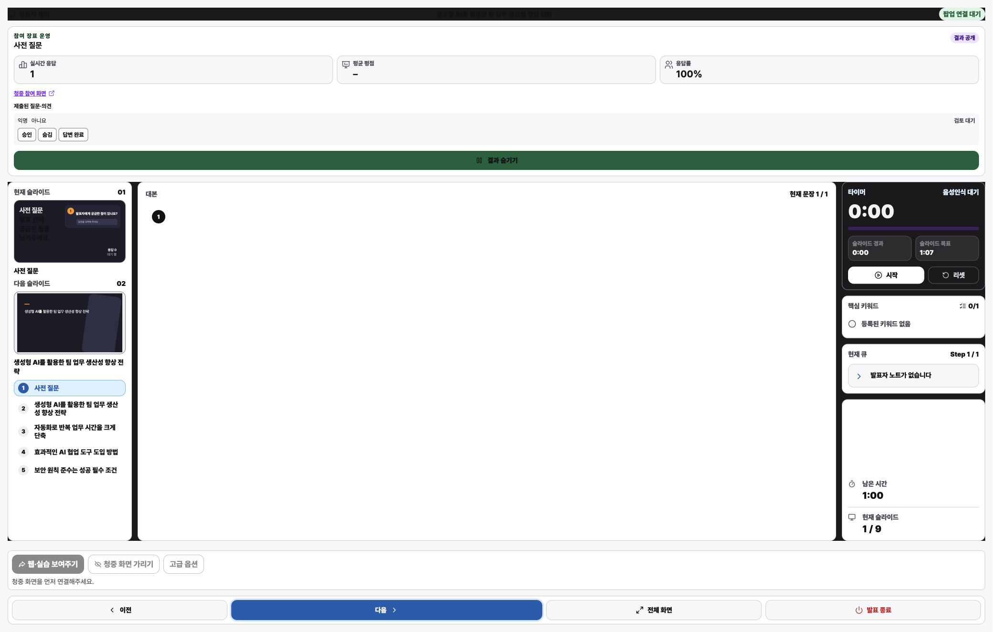
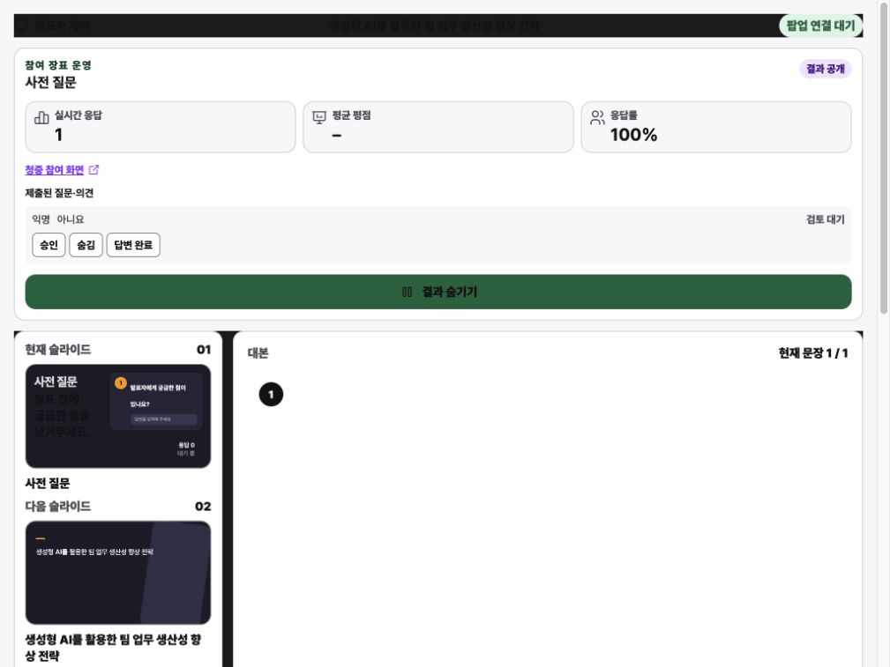
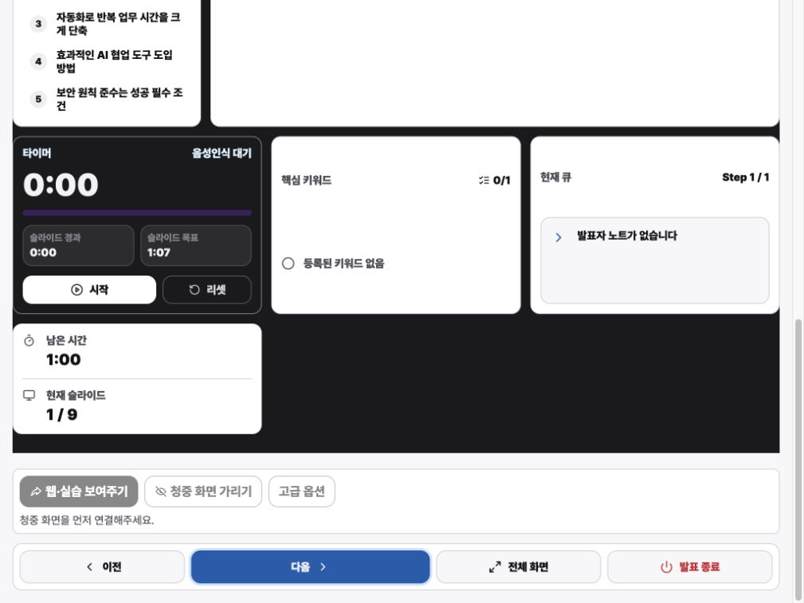

# ORBIT 발표자 제어 UI/UX 감사

- 감사 일자: 2026-07-21
- 대상: `/rehearsal/:projectId?presenterWindow=1`
- 사용자 목표: 발표 중 슬라이드, 대본, 타이머, 참여 응답을 빠르고 확실하게 제어한다.
- 접근성 목표: 키보드와 저시력 사용자를 포함해 핵심 상태와 제어 결과를 즉시 인지한다.

## 전체 판정

구조와 기능 범위는 좋지만, 실제 발표 환경에서는 연결 실패가 조용히 무시되고 작은 노트북에서 핵심 제어가 화면 밖으로 밀리는 문제가 있어 현재 상태는 `Needs attention`이다.

## 흐름 단계

### 1. 초기 발표자 화면 — Mixed

- 현재/다음 슬라이드, 대본, 타이머, 키워드, 참여 응답이 한 화면에 모여 있어 기능 범위는 명확하다.
- `main`, `region`, `navigation`, 버튼의 접근 가능한 이름이 확인되어 의미 구조가 좋다.
- 대본이 없을 때 중앙 패널 대부분이 빈 공간으로 남아 정보 밀도가 크게 떨어진다.
- 참여 패널의 `실시간 응답 1`과 슬라이드 미리보기의 `응답 0`이 동시에 보여 상태 신뢰를 해친다.

### 2. 연결 대기 중 `시작`과 `다음` 실행 — Poor

- 상단은 `팝업 연결 대기`이지만 `시작`, `이전`, `다음`이 활성화되어 있다.
- `시작`과 `다음`을 실행해도 타이머, 슬라이드, 상태 문구, 오류 안내가 변하지 않았다.
- 연결 대기 배지가 초록색 성공 계열이라 “준비 완료”처럼 보이는 점도 실제 상태와 충돌한다.

### 3. 1024×768 작은 노트북 진입 — Poor

- 참여 패널이 첫 화면 높이의 약 41%를 차지하고, 발표 제어 dock은 `y=1543px`부터 시작한다.
- 768px 높이에서 `이전`, `다음`, `전체 화면`, `발표 종료`가 두 화면 아래로 밀려 발표 중 즉시 조작할 수 없다.
- 오른쪽 타이머·키워드·큐 영역도 아래로 재배치되어 핵심 상태를 동시에 볼 수 없다.

### 4. 아래로 스크롤해 발표 제어 접근 — Mixed

- 스크롤 후에는 핵심 제어와 타이머를 사용할 수 있고, 키보드 초점에는 3px focus shadow가 확인된다.
- 그러나 슬라이드와 참여 응답을 보면서 제어할 수 없으며, 스크롤 자체가 발표 중 추가 작업이 된다.
- `승인`, `숨김`, `답변 완료`가 작은 인접 버튼으로 배치되어 오조작 방지와 되돌리기 단서가 부족하다.

## 주요 발견

1. `P1` 연결되지 않은 제어가 활성화된 채 조용히 실패한다. 연결 전에는 원격 명령 버튼을 비활성화하고, 같은 위치에 연결 방법과 재시도 동작을 제공해야 한다.
2. `P1` 1024×768에서 핵심 발표 제어가 viewport 밖으로 밀린다. 발표 제어 dock을 sticky/fixed 영역으로 유지하고, 참여 패널과 보조 rail은 내부 스크롤 또는 접기 방식으로 바꾸는 것이 안전하다.
3. `P1` 상단 dark header의 텍스트 대비가 약 `1.11:1`이고, green 결과 버튼의 텍스트 대비가 약 `2.92:1`이다. 각각 `--redesign-color-on-dark`, `--redesign-color-on-success` 역할을 사용해야 한다.
4. `P2` `팝업 연결 대기`가 success green으로 표시된다. 대기는 neutral/warning, 연결됨만 success로 분리해야 한다.
5. `P2` 같은 화면에서 응답 수가 `1`과 `0`으로 충돌한다. 미리보기에 live runtime 값을 반영하거나 `미리보기 예시`임을 명시해야 한다.
6. `P2` 빈 대본 패널이 가장 큰 면적을 차지한다. 빈 상태에서는 패널을 축소하고 “발표자 노트 없음”과 수정 경로를 더 명확히 보여주는 편이 낫다.
7. `P2` 라이브 moderation 액션이 조밀하고 undo가 보이지 않는다. `숨김`을 시각적으로 분리하고, 충분한 target size와 실행 후 되돌리기를 제공해야 한다.

## 확인된 장점

- 현재/다음 슬라이드와 시간 상태를 한 화면에서 파악하려는 정보 구조가 발표자 과업과 잘 맞는다.
- 청중 화면이 연결되지 않았을 때 관련 버튼은 비활성화되고 원인 문구가 함께 표시된다.
- 의미 영역과 버튼 이름이 비교적 충실하고, 키보드 focus 표시는 시각적으로 확인된다.

## 검증 한계

- 이번 실행에서는 owner popup과 청중 화면이 연결되지 않아 연결 성공 후 실제 슬라이드 전환, 타이머, 음성인식, 화면 공유를 검증하지 못했다.
- 데이터 변경을 피하기 위해 `승인`, `숨김`, `답변 완료`, `결과 숨기기`는 실행하지 않았다.
- 스크린리더 실제 낭독, 200% zoom, 운영체제 고대비 모드, 실제 마이크 권한 흐름은 별도 검증이 필요하다.

## 권장 순서

1. 연결 상태와 원격 제어 enabled state를 묶고 실패 피드백을 추가한다.
2. 1024×768에서도 발표 제어와 타이머가 항상 보이도록 레이아웃을 고정한다.
3. header와 green command의 대비 토큰을 수정한다.
4. live 응답 수와 미리보기 수치를 하나의 상태 원본으로 통일한다.
