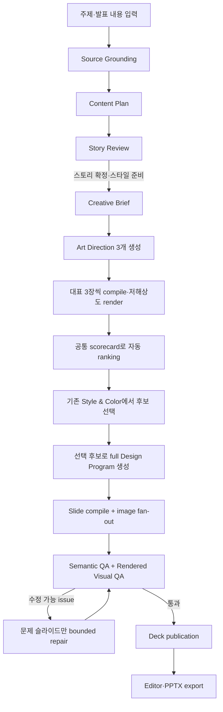
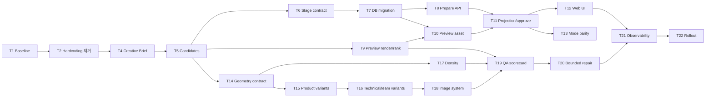

# AI PPT Creative Direction 및 생성 품질 고도화 구현 계획

> 기준일: 2026-07-18
>
> 상태: 구현 전 검토 요청
>
> 선행 기준: `AI-PPT-생성-고도화-기획서-V12.md`, `ai-ppt-341-339-338-integrated-execution-plan.md`
>
> 범위: `/ai-ppt`의 텍스트 입력부터 편집 가능한 Deck JSON, 이미지 asset, 렌더링 QA, PPTX export까지

## 1. 목표

사용자가 주제와 발표 내용만 입력해도 Orbit이 콘셉트, 분위기, 색상, 타이포그래피, 모티프, 이미지 스타일, 레이아웃 리듬을 해석하고, 서로 다른 세 가지 아트 디렉션을 제안한 뒤 선택된 방향으로 일관된 발표자료를 생성하도록 한다.

이 계획의 핵심 결과는 다음 네 가지다.

1. 사용자 입력을 구조화된 `CreativeBrief`로 확장한다.
2. 같은 Brief에서 시각적으로 구분되는 `ArtDirectionCandidate` 세 개를 만들고 실제 렌더 미리보기로 선택하게 한다.
3. LLM은 디자인 문법과 geometry variant를 선택하고, 검증된 compiler가 좌표를 계산하게 한다.
4. 실제 렌더 결과를 공통 scorecard로 평가하고 문제가 있는 슬라이드만 제한적으로 다시 구성한다.

기존 `Deck JSON -> Editor -> PPTX export` source-of-truth 원칙, 공통 Job 상태, staged checkpoint, 이미지 provenance, legacy Deck 읽기 호환은 유지한다.

## 2. 이번 계획에서 확정한 제품 결정

사용자 확인을 거쳐 다음 두 가지를 확정했다.

- 기존 `/project/:projectId/style-color/:jobId` 화면을 세 가지 아트 디렉션 후보 선택 화면으로 확장한다. 팔레트와 폰트 선택은 후보를 덮어쓸 수 있는 고급 설정으로 유지한다.
- 후보 선택 UX는 `pg`, `bullmq`, `monolith` 등 queue transport와 분리해 모든 일반 AI PPT 생성에서 동일하게 제공한다. 실행 모드는 작업 운반 방식만 바꾸고 사용자 흐름을 바꾸지 않는다.

후보를 직접 클릭하지 않은 사용자는 자동 평가 1위 후보가 기본 선택된 상태로 생성할 수 있다. 따라서 별도의 Art Direction 페이지를 추가하지 않는다.

## 3. 현재 구현 대조 결과

### 3.1 이미 재사용할 수 있는 기반

- Python worker에는 `content-planning -> design-planning -> layout-compile` stage와 `program-v2` Art Director가 있다.
- `design_program.py`는 LLM이 composition을 선택하고 `composition_library.py`가 좌표를 만드는 역할 분리를 이미 갖고 있다.
- `visual_qa.py`는 PPTX를 PNG로 렌더링한 뒤 focal point, balance, image fit, crop, repetition, background rhythm, card overuse, color harmony, consistency를 평가한다.
- Worker에는 image fan-out, semantic quality, rendered visual quality, publication checkpoint와 planning/execution artifact 저장소가 있다.
- Story Review와 Style & Color 승인 화면, 승인 revision, stale update 방지, generation preview가 이미 있다.
- Editor와 PPTX export는 같은 Deck JSON을 소비한다.

즉 전체 생성기를 교체하지 않고 현재 stage 사이에 Creative Brief와 후보 렌더 단계를 삽입하고, 디자인 문법을 확장하는 방향이 적절하다.

### 3.2 즉시 제거해야 하는 제약

| 현재 위치 | 확인된 동작 | 영향 |
| --- | --- | --- |
| `apps/web/src/features/ai-ppt/AiPptMockupPage.tsx` | `brandlogy-modern`, `clean`, `minimal`을 초기 요청에 강제 | 사용자 텍스트보다 고정 스타일이 우선함 |
| 같은 파일의 submit 경로 | `defaultPaletteOptions[0]`을 생성 payload에 전달 | 선택 전 기본 팔레트가 최종 경로에 남을 수 있음 |
| `apps/api/src/generate-deck/story-plan-review.service.ts` | 승인 시 다시 `mediaPolicy=minimal`, `base=brandlogy-modern`을 조립 | Web 수정만으로 하드코딩이 제거되지 않음 |
| `packages/shared/src/deck/generate-deck.schema.ts` | `stylePackId`는 이미 optional이고 `visualRhythm` 기본값은 `auto` | `stylePackId: "auto"`를 새 enum처럼 보내지 말고 필드를 생략해야 함 |
| `services/python-worker/app/ai/design_program.py` | composition 13개, `variant`와 `backgroundMode`가 모두 `light | dark | image` | 배경과 geometry가 분리되지 않음 |
| `services/python-worker/app/ai/deck_generation/design_planning.py` | type scale을 cover 72, title 56, body 32, caption 24 이상으로 재강제 | technical/document 밀도에서 작은 보조 텍스트를 표현하기 어려움 |
| `packages/ai/src/image-providers.ts` | 생성 입력은 `prompt`만 받고 `1536x1024`, `medium` 고정 | hero, portrait, square object가 같은 비율로 생성됨 |
| `apps/worker/src/image-asset-pipeline.ts` | media placeholder 교체 시 `_media_caption`을 삭제 | caption과 credit이 최종 Deck에서 사라짐 |
| `apps/api/src/generate-deck/generate-deck.service.ts` | `storyReviewRequired`가 `AI_DECK_EXECUTION_MODE === "pg"`에 종속 | transport에 따라 제품 UX가 달라짐 |
| `apps/worker/src/generate-deck/execution-stage.processor.ts` | staged v2 Visual QA에 `maxRepairAttempts: 0` 전달 | 실제 렌더를 평가하지만 해당 경로에서 자동 수정하지 못함 |

### 3.3 현재 제안에서 수정할 부분

초기 제안의 `stylePackId: "auto"`는 현재 계약에 넣지 않는다. `stylePackId`를 생략하면 Python의 `select_style_pack()`과 주제 기반 profile 선택이 동작하며, 존재하지 않는 style pack ID 오류도 피할 수 있다.

초기 `/ai-ppt` 요청은 다음 원칙을 따른다.

```text
design.stylePackId       생략
design.visualRhythm      auto
design.densityTarget     medium (Brief에서 재결정)
design.mediaPolicy       hybrid
design.layoutDiversity   varied
visualPlanPolicy         design.mediaPolicy와 동일
design.paletteOverride   사용자가 명시적으로 고른 경우만 포함
design.fontOverride      사용자가 명시적으로 고른 경우만 포함
```

## 4. 목표 사용자 흐름



Story에서 수정한 title, message, 순서를 후보에 반영하기 위해 후보 생성은 Content Plan 직후 자동 실행하지 않는다. 사용자가 Story Review에서 `스타일 선택`을 누를 때 현재 draft를 서버에 저장한 뒤 `creative-brief` stage를 시작한다.

## 5. 목표 stage와 상태 계약

### 5.1 planning stage

```text
reference-extract-file
source-grounding
content-planning
        ↓ 사용자 Story Review
creative-brief
art-direction-preview
        ↓ 사용자 후보 선택
design-planning
layout-compile
```

`creative-brief`와 `art-direction-preview`는 singleton planning stage다. queue message에는 기존 규칙대로 `{ pipelineJobId, projectId, stage, shardKey: "" }`만 넣고, 큰 결과는 `ai_deck_planning_artifacts`에 저장한다.

### 5.2 Story Review 상태

기존 상태에 다음 두 상태를 additive하게 추가한다.

```text
review-pending
design-preparing
design-ready
regenerating
approved
cancelled
```

- `review-pending`: Story를 검토·편집할 수 있다.
- `design-preparing`: Creative Brief와 후보 preview를 생성 중이다.
- `design-ready`: 세 후보가 준비됐고 Style & Color에서 선택할 수 있다.
- Story를 다시 수정하거나 재생성하면 기존 후보 artifact와 preview를 무효화하고 `review-pending`으로 돌아간다.
- 후보 준비 실패는 부모 Job을 즉시 terminal 처리하지 않고, 안전한 오류 코드와 함께 `review-pending`으로 복귀해 다시 시도할 수 있게 한다. 반복 provider/schema 실패는 기존 stage retry 정책에 따라 terminal 처리한다.

### 5.3 모든 실행 모드에서 같은 UX 유지

`storyReviewRequired`를 `AI_DECK_EXECUTION_MODE`에서 계산하지 않는다. `/ai-ppt`의 product policy로 결정해 stored Job payload에 저장한다.

- `pg`: DB checkpoint runner가 후보 준비와 승인 이후 작업을 이어 간다.
- `bullmq`: 동일 checkpoint를 BullMQ가 운반한다.
- `monolith`: 승인 전 planning stage는 동일 durable artifact 경로를 사용한다. 승인 후에는 approved Content Plan과 candidate artifact를 읽는 continuation entrypoint로 기존 monolithic final generation을 이어 가며 source/content planning을 다시 실행하지 않는다. monolith가 Story/후보 선택을 건너뛰는 fallback은 제공하지 않는다.

이 분리를 완료하기 전에는 후보 UX를 production default로 켜지 않는다.

## 6. 핵심 내부 계약

### 6.1 Creative Brief

`CreativeBrief`는 사용자에게 긴 디자인 프롬프트를 요구하지 않기 위한 내부 계약이다. 자유형 문장만 저장하지 않고 아래처럼 bounded schema로 검증한다.

```py
class CreativeBrief(BaseModel):
    version: Literal["creative-brief-v1"]
    presentation_archetype: PresentationArchetype
    visual_metaphor: str
    brand_traits: list[str]
    palette_strategy: PaletteStrategy
    typography_strategy: TypographyStrategy
    motif_system: list[MotifId]
    surface_system: SurfaceSystem
    identity_strategy: IdentityStrategy
    image_system: ImageSystem
    layout_rhythm: list[LayoutIntensity]
    density_profile: DensityProfile
    media_budget: int
    forbidden_patterns: list[ForbiddenPattern]
```

초기 enum 범위는 작고 명시적으로 시작한다.

```text
PresentationArchetype
- future-saas-launch
- editorial-minimal
- dark-technical
- warm-human-centered
- executive-data

DensityProfile
- cinematic
- balanced
- technical
- document

LayoutIntensity
- brand-strong
- restrained
- product-focus
- technical-focus
```

사용자가 색상, 폰트, 브랜드 규칙을 명시했거나 Saved Design Pack이 lock한 값은 Creative Brief가 덮어쓰지 않는다.

### 6.2 Art Direction Candidate

```py
class ArtDirectionCandidate(BaseModel):
    candidate_id: str
    name: str
    rationale: str
    archetype: PresentationArchetype
    palette: PaletteStrategy
    typography: TypographyStrategy
    motif_system: list[MotifId]
    surface_system: SurfaceSystem
    identity_strategy: IdentityStrategy
    image_system: ImageSystem
    density_profile: DensityProfile
    geometry_families: list[GeometryFamily]
    sample_slide_orders: list[int]
    sample_recipe_keys: list[str]
```

세 후보의 모든 쌍은 다음 차원 중 최소 세 개가 달라야 한다.

```text
typography family
background strategy
primary geometry family
motif system
image medium
surface style
density profile
visual metaphor
```

단순히 palette만 다른 세 후보는 schema 후 검증에서 거부하고 1회 재생성한다. 두 번째에도 구분 기준을 만족하지 못하면 deterministic archetype fallback 세트를 사용한다.

### 6.3 Candidate preview artifact

preview는 후보마다 표지, 핵심 기능 또는 제품 데모, 아키텍처 또는 프로세스 세 장을 사용한다. Content Plan에 해당 기능이 없으면 deterministic priority로 가장 가까운 slide type을 선택한다.

planning artifact에는 binary나 signed URL을 저장하지 않는다.

```ts
type ArtDirectionPreviewArtifact = {
  artifactVersion: 1;
  creativeBriefArtifactId: string;
  candidates: Array<{
    candidateId: string;
    name: string;
    rationale: string;
    previewFileId: string;
    sampleSlideOrders: number[];
    score: CandidateScorecard;
  }>;
  recommendedCandidateId: string;
  rankingVersion: "art-direction-rank-v1";
};
```

montage PNG는 project-scoped asset으로 저장하고 `purpose: "thumbnail"`을 재사용한다. API는 project 접근 권한을 확인한 뒤 응답 직전에 URL을 만든다. base64, 내부 prompt, provider 원문은 artifact, Job result, 로그에 남기지 않는다.

### 6.4 선택 계약

`StoryPlanApproveRequest.designSelection`에는 `artDirectionCandidateId`를 additive하게 추가한다. 새 후보 artifact가 있는 Job에서는 candidate ID를 필수로 검증하고, 후보가 없는 in-flight legacy Job은 기존 palette/font selection을 계속 허용한다.

팔레트와 폰트는 다음 우선순위를 사용한다.

```text
Saved Design Pack locked value
> 사용자 고급 설정 override
> 선택한 Art Direction
> Creative Brief fallback
```

승인 transaction은 다음을 함께 처리한다.

- review revision과 candidate artifact identity 검증
- 선택한 candidate snapshot 저장
- optional palette/font override 적용
- review를 `approved`로 변경
- `design-planning` checkpoint 생성 또는 monolith continuation enqueue

### 6.5 Design Program 호환

기존 Deck과 repair code가 `variant`를 읽으므로 즉시 삭제하지 않는다.

```py
class SlideCompositionDirection(BaseModel):
    composition_id: CompositionId
    geometry_variant: GeometryVariant
    background_mode: BackgroundMode
    variant: BackgroundMode  # historical read compatibility; 신규 선택에는 사용하지 않음
```

신규 compiler 선택 key는 `(compositionId, geometryVariant)`다. `backgroundMode`는 배경만 결정한다. 기존 `program-v2` snapshot은 계속 읽고, `geometryVariant`가 없으면 `default`로 normalize한다.

## 7. 디자인 문법 확장 범위

### 7.1 초기 archetype 5개

| Archetype | 핵심 시각 언어 | 대표 사용처 |
| --- | --- | --- |
| `future-saas-launch` | 밝은 바탕, blue/violet, 3D editorial, orbit motif | AI/SaaS 제품 발표 |
| `editorial-minimal` | 흰색·검정, 초대형 문장, 비대칭 split | 전략·브랜드 스토리 |
| `dark-technical` | navy, neon accent, layered system diagram | 아키텍처·기술 데모 |
| `warm-human-centered` | warm neutral, organic motif, illustration | 교육·코칭·서비스 경험 |
| `executive-data` | restrained palette, metric hierarchy, dense evidence | 경영진 보고·제안 |

### 7.2 초기 recipe/geometry 목표

1차 목표는 slide function 8개, geometry variant 24개다.

| Slide function | 초기 geometry variants |
| --- | --- |
| cover | `brand-center`, `visual-left`, `visual-right`, `full-bleed` |
| problem | `statement-left`, `illustration-right`, `editorial-60-40` |
| feature | `three-pillars`, `large-plus-two`, `bento-3`, `product-centered-orbit` |
| product-demo | `browser-stage`, `screenshot-callout-right`, `bottom-caption`, `full-bleed-product` |
| architecture/process | `diagram-horizontal`, `diagram-radial`, `layered-system`, `side-rail` |
| challenge/comparison | `before-after`, `step-story`, `evidence-split` |
| team | `portrait-grid`, `lead-plus-members`, `orbit-constellation` |
| closing | `brand-return`, `cta-split` |

후속 목표는 slide function 12~16개, geometry variant 40~60개다. 새 variant는 편집 가능한 text, shape, connector, image element만 만들며 복잡한 정보 구조를 AI 이미지로 평면화하지 않는다.

### 7.3 density profile

현재의 전역 최소 font size 강제를 profile별 token으로 교체한다. 아래 수치는 초기값이며 한글 overflow fixture로 보정한다.

| Profile | cover | title | body | caption | 용도 |
| --- | ---: | ---: | ---: | ---: | --- |
| cinematic | 72 | 56 | 32 | 24 | 표지·statement |
| balanced | 64 | 44 | 24 | 18 | 일반 본문 |
| technical | 56 | 36 | 20 | 15 | 아키텍처·제품 설명 |
| document | 48 | 32 | 18 | 14 | 제출·경영진 문서 |

font size를 낮추는 것만으로 밀도를 해결하지 않는다. content item 상한, line height, safe area, minimum tap/edit target, overflow validation을 profile과 함께 검증한다.

### 7.4 motif와 임시 identity

초기 native motif는 다음 8개로 제한한다.

```text
orbit-line
spark
planet-dot
gradient-sphere
direction-arrow
signal-wave
human-link
data-axis
```

임시 mark는 SVG path 또는 Deck native shape로 만들고 wordmark는 실제 font로 렌더링한다. AI 이미지 안에 로고 글자를 생성하지 않는다. Deck metadata에는 `identityDisclosure: "ai-generated-presentation-identity"`를 남기고 UI/PPTX notes 또는 export metadata에서 확인할 수 있게 한다.

## 8. 이미지 시스템

### 8.1 provider 입력

```ts
type GenerateImageInput = {
  subjectPrompt: string;
  stylePrompt: string;
  visualMetaphor: string;
  palette: string[];
  consistencyKey: string;
  targetWidth: number;
  targetHeight: number;
  aspectRatio: number;
  quality: "draft" | "final";
  negativeStylePrompt?: string;
};
```

provider adapter는 임의 크기를 그대로 외부 API에 보내지 않고 지원되는 size로 quantize한 뒤 target frame과 crop focus를 반환한다. `consistencyKey`는 seed 보장을 의미하지 않으며 같은 덱의 style prompt, palette, lighting, camera 규칙을 공유하고 관측·cache grouping에 쓰는 키다.

후보 preview에서는 생성 이미지를 호출하지 않는다. native motif와 명시적 placeholder로 아트 디렉션을 비교하고, 선택된 후보의 final deck에서만 AI 이미지를 10장 기준 2~4장 생성한다.

### 8.2 caption과 provenance

`slideVisualPlanSchema`에 다음 optional field를 추가한다.

```text
imageIntro
imageCaption
assetCredit
```

- `imageIntro`: 이미지가 맡는 메시지 역할
- `imageCaption`: 이미지 아래 표시할 독립 텍스트
- `assetCredit`: 공개/공식 asset의 저작자·출처·license 요약

placeholder를 asset으로 바꿀 때 `_media_caption`을 삭제하지 않는다. AI atmosphere처럼 caption이 불필요하면 composition 단계에서 만들지 않고, evidence image는 caption 또는 credit 중 하나 이상을 유지한다. credit 원문 전체와 signed URL은 Deck text에 넣지 않는다.

## 9. 후보 및 최종 덱 평가

### 9.1 후보 scorecard

| 항목 | 가중치 |
| --- | ---: |
| 콘텐츠 전달력 | 25 |
| 시각적 완성도 | 25 |
| 세 장 간 일관성 | 15 |
| 레이아웃 다양성 | 10 |
| 이미지/모티프 적합성 | 10 |
| 가독성 | 10 |
| 편집 가능성 | 5 |

결정론적 validator가 overflow, overlap, contrast, safe area, unsupported element, recipe contract를 먼저 검사한다. blocking issue가 있는 후보는 VLM 점수와 관계없이 추천하지 않는다. VLM은 렌더 montage를 보고 subject fit, visual hierarchy, archetype fidelity, coherence를 평가한다.

초기 hard gate는 calibration fixture에서 확정한다. 임시 기준은 총점 75/100 이상, blocking issue 0, 후보 간 distinctness 3차원 이상이다.

### 9.2 final deck scorecard

최종 QA는 기존 issue 검출에 다음을 추가한다.

```text
Content
Design
Coherence
art direction fidelity
adjacent silhouette duplication
card overuse
image style consistency
caption/provenance completeness
text density profile compliance
editability
```

`semantic-quality`은 내용, 출처, speaker notes, native structure를 담당하고 `rendered-visual-quality`은 실제 pixels와 덱 전체 리듬을 담당한다. 같은 문제를 두 stage가 서로 다른 코드로 중복 보고하지 않도록 issue ownership 표를 테스트로 고정한다.

### 9.3 bounded repair

staged v2에서 현재 비활성인 repair를 다시 켜되 전체 덱 재생성을 허용하지 않는다.

- 한 번의 generation에서 최대 2회
- 한 회에 최대 3개 slide
- 허용 action은 geometry 변경, focal scale, crop, background, cards 축소, copy 축약으로 제한
- Story content와 source ledger 의미는 변경하지 않음
- 새 이미지가 필요한 repair만 해당 slide asset을 다시 resolve
- repair 후 semantic validation과 rendered review를 모두 재실행
- generation preview API는 마지막 quality artifact의 repaired Deck을 우선 표시해 최종 publication과 차이가 없게 함

## 10. 성공 지표와 운영 예산

### 10.1 품질 지표

| 지표 | 완료 기준 |
| --- | --- |
| Deck/Editor/PPTX 계약 | 대표 fixture 전부 schema issue 0, Editor issue 0, PPTX 장수·텍스트·이미지 정합 |
| 후보 구분 | 모든 후보 쌍이 8개 차원 중 3개 이상 다름 |
| 시각 다양성 | 8장 이상 덱에서 adjacent silhouette 중복 0, unique core geometry ratio 0.6 이상 |
| media budget | 10장 기준 AI image 2~4, native diagram/chart 2~4, 제품/근거 image 2~4 |
| caption | evidence image의 caption/credit 누락 0 |
| human preference | baseline 대비 blind pairwise 선호 70% 이상 |
| editability | architecture/process/comparison이 native element로 유지되고 flattened AI diagram 0 |

### 10.2 latency/cost 초기 예산

| 항목 | 초기 목표 |
| --- | --- |
| 세 후보 preview ready P95 | 90초 이하 |
| preview provider call | text/VLM 합계 최대 2회, image generation 0회 |
| full deck AI image | 기본 최대 4개 |
| final visual repair | 최대 2회, 최대 3개 slide/회 |

실측 baseline이 없는 항목은 Phase 0에서 먼저 계측하고, production hard gate 전에 수치를 조정한다.

## 11. 단계별 구현 작업

모든 작업은 하나의 집중 세션에서 구현·검증할 수 있도록 S 또는 M 크기로 나눴다. 공통 계약을 먼저 병합하고 Web/API/Python mirror를 뒤따르게 한다.

### Phase 0 — 현재 제약 제거와 baseline

#### Task 1: 시각 품질 baseline fixture와 scorecard 고정

**Description:** 현재 코드로 5개 archetype 대표 prompt를 생성해 composition usage, geometry fingerprint, media count, caption count, Visual QA issue, generation latency를 기록한다. 기존 V12 golden fixture는 회귀 기준으로 유지한다.

**Acceptance criteria:**

- [ ] 5개 archetype과 최소 3개 slide count 구간을 포함한 fixture manifest가 있다.
- [ ] 동일 Deck을 다시 평가하면 deterministic metric이 같은 값을 반환한다.
- [ ] baseline 결과와 목표 지표 차이가 문서에 기록된다.

**Verification:**

- [ ] `cd services/python-worker && uv run pytest tests/test_design_program.py tests/test_visual_qa.py`
- [ ] baseline evaluator가 fixture 전체를 성공 처리한다.

**Dependencies:** 없음

**Files likely touched:**

- `services/python-worker/tests/fixtures/creative_direction/`
- `services/python-worker/tests/test_creative_direction_baseline.py`
- `docs/testing/ai-ppt-creative-direction-evaluation.md`

**Estimated scope:** M

#### Task 2: Web/API 디자인 하드코딩 제거

**Description:** 초기 payload와 Story approval에서 `brandlogy-modern`, `clean`, `minimal`, 첫 번째 palette 강제를 제거한다. 초기 request는 `auto + hybrid + varied`만 전달하고 palette/font는 명시적 선택 또는 후보 승인 시에만 적용한다.

**Acceptance criteria:**

- [ ] 초기 payload에 `stylePackId`, `base=brandlogy-modern`, `mediaPolicy=minimal`이 없다.
- [ ] `design.mediaPolicy`와 `visualPlanPolicy.mediaPolicy`가 모두 `hybrid`다.
- [ ] Story approval이 선택된 candidate/override만 적용하고 고정 base를 재삽입하지 않는다.

**Verification:**

- [ ] `pnpm --filter @orbit/web test -- AiPptMockupPage`
- [ ] `pnpm --filter @orbit/api test -- story-plan-review.service.spec.ts`

**Dependencies:** Task 1

**Files likely touched:**

- `apps/web/src/features/ai-ppt/AiPptMockupPage.tsx`
- `apps/web/src/features/ai-ppt/AiPptMockupPage.test.ts`
- `apps/api/src/generate-deck/story-plan-review.service.ts`
- `apps/api/src/generate-deck/story-plan-review.service.spec.ts`

**Estimated scope:** M

#### Task 3: 이미지 caption/provenance 계약 보존

**Description:** visual plan에 caption field를 추가하고 placeholder 교체 뒤에도 독립 text element를 유지·갱신한다.

**Acceptance criteria:**

- [ ] `imageIntro`, `imageCaption`, `assetCredit`가 shared schema에서 optional로 검증된다.
- [ ] evidence placeholder가 실제 image로 바뀌어도 caption element가 남는다.
- [ ] AI atmosphere는 빈 credit을 억지로 만들지 않는다.

**Verification:**

- [ ] `pnpm --filter @orbit/shared test -- deck.schema.test.ts`
- [ ] `pnpm --filter @orbit/worker test -- image-asset-pipeline.spec.ts`
- [ ] `cd services/python-worker && uv run pytest tests/test_composition_library.py`

**Dependencies:** 없음

**Files likely touched:**

- `packages/shared/src/deck/deck.schema.ts`
- `packages/shared/src/deck/deck.schema.test.ts`
- `apps/worker/src/image-asset-pipeline.ts`
- `apps/worker/src/image-asset-pipeline.spec.ts`
- `services/python-worker/app/ai/deck_generation/visual_requirements.py`

**Estimated scope:** M

### Checkpoint A — P0

- [ ] 기존 GenerateDeck contract와 V12 golden fixture가 통과한다.
- [ ] 동일 prompt가 더 이상 Brandlogy/minimal media로 강제되지 않는다.
- [ ] 생성된 evidence image caption이 Editor와 PPTX에서 유지된다.

### Phase 1 — Creative Brief와 후보 계약

#### Task 4: Creative Brief Pydantic schema와 generator

**Description:** content plan과 사용자/Saved Design Pack constraint를 입력으로 strict `CreativeBrief`를 생성하고 deterministic fallback을 제공한다.

**Acceptance criteria:**

- [ ] schema는 enum, 길이, media budget, layout rhythm을 제한한다.
- [ ] locked palette/font/forbidden style을 생성 결과가 위반하지 않는다.
- [ ] provider 불가 시 주제/profile 기반 fallback Brief를 반환한다.

**Verification:**

- [ ] `cd services/python-worker && uv run pytest tests/test_creative_brief.py`
- [ ] `uv run mypy app`

**Dependencies:** Task 2

**Files likely touched:**

- `services/python-worker/app/ai/creative_brief.py`
- `services/python-worker/app/ai/deck_generation/models.py`
- `services/python-worker/tests/test_creative_brief.py`

**Estimated scope:** M

#### Task 5: 세 Art Direction과 distinctness validator

**Description:** 하나의 Brief에서 세 후보를 만들고 후보 쌍별 차원을 검증한다. schema retry 후에도 실패하면 archetype fallback을 사용한다.

**Acceptance criteria:**

- [ ] 항상 candidate ID가 다른 정확히 3개 후보를 반환한다.
- [ ] 모든 후보 쌍이 최소 3개 차원에서 다르다.
- [ ] palette만 다른 provider 응답이 테스트에서 거부된다.

**Verification:**

- [ ] `cd services/python-worker && uv run pytest tests/test_art_direction.py`
- [ ] fallback 결과도 같은 distinctness 검사를 통과한다.

**Dependencies:** Task 4

**Files likely touched:**

- `services/python-worker/app/ai/art_direction.py`
- `services/python-worker/tests/test_art_direction.py`
- `services/python-worker/app/ai/creative_brief.py`

**Estimated scope:** M

#### Task 6: planning stage/shared artifact 계약 확장

**Description:** `creative-brief`, `art-direction-preview` stage와 strict artifact payload를 shared, Worker planning contract, Python stage DTO에 추가한다.

**Acceptance criteria:**

- [ ] stage enum 순서와 input/result reference 규칙이 TypeScript/Python에서 일치한다.
- [ ] planning artifact에 binary, signed URL, prompt 원문을 넣으면 schema가 거부한다.
- [ ] 기존 9개 stage message와 historical artifact parsing이 유지된다.

**Verification:**

- [ ] `pnpm --filter @orbit/shared test -- ai-deck-generation-stage.schema.test.ts`
- [ ] `pnpm --filter @orbit/worker test -- planning-stage-contract`
- [ ] `cd services/python-worker && uv run pytest tests/test_generate_deck_stages.py`

**Dependencies:** Tasks 4, 5

**Files likely touched:**

- `packages/shared/src/jobs/ai-deck-generation-stage.schema.ts`
- `packages/shared/src/jobs/ai-deck-generation-stage.schema.test.ts`
- `apps/worker/src/generate-deck/planning-stage-contract.ts`
- `apps/worker/src/generate-deck/planning-stage-contract.spec.ts`
- `services/python-worker/app/ai/deck_generation/stage_runtime.py`

**Estimated scope:** M

#### Task 7: stage/Artifact DB CHECK migration

**Description:** 두 planning stage를 checkpoint와 artifact table CHECK에 추가하고 up/down migration을 검증한다.

**Acceptance criteria:**

- [ ] 새 stage의 singleton shard와 `planningArtifactId` locator만 허용된다.
- [ ] 기존 row를 삭제하거나 rewrite하지 않고 migration이 적용된다.
- [ ] down migration은 새 stage row/artifact를 명시적으로 정리한 뒤 기존 CHECK를 복원한다.

**Verification:**

- [ ] migration unit spec 통과
- [ ] `docker compose up -d postgres && pnpm db:migration:run && pnpm db:migration:revert`

**Dependencies:** Task 6

**Files likely touched:**

- `apps/api/src/database/migrations/<timestamp>-AddAiDeckCreativeDirectionStages.ts`
- `apps/api/src/database/migrations/<timestamp>-AddAiDeckCreativeDirectionStages.spec.ts`

**Estimated scope:** S

### Checkpoint B — 계약 기반

- [ ] Creative Brief와 후보 3개를 standalone Python test에서 생성할 수 있다.
- [ ] stage schema, DB CHECK, artifact repository가 새 stage를 왕복 저장한다.
- [ ] 공개 `GenerateDeckRequest`에는 내부 Creative Brief 전체를 추가하지 않는다.

### Phase 2 — 기존 Style & Color에 실제 후보 연결

#### Task 8: Story draft 확정 및 design preparation API

**Description:** Story Review의 현재 draft를 저장하고 `creative-brief`를 enqueue하는 `prepare-style` mutation을 추가한다. revision, stale draft, 재생성, 취소를 기존 transaction 경계에서 처리한다.

**Acceptance criteria:**

- [ ] `prepare-style`은 draft 저장, 상태 변경, checkpoint 생성을 한 transaction에서 수행한다.
- [ ] stale revision은 `409`이고 중복 요청은 멱등이다.
- [ ] Story 수정/재생성 시 이전 candidate artifact와 preview가 선택에 사용되지 않는다.

**Verification:**

- [ ] API service unit test와 PostgreSQL integration test 통과
- [ ] 동일 revision 중복 호출에서 checkpoint가 하나만 존재한다.

**Dependencies:** Task 7

**Files likely touched:**

- `packages/shared/src/deck/story-plan-review.schema.ts`
- `apps/api/src/generate-deck/story-plan-review.controller.ts`
- `apps/api/src/generate-deck/story-plan-review.service.ts`
- `apps/api/src/generate-deck/story-plan-review.service.spec.ts`
- `apps/api/src/generate-deck/story-plan-review.postgres.integration.spec.ts`

**Estimated scope:** M

#### Task 9: Python candidate sample compile·render·rank

**Description:** 대표 slide 3개를 고르고 후보별 sample Deck을 compile한 뒤 montage를 렌더링하고 공통 scorecard로 평가한다. preview에는 AI image provider를 호출하지 않는다.

**Acceptance criteria:**

- [ ] 후보마다 cover + body + technical/product 기능을 대표하는 3장을 렌더링한다.
- [ ] deterministic validator가 blocking issue 후보를 추천하지 않는다.
- [ ] response는 정확히 3개 montage와 versioned scorecard를 반환한다.

**Verification:**

- [ ] `cd services/python-worker && uv run pytest tests/test_art_direction_preview.py`
- [ ] provider mock에서 image generation call count가 0이다.
- [ ] LibreOffice/render dependency가 없는 환경의 실패가 안전한 stage error로 변환된다.

**Dependencies:** Tasks 5, 6

**Files likely touched:**

- `services/python-worker/app/ai/art_direction_preview.py`
- `services/python-worker/app/ai/visual_qa.py`
- `services/python-worker/app/ai/deck_generation/stage_runtime.py`
- `services/python-worker/app/main.py`
- `services/python-worker/tests/test_art_direction_preview.py`

**Estimated scope:** M

#### Task 10: Worker preview asset 저장과 artifact 정규화

**Description:** Python의 montage bytes를 storage/project asset으로 저장하고 planning artifact에는 `previewFileId`만 남긴다.

**Acceptance criteria:**

- [ ] candidate별 PNG가 project-scoped `thumbnail` asset으로 저장된다.
- [ ] artifact/Job/log에 base64와 signed URL이 없다.
- [ ] retry는 같은 candidate identity의 asset을 중복 누적하지 않는다.

**Verification:**

- [ ] Worker unit test에서 storage PUT, DB upsert, artifact sanitize 검증
- [ ] stage retry 후 candidate 수와 active preview 수가 각각 3개다.

**Dependencies:** Tasks 7, 9

**Files likely touched:**

- `apps/worker/src/generate-deck/planning-stage.processor.ts`
- `apps/worker/src/generate-deck/art-direction-preview-assets.ts`
- `apps/worker/src/generate-deck/art-direction-preview-assets.spec.ts`
- `apps/worker/src/generate-deck/planning-artifact-repository.ts`

**Estimated scope:** M

#### Task 11: candidate projection과 승인 계약

**Description:** Story response에 안전한 candidate metadata와 접근 URL을 projection하고, 승인 시 selected candidate identity를 검증한다.

**Acceptance criteria:**

- [ ] `design-ready` 응답은 3개 후보, recommended ID, score 요약, preview URL만 노출한다.
- [ ] 다른 project/user는 preview를 읽을 수 없다.
- [ ] legacy Job은 기존 palette/font approval을 계속 처리한다.

**Verification:**

- [ ] shared schema test, API projection test, authorization test 통과
- [ ] 응답 JSON에 internal prompt, source 원문, storage key가 없다.

**Dependencies:** Tasks 8, 10

**Files likely touched:**

- `packages/shared/src/deck/story-plan-review.schema.ts`
- `packages/shared/src/deck/story-plan-review.schema.test.ts`
- `apps/api/src/generate-deck/story-plan-review.service.ts`
- `apps/api/src/generate-deck/story-plan-review.service.spec.ts`
- `apps/api/src/files/files.service.ts`

**Estimated scope:** M

#### Task 12: Style & Color 후보 선택 UI

**Description:** 기존 화면을 세 개 preview 카드, 추천 배지, rationale, 고급 palette/font accordion으로 확장한다. 직접 선택하지 않으면 추천 후보가 선택된 상태다.

**Acceptance criteria:**

- [ ] loading, retryable error, design-ready, approved 상태를 모두 표시한다.
- [ ] keyboard와 mobile에서 후보 선택이 가능하고 선택 상태가 명확하다.
- [ ] 승인 payload가 candidate ID와 optional override를 보낸다.

**Verification:**

- [ ] `pnpm --filter @orbit/web test -- AiPptMockupPage.ui.test.ts`
- [ ] route/state test에서 기존 Story -> Style -> Generation 순서가 유지된다.
- [ ] 실제 preview 이미지가 없을 때 안전한 placeholder와 retry action을 제공한다.

**Dependencies:** Task 11

**Files likely touched:**

- `apps/web/src/features/ai-ppt/AiPptMockupPage.tsx`
- `apps/web/src/features/ai-ppt/AiPptMockupPage.ui.test.ts`
- `apps/web/src/features/ai-ppt/story-plan-api.ts`
- `apps/web/src/features/ai-ppt/ai-ppt-mockup.css`

**Estimated scope:** M

#### Task 13: 실행 모드와 review policy 분리

**Description:** 모든 일반 AI PPT 생성이 같은 Story/Art Direction gate를 사용하게 한다. monolith에는 approved Content Plan과 candidate artifact에서 시작하는 continuation entrypoint를 추가해 source/content를 다시 생성하지 않으며, 실행 모드는 approval 전후 stage 운반 방식만 결정하게 한다.

**Acceptance criteria:**

- [ ] 세 실행 모드의 start response가 동일한 review policy를 반환한다.
- [ ] 승인 전에는 어떤 모드도 final Deck을 publication하지 않는다.
- [ ] 승인 후 선택된 candidate snapshot이 세 모드 모두 같은 Design Program 입력으로 전달된다.
- [ ] monolith continuation이 approved title/message/order와 candidate ID를 보존하고 content planning을 다시 호출하지 않는다.

**Verification:**

- [ ] API mode matrix test 통과
- [ ] Worker mode matrix에서 `design-ready -> approve -> succeeded` E2E 통과
- [ ] monolith rollback smoke가 candidate selection을 건너뛰지 않는다.

**Dependencies:** Tasks 8, 11

**Files likely touched:**

- `apps/api/src/generate-deck/generate-deck.service.ts`
- `apps/api/src/generate-deck/generate-deck.service.spec.ts`
- `apps/worker/src/generate-deck.processor.ts`
- `apps/worker/src/generate-deck.processor.spec.ts`
- `services/python-worker/app/ai/deck_generation/pipeline.py`

**Estimated scope:** M

### Checkpoint C — 사용자 선택 vertical slice

- [ ] 텍스트 입력부터 Story Review, 세 preview, 후보 선택, 최종 Deck까지 한 흐름으로 동작한다.
- [ ] 세 실행 모드가 같은 후보와 선택 결과를 사용한다.
- [ ] 후보 preview에는 AI image 생성 비용이 발생하지 않는다.

### Phase 3 — geometry, motif, density 확장

#### Task 14: `geometryVariant` additive 계약과 compiler registry

**Description:** background와 geometry를 분리하고 기존 `variant` snapshot을 normalize하는 registry를 추가한다.

**Acceptance criteria:**

- [ ] `geometryVariant` 없는 historical Deck이 `default`로 읽힌다.
- [ ] 지원하지 않는 `(compositionId, geometryVariant)` 조합은 compile 전에 거부된다.
- [ ] LLM은 좌표가 아니라 registry key만 반환한다.

**Verification:**

- [ ] Python design program/composition tests 통과
- [ ] shared Deck historical compatibility test 통과

**Dependencies:** Task 5

**Files likely touched:**

- `services/python-worker/app/ai/design_program.py`
- `services/python-worker/app/ai/composition_library.py`
- `services/python-worker/tests/test_design_program.py`
- `services/python-worker/tests/test_composition_library.py`
- `packages/shared/src/deck/deck.schema.ts`

**Estimated scope:** M

#### Task 15: cover·problem·feature·product geometry 15개

**Description:** 사용자 가치가 큰 브랜드/제품 slide function부터 첫 geometry 묶음을 구현한다.

**Acceptance criteria:**

- [ ] 표지 4, 문제 3, 기능 4, 제품 데모 4 variant가 compile된다.
- [ ] variant별 core geometry fingerprint가 의도대로 구분된다.
- [ ] 동일 content를 넣어도 adjacent silhouette 반복을 피할 후보가 존재한다.

**Verification:**

- [ ] composition golden test 15개 통과
- [ ] Editor renderer와 PPTX export smoke에서 element 누락 0

**Dependencies:** Task 14

**Files likely touched:**

- `services/python-worker/app/ai/composition_library.py`
- `services/python-worker/tests/test_composition_library.py`
- `services/python-worker/tests/fixtures/compositions/`

**Estimated scope:** M

#### Task 16: architecture·challenge·team·closing geometry 9개와 motif

**Description:** 기술/팀/마무리 slide를 native shapes, connectors, SVG motif로 확장한다.

**Acceptance criteria:**

- [ ] architecture/process 4, challenge 3, team 3, closing 2 variant 중 총 초기 목표 24개 이상이 registry에 있다.
- [ ] architecture/process는 AI image가 아닌 editable shape/connector로 구성된다.
- [ ] 임시 identity mark가 slide마다 같은 path와 clear space를 사용한다.

**Verification:**

- [ ] composition/motif unit test 통과
- [ ] Deck schema와 PPTX export에서 connector/shape 정합성 통과

**Dependencies:** Task 15

**Files likely touched:**

- `services/python-worker/app/ai/composition_library.py`
- `services/python-worker/app/ai/motif_library.py`
- `services/python-worker/tests/test_composition_library.py`
- `services/python-worker/tests/test_motif_library.py`

**Estimated scope:** M

#### Task 17: density profile과 한글 overflow 보정

**Description:** 전역 `max(72/56/32/24)` 강제를 제거하고 네 density profile의 type/spacing token을 적용한다.

**Acceptance criteria:**

- [ ] technical/document slide가 18~20px body와 14~15px caption을 사용할 수 있다.
- [ ] cinematic slide의 큰 focal typography는 유지된다.
- [ ] 한글, 영문, 숫자/코드 혼합 fixture에서 overflow와 overlap issue가 0이다.

**Verification:**

- [ ] `cd services/python-worker && uv run pytest tests/test_design_program.py tests/test_generate_deck_contract.py`
- [ ] Web Editor validation fixture 통과

**Dependencies:** Task 14

**Files likely touched:**

- `services/python-worker/app/ai/deck_generation/design_planning.py`
- `services/python-worker/app/ai/composition_library.py`
- `services/python-worker/tests/test_design_program.py`
- `apps/web/src/features/editor/ai/quality/editorValidation.test.ts`

**Estimated scope:** M

### Checkpoint D — 디자인 문법

- [ ] 5개 archetype이 palette뿐 아니라 typography, background, geometry, motif에서 구분된다.
- [ ] 초기 geometry variant 24개 이상이 compile·Editor·PPTX 경로를 통과한다.
- [ ] technical/document density가 작은 글자 남용 없이 정보량을 수용한다.

### Phase 4 — 이미지 일관성과 렌더 repair

#### Task 18: deck-level image style와 aspect-aware provider

**Description:** 생성 이미지 입력을 deck image system과 target frame 정보로 확장하고 provider-supported size mapping을 구현한다.

**Acceptance criteria:**

- [ ] hero, portrait, square frame이 서로 다른 supported size로 요청된다.
- [ ] 같은 Deck의 모든 image prompt가 동일한 style/palette/lighting context를 공유한다.
- [ ] architecture/process slide는 image generator 대상에서 제외된다.

**Verification:**

- [ ] `pnpm --filter @orbit/ai test -- image-providers.test.ts`
- [ ] Worker image pipeline test에서 target ratio와 generation prompt provenance 검증

**Dependencies:** Tasks 5, 16

**Files likely touched:**

- `packages/ai/src/index.ts`
- `packages/ai/src/image-providers.ts`
- `packages/ai/src/image-providers.test.ts`
- `apps/worker/src/image-asset-pipeline.ts`
- `apps/worker/src/image-asset-pipeline.spec.ts`

**Estimated scope:** M

#### Task 19: 후보/최종 QA scorecard와 diagnostics

**Description:** Content, Design, Coherence와 art direction fidelity를 versioned scorecard로 저장하고 기존 diagnostics에 안전한 요약만 추가한다.

**Acceptance criteria:**

- [ ] candidate와 final deck이 같은 rubric version을 사용한다.
- [ ] blocking issue와 advisory score가 분리된다.
- [ ] diagnostics에 원문 prompt, 발표 대본, asset URL이 포함되지 않는다.

**Verification:**

- [ ] shared diagnostics schema test와 Python visual QA test 통과
- [ ] scorecard weight 합이 100이고 unknown rubric version을 거부한다.

**Dependencies:** Tasks 9, 17, 18

**Files likely touched:**

- `packages/shared/src/deck/generate-deck.schema.ts`
- `packages/shared/src/deck/generate-deck.schema.test.ts`
- `services/python-worker/app/ai/visual_qa.py`
- `services/python-worker/tests/test_visual_qa.py`

**Estimated scope:** M

#### Task 20: staged v2 bounded visual repair와 preview parity

**Description:** `maxRepairAttempts: 0` 제한을 제거하고 repair 결과가 generation preview와 publication에 동일하게 반영되도록 quality artifact 우선 projection을 구현한다.

**Acceptance criteria:**

- [ ] 수정 가능한 issue는 최대 2회 내 해당 slide만 다시 compile된다.
- [ ] repair가 Story content/source ledger를 바꾸면 schema가 거부한다.
- [ ] generation preview와 최종 published Deck의 slide fingerprint가 같다.

**Verification:**

- [ ] Worker rendered visual quality/preview API test 통과
- [ ] repair 0회, 1회 성공, 2회 후 실패, provider unavailable 시나리오 통과

**Dependencies:** Tasks 14, 19

**Files likely touched:**

- `apps/worker/src/generate-deck/execution-stage.processor.ts`
- `apps/worker/src/generate-deck/rendered-visual-quality.ts`
- `apps/worker/src/generate-deck/execution-stage.processor.spec.ts`
- `apps/api/src/generate-deck/ai-deck-preview.service.ts`
- `apps/api/src/generate-deck/ai-deck-preview.service.spec.ts`

**Estimated scope:** M

### Phase 5 — rollout와 품질 승인

#### Task 21: 관측 이벤트, 선택 데이터, 비용·지연 계측

**Description:** 후보 준비, 자동 추천, 사용자 선택, preview latency, provider call, repair 결과를 개인정보 없이 업무 이벤트로 남긴다.

**Acceptance criteria:**

- [ ] candidate ID, rubric version, score, 선택 여부, duration, call count만 기록한다.
- [ ] prompt, speaker notes, source 원문, signed URL, credential은 로그에 없다.
- [ ] 선택률, 추천 유지율, preview P95, repair success를 집계할 수 있다.

**Verification:**

- [ ] event logger unit test와 redaction test 통과
- [ ] `docs/conventions/logging.md`에 event field가 문서화된다.

**Dependencies:** Tasks 12, 19, 20

**Files likely touched:**

- `apps/worker/src/generate-deck/stage-diagnostics.ts`
- `apps/worker/src/generate-deck/planning-stage.processor.ts`
- `apps/api/src/generate-deck/story-plan-review.service.ts`
- `docs/conventions/logging.md`

**Estimated scope:** M

#### Task 22: golden set 비교, feature rollout, 문서 동기화

**Description:** baseline과 새 경로를 blind 비교하고 contract/runbook을 갱신한 뒤 단계적으로 기본 경로를 전환한다.

**Acceptance criteria:**

- [ ] human pairwise preference 70% 이상과 hard correctness 기준을 충족한다.
- [ ] `pg`, `bullmq`, `monolith` E2E가 모두 통과한다.
- [ ] rollback 시 새 artifact를 삭제하지 않고 기존 Deck과 Job을 읽을 수 있다.

**Verification:**

- [ ] `pnpm build`
- [ ] `pnpm lint`
- [ ] `pnpm test`
- [ ] `node infra/scripts/check-env.mjs`
- [ ] `docker compose config`
- [ ] `cd services/python-worker && uv run ruff check . && uv run mypy app && uv run pytest`
- [ ] 대표 Deck의 Editor 전수 확인과 PPTX export 비교

**Dependencies:** Tasks 1~21

**Files likely touched:**

- `docs/contracts.md`
- `docs/runbooks/local-development.md`
- `docs/testing/ai-ppt-creative-direction-evaluation.md`
- `.env.example`
- `infra/scripts/check-env.mjs`

**Estimated scope:** M

### Checkpoint E — 완료

- [ ] 사용자는 디자인 세부 지시 없이 세 개의 실제 렌더 후보를 받는다.
- [ ] 추천 후보 또는 사용자가 고른 후보가 최종 Deck에 재현된다.
- [ ] 이미지, diagram, caption, identity가 편집 가능한 Deck JSON으로 유지된다.
- [ ] Visual QA가 실제 렌더를 보고 제한적으로 수정하며 preview와 publication이 일치한다.
- [ ] 세 실행 모드와 PPTX export가 같은 공통 계약을 지킨다.

## 12. 의존성 그래프와 병렬화



계약이 고정된 뒤에는 다음을 병렬 진행할 수 있다.

- Tasks 8과 9
- Tasks 12와 13
- Tasks 15와 17
- Task 18의 provider adapter와 Task 19의 score schema

같은 `composition_library.py`, stage enum, Story approval transaction을 만지는 작업은 순차 진행한다.

## 13. 현실적인 일정

현재 staged Job, Story approval, preview asset, historical compatibility까지 포함하면 전체 범위를 5~7일로 완료하는 것은 위험하다. 한 명 기준 현실적인 일정은 다음과 같다.

| 구간 | 예상 |
| --- | ---: |
| Phase 0 P0와 baseline | 1~2일 |
| Phase 1 Creative Brief/contract | 3~4일 |
| Phase 2 세 후보 실제 preview/선택 | 5~7일 |
| Phase 3 geometry 24개/density/motif | 5~7일 |
| Phase 4 image/QA/repair | 4~6일 |
| Phase 5 E2E/rollout | 2~3일 |

총 20~29 engineer-day가 적절하다. 계약 고정 후 Web, composition, image/QA를 분리하면 2~3명이 약 2주 내 병렬 수행할 수 있다.

가장 빠른 사용자 가치 전달 순서는 다음과 같다.

1. 1~2일: 하드코딩과 caption 결함 제거
2. 4~6일: `CreativeBrief -> 자동 추천 후보 1개 -> full deck` vertical slice
3. 추가 4~6일: 실제 렌더 후보 3개와 기존 Style & Color 선택 UI
4. 이후: geometry 24개, deck image system, bounded repair

## 14. 위험과 완화

| 위험 | 영향 | 완화 |
| --- | --- | --- |
| 후보 생성으로 latency 증가 | Style 화면 대기 증가 | preview에서 AI image 금지, 3장만 render, text/VLM call 최대 2회 |
| 세 후보가 색만 다름 | 선택 가치 없음 | 8차원 distinctness validator와 deterministic fallback |
| Story draft와 preview 불일치 | 신뢰 저하 | `prepare-style`에서 draft 저장 후 candidate stage 시작 |
| transport별 UX 분기 재발 | 환경별 기능 차이 | review policy를 execution mode와 분리하고 mode matrix E2E 고정 |
| DB CHECK와 stage enum 불일치 | stage terminal failure | shared -> migration -> Worker/Python 순서로 배포, contract test 선행 |
| preview binary가 artifact에 저장됨 | DB 비대화·정보 노출 | storage asset + `previewFileId`, artifact schema에서 base64 거부 |
| geometry 증가로 repair 조합 폭증 | 회귀·유지보수 비용 | `(compositionId, geometryVariant)` registry와 function별 golden test |
| 작은 font로 가독성 저하 | 발표 품질 악화 | density별 최소값, 16:9 render test, 한글 overflow fixture |
| consistencyKey를 seed처럼 오해 | 이미지 일관성 과대 기대 | style/palette/lighting 공유 키로만 정의하고 image QA 유지 |
| staged repair와 generation preview 불일치 | 사용자가 본 결과와 최종 Deck 차이 | quality artifact 우선 preview projection, fingerprint equality test |
| 임시 로고가 실제 상표로 오인 | 사용자 혼동 | native mark만 생성하고 AI-generated identity disclosure 저장 |

## 15. 범위 제외

이번 계획에서는 다음을 구현하지 않는다.

- 실제 제품 URL의 자동 browser capture
- 실제 팀원 얼굴 생성 또는 합성
- 공식 등록 로고 자동 생성
- 측정되지 않은 수치나 제품 기능 화면의 사실적 위조
- 처음부터 수백 개 slide library 구축 또는 model fine-tuning
- Kubernetes 전환 또는 새 queue transport 도입

제품 화면이 없으면 `Concept UI`, 임시 mark는 `AI-generated presentation identity`, 실제 팀 사진이 없으면 이니셜 또는 일관된 비실사 캐릭터로 명시한다.

## 16. 연구·제품 근거

- [AutoPresent](https://openaccess.thecvf.com/content/CVPR2025/papers/Ge_AutoPresent_Designing_Structured_Visuals_from_Scratch_CVPR_2025_paper.pdf)는 고수준 자연어 지시에서 시스템이 content와 visual planning을 함께 수행해야 하며, programmatic slide generation과 iterative refinement가 editable output과 품질 측면에서 유리하다고 보고한다.
- [PPTAgent / PPTEval](https://arxiv.org/html/2501.03936v3)은 프레젠테이션을 `Content`, `Design`, `Coherence` 세 축으로 평가하고 slide function/schema와 구조적 흐름의 중요성을 제시한다.
- [DeepPresenter](https://arxiv.org/html/2602.22839v1)는 내부 계획만 검토하지 않고 rendered pixels를 관찰해야 overflow, overlap, broken image, low contrast 같은 post-render defect를 수정할 수 있다고 설명한다.
- [Canva Magic Design](https://www.canva.com/create/ai-presentations/)은 짧은 아이디어에서 초안을 만들고 여러 on-brand layout 제안 중 선택하는 사용자 흐름을 제공한다.
- [Gamma AI image style](https://help.gamma.app/en/articles/11047204-how-can-i-customize-ai-image-styles)은 theme-level style prompt를 전체 생성 이미지에 적용해 시각적 일관성을 유지하는 방식을 제공한다.

## 17. 구현 시작 전 승인 체크리스트

- [ ] 본 계획의 `CreativeBrief`, candidate, scorecard field 범위를 승인한다.
- [ ] `prepare-style -> design-ready -> approve` 상태 전이를 승인한다.
- [ ] 모든 실행 모드에서 후보 선택 UX를 유지하는 transport 분리를 승인한다.
- [ ] 초기 archetype 5개와 geometry variant 24개 범위를 승인한다.
- [ ] Phase 0 baseline 완료 전 hard quality gate를 production에 켜지 않는 데 동의한다.
- [ ] 각 checkpoint 종료 시 human visual review를 수행한다.
