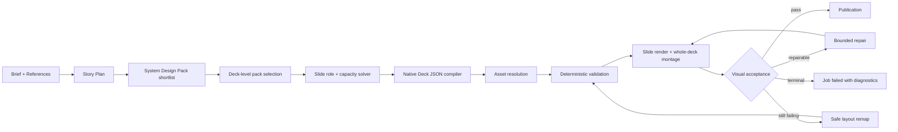

# AI PPT Curated Design Pack 및 시각 품질 게이트 구현 계획

> 상태: Proposed  
> 작성일: 2026-07-22  
> 대상 경로: `/createdeck → generate-deck → design-pack + program-v2 → editor → PPTX export`  
> 기준 프로젝트: `project_7156b624-8da6-4832-9277-199f9eaea532`

## 1. 목적

현재 AI PPT 생성기는 편집 가능한 `Deck JSON`, 코드 기반 composition compiler, 실제 렌더 기반 Vision QA를 이미 갖추고 있다. 그러나 현재 제품 경로는 하나의 기본 style pack을 고정하고, 제한된 composition 집합을 사용하며, 검출된 시각 이슈를 advisory로 남긴 채 발행한다. 이 계획은 기존 `program-v2`를 교체하지 않고 다음 세 가지를 추가해, 검수된 레퍼런스 수준의 결과를 반복 생성할 수 있게 한다.

1. 검수된 슬라이드 디자인을 `System Design Pack`과 layout catalog로 구조화한다.
2. AI가 덱 단위 pack 하나와 pack 내부의 slide layout을 의미·용량 기반으로 선택하게 한다.
3. 구조적 결함과 중대한 시각 결함이 남은 Deck은 보정·재매핑 전에는 발행하지 않는다.

최종 목표는 “매번 새로운 좌표를 생성하는 AI”가 아니라 “충분히 넓은 검수 레이아웃 집합에서 일관된 결과를 고르는 AI”다.

## 2. 현재 기준과 문제 정의

### 2.1 확인된 기준 결과

기준 프로젝트의 최초 AI 생성 Job과 현재 Deck을 읽기 전용으로 비교한 결과는 다음과 같다.

| 항목 | 확인 결과 | 의미 |
| --- | --- | --- |
| 생성 Job 상태 | `succeeded` | publication은 완료됨 |
| 생성 Job validation | `passed=false` | issue가 남은 결과가 발행됨 |
| validation issue | 25개 | 구조·디자인 경고가 누적됨 |
| Vision issue | `BALANCE_WEAK` 5개 | 3~7번 생성 슬라이드의 균형 문제가 검출됨 |
| repair | `repairAttempted=false` | 검출 후 실제 보정이 실행되지 않음 |
| 최초 생성 슬라이드 | 8장, image element 0개 | 생성 원본의 기준 |
| 현재 Deck | version 21, 9장 | 사용자 편집이 반영된 별도 상태 |

현재 보안 슬라이드의 큰 이미지 가림은 최초 생성 결과가 아니라 후속 편집 상태에서 생겼다. 따라서 생성 품질 게이트와 편집기 안전성 검증을 별도 작업으로 다룬다.

### 2.2 코드상 원인

- `apps/web/src/features/ai-ppt/AiPptMockupPage.tsx`가 `stylePackId = "brandlogy-modern"`을 고정한다.
- `services/python-worker/app/ai/design_program.py`와 `composition_library.py`의 curated composition은 표지 6개를 포함해 19개다.
- `metric-poster`는 message나 item에 숫자가 하나만 있어도 선택 가능하다.
- `apps/worker/src/generate-deck/rendered-visual-quality.ts`의 최종 acceptance 함수는 review와 관계없이 `true`를 반환한다.
- staged `program-v2` 경로는 image-slide 단위 Vision QA에 `maxRepairAttempts: 0`을 사용한다.
- final rendered-visual-quality stage는 전체 덱을 다시 렌더·검토하지 않고 개별 slide 결과를 `advisory`로 집계한다.
- 현재 계약은 모든 rendered Vision issue를 advisory로 취급하고 Vision provider unavailable도 조건부 발행한다.

### 2.3 레퍼런스 디자인 집합

초기 레퍼런스는 총 7개 PPTX, 139장이다. 런타임에서 plugin cache의 절대 경로를 참조하지 않는다. 제품에 포함하기 전 라이선스·재배포 가능 여부·폰트 사용 조건을 확인하고, 승인된 결과만 저장소 또는 관리형 asset storage로 ingest한다.

| Pack family | 레퍼런스 | 주 사용 맥락 |
| --- | --- | --- |
| Neutral | Simple Light, Simple Dark | 범용 설명, 제안, 교육, 내부 공유 |
| Executive Review | Operating Review, Business Review | 경영 보고, KPI, 표, 차트, 의사결정 |
| Kickoff & Alignment | Project Kickoff, Team Alignment | 목표, 역할, 일정, 로드맵, 합의 |
| Editorial Insight | Market Trends Report | 시장 인사이트, 강한 주장, 에디토리얼 서사 |

139장을 모두 product layout으로 등록하지 않는다. 1차에서는 의미가 겹치는 변형과 한글 용량이 부족한 장표를 제외하고 30~40개를 선별한다.

## 3. 범위

### 3.1 포함

- `program-v2` 내부 System Design Pack manifest와 registry
- 검수된 native Deck JSON layout catalog
- 덱 단위 자동 pack selector
- 슬라이드 단위 layout capacity solver
- pack selection과 layout provenance snapshot
- palette·typography·media hard rule
- staged pipeline의 bounded repair와 final whole-deck review
- 발행을 차단하는 시각 acceptance policy
- 편집기 이미지 가림·overflow 경고
- pack 추천 미리보기와 사용자 override
- golden deck, montage, PPTX export 회귀 검증

### 3.2 제외

- LLM이 임의 좌표·크기·zIndex를 생성하는 방식
- 슬라이드 전체를 이미지로 만들어 편집성을 포기하는 기본 경로
- 일반 GenerateDeck request에 제거된 `templateBlueprintId`나 `designReferences`를 즉시 복구하는 작업
- 139개 레퍼런스 장표의 무검수 일괄 등록
- 사용자 편집을 자동으로 되돌리거나 이미지 삽입을 무조건 차단하는 동작
- 기존 PPTX import·OOXML sync 계약의 대규모 재작성

## 4. 아키텍처 결정

### 4.1 기본 생성 경로는 native Design Pack으로 유지한다

`Deck JSON`을 source of truth로 유지한다. pack과 layout은 최종적으로 기존 `deck.theme`, `slide.style`, `slide.elements`, `slide.aiNotes.compositionPlan`에 컴파일된다. PPTX는 export 산출물이며 생성 원본이 아니다.

### 4.2 Pack은 덱 단위, layout은 슬라이드 단위로 선택한다

한 덱에서 서로 다른 디자인 family를 혼합하지 않는다. pack을 먼저 한 개 선택하고, 해당 pack이 허용하는 layout 안에서만 slide별 구성을 선택한다. light/dark 배경 변화는 같은 pack의 variant로 취급한다.

### 4.3 LLM과 코드의 책임을 분리한다

LLM은 다음만 결정한다.

- pack 후보의 의미 적합성
- slide role과 primary claim
- 허용된 `layoutId` 또는 `compositionId`
- 슬롯별 콘텐츠와 이미지 필요 여부

코드는 다음을 강제한다.

- slot capacity와 데이터 요구사항
- 좌표, 크기, zIndex, safe area
- 인접 silhouette 반복 제한
- palette와 typography hard rule
- deterministic validation, repair, fallback과 publication gate

### 4.4 OOXML template mode는 별도 검증 후 확장한다

원본 PPTX 충실도가 반드시 필요한 경우를 위해 OOXML-backed slide clone과 slot replacement를 후속 선택지로 남긴다. 일반 AI GenerateDeck 계약에 바로 연결하지 않고, 한 개 pack으로 spike를 수행한 뒤 native path 대비 품질·편집성·export 안정성을 통과한 경우에만 별도 제품 계획을 승인한다.

### 4.5 현재 계약과의 관계

이 문서는 구현 계획이며 아직 `docs/contracts.md`를 대체하지 않는다. 다음 정책 변경이 구현되는 PR은 `docs/contracts.md`를 같은 PR에서 갱신해야 한다.

- 모든 Vision issue가 advisory라는 기존 정책
- staged `program-v2`에서 synchronous repair를 하지 않는 정책
- final whole-deck Vision 재검사를 생략하는 정책
- wizard가 `brandlogy-modern`을 기본값으로 항상 전송하는 정책

### 4.6 고려한 대안

| 대안 | 장점 | 채택하지 않는 이유 |
| --- | --- | --- |
| 기존 composition 수만 늘림 | 구현이 가장 단순함 | 덱 단위 motif, pack coherence, preview와 provenance를 표현하지 못함 |
| 모든 AI PPT를 OOXML template clone으로 생성 | 원본 시각 충실도가 높음 | slot inference, source mapping, export sync 실패가 일반 생성 가용성을 떨어뜨림 |
| 슬라이드 전체를 이미지 배경으로 사용 | 빠르게 시각 품질을 올릴 수 있음 | 편집성, 검색, 접근성, 애니메이션과 구조적 QA를 잃음 |
| LLM이 좌표와 zIndex까지 생성 | 이론상 다양성이 큼 | 재현성, deterministic repair, contract 검증이 약함 |
| 슬라이드마다 서로 다른 pack 선택 | 개별 장표 적합성을 높일 수 있음 | 덱 전체의 일관성과 발표 흐름이 무너짐 |

### 4.7 결과와 비용

- native layout을 추가·검수하는 초기 비용이 생긴다.
- pack과 catalog version을 운영하고 레퍼런스 라이선스를 관리해야 한다.
- final render와 bounded repair로 생성 latency와 provider 비용이 증가한다.
- 대신 결과 재현성, 편집성, 품질 실패의 관찰 가능성과 안전한 fallback을 확보한다.
- OOXML mode를 기본 경로와 분리해 일반 생성 계약의 복잡도 증가를 제한한다.

## 5. 목표 파이프라인



## 6. 내부 계약 초안

### 6.1 System Design Pack manifest

```json
{
  "id": "executive-review-light",
  "version": 1,
  "family": "executive-review",
  "variant": "light",
  "status": "active",
  "baseStylePackId": "brandlogy-modern",
  "supportedProfiles": ["executive-report"],
  "supportedPurposes": ["report", "inform"],
  "selectionTags": ["kpi", "operating-review", "decision"],
  "layoutIds": ["exec-cover-01", "exec-summary-01", "exec-kpi-01"],
  "backgroundRhythm": "light-dominant",
  "mediaPolicy": ["minimal", "balanced", "hybrid"],
  "previewManifestId": "preview-executive-review-light-v1",
  "provenance": {
    "source": "curated-reference",
    "licenseStatus": "approved"
  }
}
```

`System Design Pack`은 플랫폼이 관리하는 immutable/versioned catalog다. 기존 `Saved Design Pack`은 사용자의 palette, font, density, preferred composition 같은 preference overlay로 유지한다.

### 6.2 Layout definition

```json
{
  "layoutId": "exec-kpi-01",
  "rendererId": "exec-kpi-01",
  "slideRoles": ["data", "summary"],
  "silhouetteId": "metric-left-evidence-right",
  "backgroundModes": ["light"],
  "contentCapacity": {
    "titleMaxLines": 2,
    "messageMaxChars": 90,
    "itemMin": 2,
    "itemMax": 4
  },
  "dataRequirement": "grounded-metrics",
  "mediaRequirement": "none",
  "slots": [
    { "role": "title", "required": true },
    { "role": "metric", "required": true },
    { "role": "evidence", "required": true },
    { "role": "source", "required": false }
  ],
  "previewId": "preview-exec-kpi-01-v1"
}
```

### 6.3 Deck snapshot

최종 Deck은 재현과 진단을 위해 `metadata.designProgramSnapshot`에 다음 optional 필드를 저장한다.

```json
{
  "designPackId": "executive-review-light",
  "designPackVersion": 1,
  "selectionMode": "auto",
  "layoutIds": ["exec-cover-01", "exec-summary-01", "exec-kpi-01"],
  "layoutCatalogVersion": 1
}
```

기존 Deck과의 호환을 위해 모두 optional로 추가한다. `stylePackId`나 사용자 원문을 최종 Deck에 저장하지 않는 기존 원칙은 유지한다.

Phase 1의 auto mode는 public GenerateDeck request를 확장하지 않는다. Phase 3에서 사용자 override를 제공할 때는 이미 palette와 font를 받는 `PUT /api/v1/projects/:projectId/jobs/:jobId/design-selection`의 `generateDeckDesignSelectionSchema`에 `systemDesignPackSelection`을 optional strict object로 추가한다.

```json
{
  "paletteOptionId": "brandlogy-blue",
  "paletteOverride": {},
  "fontOverride": {},
  "systemDesignPackSelection": {
    "id": "executive-review-light",
    "version": 1
  }
}
```

필드를 생략하면 auto selector를 사용한다. 명시한 경우 플랫폼의 versioned System Design Pack만 선택하며, Worker의 `applySelectedDesign()`이 palette/font와 함께 design-planning raw input에 적용한다. 기존 `savedDesignPack`은 사용자 preference overlay, `stylePackId`는 하위 호환 theme hint로 유지하며 `templateBlueprintId`나 `designReferences`를 복구하지 않는다.

### 6.4 Pack selector

selector는 먼저 코드로 incompatible pack을 제거하고, 남은 후보만 LLM 또는 deterministic scorer가 순위를 매긴다.

Hard filter:

- presentation profile과 purpose 지원
- 한글 폰트 지원
- 필요한 chart, table, timeline layout 존재
- media policy와 사용 가능한 asset의 일치
- 선택된 palette/background constraint 적용 가능

기본 score:

| 기준 | 가중치 |
| --- | ---: |
| presentation profile 적합성 | 30 |
| slide role 구성 적합성 | 25 |
| purpose와 tone | 15 |
| data·media 가용성 | 15 |
| density와 slide count | 10 |
| 사용자 Saved Design preference | 5 |

동점이나 LLM 실패 시 `profile → purpose → packId` 순의 deterministic fallback을 사용한다.

### 6.5 Layout solver

layout 선택은 다음 조건을 모두 만족해야 한다.

- slide role이 layout의 `slideRoles`에 포함됨
- 콘텐츠가 min/max item과 text capacity 범위 안에 있음
- `grounded-metrics`, chart, timeline 같은 data requirement 충족
- required media가 실제 asset으로 해소 가능
- 같은 `silhouetteId`가 인접 슬라이드에서 반복되지 않음
- 8~10장 덱에서 최소 4개의 실질 silhouette 확보
- 같은 layout은 의도적 반복이 아니면 2회를 초과하지 않음
- 배경 sequence가 pack의 rhythm과 일치함

조건을 만족하는 layout이 없으면 콘텐츠를 슬롯에 억지로 넣지 않는다. content compact, slide split, safe layout fallback 순으로 처리한다.

## 7. 시각 품질 게이트 정책

### 7.1 P0: 즉시 차단

- schema 또는 element contract 위반
- text overflow 또는 slide boundary 이탈
- 의미 있는 text·chart·table의 겹침
- 본문 contrast 기준 미달
- unresolved required media 또는 placeholder
- required slot 누락
- 근거 없는 metric·chart
- 생성 계획에 없는 media가 핵심 콘텐츠를 가림
- export 또는 render asset 누락

P0는 Vision 결과와 무관하게 deterministic validation으로 차단한다.

### 7.2 P1: 보정 후 차단

- `FOCAL_POINT_WEAK`
- `BALANCE_WEAK`
- `LAYOUT_REPETITIVE`
- `BACKGROUND_RHYTHM_FLAT`
- `CARD_OVERUSED`
- `COLOR_HARMONY_WEAK`
- `VISUAL_STYLE_INCONSISTENT`
- `IMAGE_CONTENT_MISMATCH`
- 심한 `IMAGE_CROP_WEAK`

P1은 최대 2회의 bounded repair를 허용한다. 같은 issue가 남거나 repair action이 없으면 호환 가능한 safe layout으로 한 번 재매핑한다. final whole-deck review에서도 남으면 발행하지 않는다.

### 7.3 P2: 발행 가능한 advisory

- 발표 가능성을 해치지 않는 경미한 crop·spacing 개선점
- media budget 목표 미달이지만 placeholder와 빈 영역이 없는 경우
- Vision provider unavailable이면서 모든 slide가 approved layout을 사용하고 deterministic·render gate를 통과한 경우

`qaStrictness=strict`에서는 Vision provider unavailable도 실패 처리한다. `standard`에서는 승인된 pack/layout 결과에 한해 `visualQaStatus="unavailable"`로 발행할 수 있다.

### 7.4 검토 단위

1. slide shard deterministic validation
2. slide shard rendered review
3. 모든 slide join 후 montage 기반 whole-deck review
4. PPTX export fixture의 render 비교

whole-deck review는 rhythm, layout repetition, typography consistency, palette role 사용, opening/closing 대응을 판단한다.

## 8. 디자인 hard rule

### 8.1 Typography

- 한글 본문 기본 20pt 이상, 예외적 caption만 16pt 이상
- title은 최대 2줄, body는 layout별 capacity 준수
- 한 덱의 visible font family는 원칙적으로 2개 이하
- 폰트 선택 시 Korean glyph support와 width factor를 함께 적용
- export 환경의 fallback font로 재렌더해 overflow를 확인

### 8.2 Palette

- 덱의 visible accent는 기본 1개, 보조 accent는 최대 1개
- theme의 `primary`, `secondary`, `accentColor`가 실제 element 사용과 일치
- 사용되지 않는 고채도 primary를 snapshot에 남기지 않음
- 본문 4.5:1, 큰 텍스트 3:1의 contrast 목표 적용
- light/dark variant마다 별도 contrast token을 사용

### 8.3 Metric과 chart

`metric-poster`와 KPI layout은 단순 숫자 regex가 아니라 다음 typed fact가 있을 때만 사용한다.

```json
{
  "value": "35",
  "unit": "%",
  "label": "반복 업무 시간 감소",
  "sourceRef": "fact_12"
}
```

날짜, slide 순번, 문장 안의 일반 숫자를 metric으로 승격하지 않는다. `,...`, `...`, `TBD` 같은 placeholder-like text는 content QA에서 거부한다.

### 8.4 Media와 편집기

- 생성기는 `visualPlan.imageNeeded`와 `compositionPlan.requiresAsset`을 authoritative하게 사용
- media element는 text safe area와 primary focal element를 가리지 않음
- 사용자 편집으로 media가 40% 이상의 핵심 text 영역을 가리면 editor warning 표시
- 사용자 편집은 자동 되돌리지 않으며 저장 전 해결 가능한 warning으로 제공
- raw image, base64, signed URL을 로그에 기록하지 않음

## 9. 단계별 구현 작업

### Phase 0: 기준 고정과 publication gate

#### Task 1: 현재 실패를 재현하는 golden fixture 고정

**설명:** 기준 프로젝트와 동일한 slide role, density, palette, no-media 조건을 재현하는 deterministic fixture를 추가하고 현재 문제를 수치화한다.

**Acceptance criteria:**

- [ ] fixture가 `BALANCE_WEAK`, 낮은 contrast 또는 빈 영역 불균형 중 현재 확인된 문제를 재현한다.
- [ ] 8장 생성 결과의 composition sequence와 validation summary를 snapshot으로 고정한다.
- [ ] 외부 provider 없이 CI에서 재현 가능하다.

**Verification:**

- [ ] `pnpm --filter @orbit/worker test -- generate-deck`
- [ ] `cd services/python-worker && uv run pytest tests/test_visual_qa.py tests/test_composition_library.py`

**Dependencies:** None

**Files likely touched:**

- `apps/worker/src/generate-deck/test-deck.fixture.ts`
- `apps/worker/src/generate-deck/execution-stage.processor.spec.ts`
- `services/python-worker/tests/test_visual_qa.py`
- `services/python-worker/tests/test_composition_library.py`

**Estimated scope:** M

#### Task 2: 시각 acceptance policy를 결정론적으로 구현

**설명:** 항상 `true`를 반환하는 acceptance 함수를 제거하고 P0/P1/P2 정책을 독립 모듈로 구현한다.

**Acceptance criteria:**

- [ ] unresolved P0가 있으면 `passed=false`다.
- [ ] P1은 repair/remap이 남아 있는 동안 publication으로 진행하지 않는다.
- [ ] P2만 남은 approved layout 결과만 advisory publication이 가능하다.

**Verification:**

- [ ] `pnpm --filter @orbit/worker test -- rendered-visual-quality`
- [ ] P0, P1, P2, Vision unavailable 조합에 대한 table-driven test 통과

**Dependencies:** Task 1

**Files likely touched:**

- `apps/worker/src/generate-deck/visual-quality-policy.ts`
- `apps/worker/src/generate-deck/visual-quality-policy.spec.ts`
- `apps/worker/src/generate-deck/rendered-visual-quality.ts`
- `docs/contracts.md`

**Estimated scope:** M

#### Task 3: staged 경로에 bounded repair와 final whole-deck review 연결

**설명:** slide shard의 `maxRepairAttempts: 0`을 제거하고, join 이후 전체 Deck을 다시 렌더·검토한 결과가 publication을 제어하게 한다.

**Acceptance criteria:**

- [ ] P1 slide는 최대 2회의 repair를 실행한다.
- [ ] final stage가 slide PNG 전체와 montage를 새로 검토한다.
- [ ] final review 실패 Deck은 `decks` 테이블에 publication되지 않는다.

**Verification:**

- [ ] `pnpm --filter @orbit/worker test -- execution-stage.processor`
- [ ] repair success, repair exhausted, provider unavailable, fencing lost 회귀 테스트 통과
- [ ] `AI_DECK_EXECUTION_MODE=pg` 로컬 smoke에서 diagnostics에 review/repair 횟수가 기록됨

**Dependencies:** Task 2

**Files likely touched:**

- `apps/worker/src/generate-deck/execution-stage.processor.ts`
- `apps/worker/src/generate-deck/execution-stage.processor.spec.ts`
- `apps/worker/src/generate-deck/rendered-visual-quality.ts`
- `apps/worker/src/generate-deck/stage-diagnostics.ts`
- `docs/contracts.md`

**Estimated scope:** M

#### Task 4: 편집기 media occlusion 경고 추가

**설명:** 생성 이후 사용자 편집에서 image가 title, body, chart, table을 과도하게 가리는 경우를 editor validation으로 탐지한다.

**Acceptance criteria:**

- [ ] image와 핵심 content element의 교차 면적이 기준을 넘으면 warning이 생성된다.
- [ ] decoration과 의도된 full-bleed background는 false positive가 아니다.
- [ ] 사용자 편집은 자동 취소되지 않는다.

**Verification:**

- [ ] `pnpm --filter @orbit/web test -- editorValidation`
- [ ] 기준 보안 슬라이드와 유사한 overlay fixture가 warning을 생성함

**Dependencies:** None

**Files likely touched:**

- `apps/web/src/features/editor/ai/quality/editorValidation.ts`
- `apps/web/src/features/editor/ai/quality/editorValidation.test.ts`

**Estimated scope:** S

#### Checkpoint A: 발행 안전성

- [ ] `validation.passed=false`인 P0/P1 Deck이 성공 발행되지 않는다.
- [ ] staged 경로에서 실제 repair 또는 safe remap이 관찰된다.
- [ ] final whole-deck review가 diagnostics에 남는다.
- [ ] 편집기 image 가림 경고가 생성 결과와 사용자 편집을 구분한다.

### Phase 1: System Design Pack foundation

#### Task 5: System Design Pack과 layout schema 정의

**설명:** versioned pack manifest, layout definition, Deck snapshot을 shared/Python 양쪽에서 같은 의미로 검증한다.

**Acceptance criteria:**

- [ ] unknown field, duplicate layout ID, invalid capacity, 미승인 provenance를 거부한다.
- [ ] 기존 Deck은 새 optional snapshot 없이 계속 parse된다.
- [ ] TypeScript와 Python fixture가 동일 manifest를 통과하거나 거부한다.

**Verification:**

- [ ] `pnpm --filter @orbit/shared test`
- [ ] `cd services/python-worker && uv run pytest tests/test_design_pack_registry.py`

**Dependencies:** Checkpoint A

**Files likely touched:**

- `packages/shared/src/deck/system-design-pack.schema.ts`
- `packages/shared/src/deck/system-design-pack.schema.test.ts`
- `packages/shared/src/deck/deck.schema.ts`
- `services/python-worker/app/ai/deck_generation/design_pack_registry.py`
- `services/python-worker/tests/test_design_pack_registry.py`

**Estimated scope:** M

#### Task 6: 레퍼런스 inventory와 ingest validator 구축

**설명:** 레퍼런스 PPTX를 직접 런타임 dependency로 사용하지 않고, 승인된 source slide를 preview, role, capacity, font, license metadata로 변환하는 오프라인 도구를 추가한다.

**Acceptance criteria:**

- [ ] 각 후보 slide에 source, slide number, role, silhouette, Korean capacity, license status가 기록된다.
- [ ] `licenseStatus != approved`인 layout은 active pack에 포함할 수 없다.
- [ ] 원본 plugin cache 절대 경로가 product manifest에 저장되지 않는다.

**Verification:**

- [ ] `cd services/python-worker && uv run pytest tests/test_design_pack_ingest.py`
- [ ] 7개 레퍼런스의 inventory report 생성
- [ ] 30~40개 1차 후보에 대한 사람 검수 체크리스트 완료

**Dependencies:** Task 5

**Files likely touched:**

- `services/python-worker/scripts/build_design_pack_inventory.py`
- `services/python-worker/tests/test_design_pack_ingest.py`
- `services/python-worker/app/ai/design_library/design-packs/`
- `docs/quality/ai-ppt-design-pack-inventory.md`

**Estimated scope:** M

#### Task 7: Neutral pack vertical slice 구현

**설명:** Simple Light/Dark에서 선별한 cover, section, two-column, image split, comparison, timeline, metric, closing layout 8~10개를 native Deck JSON renderer로 구현한다.

**Acceptance criteria:**

- [ ] 8장 general/inform Deck이 Neutral pack만 사용해 완성된다.
- [ ] 최소 4개 silhouette를 사용하고 인접 반복이 없다.
- [ ] light/dark variant에서 한글 overflow와 contrast P0가 0건이다.

**Verification:**

- [ ] `cd services/python-worker && uv run pytest tests/test_neutral_design_pack.py tests/test_composition_library.py`
- [ ] PNG montage와 PPTX export fixture 검수
- [ ] 기존 `brandlogy-modern` program-v2 회귀 테스트 통과

**Dependencies:** Tasks 5, 6

**Files likely touched:**

- `services/python-worker/app/ai/design_pack_layouts/neutral.py`
- `services/python-worker/app/ai/design_library/design-packs/neutral.json`
- `services/python-worker/app/ai/composition_library.py`
- `services/python-worker/tests/test_neutral_design_pack.py`
- `services/python-worker/tests/test_deck_pptx_export.py`

**Estimated scope:** M

#### Task 8: 자동 pack selector와 wizard auto mode 연결

**설명:** profile, purpose, slide role mix, media/data availability로 pack을 자동 선택하고, 자동 모드에서는 Web의 고정 `brandlogy-modern` override를 제거한다.

**Acceptance criteria:**

- [ ] auto mode 요청은 특정 style pack을 강제로 덮어쓰지 않는다.
- [ ] 선택 결과와 deterministic fallback이 Deck snapshot/diagnostics에 기록된다.
- [ ] 명시적 Saved Design Pack 또는 사용자 선택은 auto selector보다 우선한다.

**Verification:**

- [ ] `cd services/python-worker && uv run pytest tests/test_design_pack_selector.py`
- [ ] `pnpm --filter @orbit/web test -- AiPptMockupPage`
- [ ] 같은 입력과 catalog version은 같은 fallback 결과를 생성함

**Dependencies:** Task 7

**Files likely touched:**

- `services/python-worker/app/ai/deck_generation/design_pack_selector.py`
- `services/python-worker/app/ai/deck_generation/design_planning.py`
- `services/python-worker/tests/test_design_pack_selector.py`
- `apps/web/src/features/ai-ppt/AiPptMockupPage.tsx`
- `apps/web/src/features/ai-ppt/AiPptMockupPage.test.ts`

**Estimated scope:** M

#### Checkpoint B: 자동 선택 MVP

- [ ] `/createdeck` topic-only 요청이 Neutral pack을 자동 선택할 수 있다.
- [ ] 기존 public GenerateDeck request에서 제거된 selector field를 복구하지 않는다.
- [ ] 생성 Deck이 선택 pack/version/layout provenance를 재현 가능하게 기록한다.
- [ ] 기준 Deck보다 blind comparison에서 과반 이상 선호된다.

### Phase 2: 의미·스타일 정합성과 pack 확장

#### Task 9: typed metric과 placeholder text gate 구현

**설명:** metric layout을 grounded typed fact에만 허용하고 placeholder-like 문장을 content/visual QA에서 거부한다.

**Acceptance criteria:**

- [ ] 일반 날짜·순번·기간 숫자는 자동 metric 승격되지 않는다.
- [ ] metric은 value, unit, label, sourceRef를 모두 추적한다.
- [ ] `,...`, `...`, `TBD`가 visible 핵심 text로 발행되지 않는다.

**Verification:**

- [ ] `cd services/python-worker && uv run pytest tests/test_composition_library.py tests/test_generate_deck_contract.py`
- [ ] qualitative slide가 `metric-poster`를 선택하지 않는 회귀 테스트 통과

**Dependencies:** Task 5

**Files likely touched:**

- `services/python-worker/app/ai/deck_generation/models.py`
- `services/python-worker/app/ai/deck_generation/content_planning.py`
- `services/python-worker/app/ai/composition_library.py`
- `services/python-worker/tests/test_composition_library.py`
- `services/python-worker/tests/test_generate_deck_contract.py`

**Estimated scope:** M

#### Task 10: palette role과 Korean typography resolver 강화

**설명:** theme에 선언된 palette role과 실제 element 사용을 일치시키고, 한글 font metric을 layout capacity와 export에 반영한다.

**Acceptance criteria:**

- [ ] visible accent가 2개를 초과하지 않는다.
- [ ] 사용되지 않는 고채도 primary가 최종 snapshot에 남지 않는다.
- [ ] browser/editor와 PPTX render의 주요 줄바꿈 차이가 허용 범위 안이다.

**Verification:**

- [ ] `cd services/python-worker && uv run pytest tests/test_design_program.py tests/test_pptx_quality.py`
- [ ] light/dark Korean typography golden fixture 통과

**Dependencies:** Task 5

**Files likely touched:**

- `services/python-worker/app/ai/deck_generation/design_planning.py`
- `services/python-worker/app/ai/composition_library.py`
- `services/python-worker/app/ai/deck_pptx_export.py`
- `services/python-worker/tests/test_design_program.py`
- `services/python-worker/tests/test_pptx_quality.py`

**Estimated scope:** M

#### Task 11: Executive Review pack 구현

**설명:** Operating Review와 Business Review 계열에서 summary, KPI, table, chart, decision, closing layout을 native renderer로 구현한다.

**Acceptance criteria:**

- [ ] executive-report/report 입력이 Executive Review pack을 선택한다.
- [ ] 근거 없는 chart를 만들지 않고 table/chart slot capacity를 준수한다.
- [ ] 8~10장 경영 보고 golden deck이 P0/P1 없이 통과한다.

**Verification:**

- [ ] `cd services/python-worker && uv run pytest tests/test_executive_review_design_pack.py`
- [ ] 표·차트가 포함된 PPTX export 및 LibreOffice render 검수

**Dependencies:** Tasks 8, 9, 10

**Files likely touched:**

- `services/python-worker/app/ai/design_pack_layouts/executive_review.py`
- `services/python-worker/app/ai/design_library/design-packs/executive-review.json`
- `services/python-worker/app/ai/composition_library.py`
- `services/python-worker/tests/test_executive_review_design_pack.py`
- `services/python-worker/tests/test_deck_pptx_export.py`

**Estimated scope:** M

#### Task 12: Kickoff & Alignment pack 구현

**설명:** Project Kickoff와 Team Alignment 계열에서 agenda, goals, roles, timeline, roadmap, Gantt-like schedule, closing layout을 구현한다.

**Acceptance criteria:**

- [ ] kickoff, alignment, project plan 입력이 해당 pack을 선택한다.
- [ ] 3~6개 milestone과 role item이 overflow 없이 배치된다.
- [ ] timeline과 process가 인접 반복되지 않는다.

**Verification:**

- [ ] `cd services/python-worker && uv run pytest tests/test_kickoff_alignment_design_pack.py`
- [ ] 8장 kickoff golden deck의 PNG montage와 PPTX export 검수

**Dependencies:** Tasks 8, 10

**Files likely touched:**

- `services/python-worker/app/ai/design_pack_layouts/kickoff_alignment.py`
- `services/python-worker/app/ai/design_library/design-packs/kickoff-alignment.json`
- `services/python-worker/app/ai/composition_library.py`
- `services/python-worker/tests/test_kickoff_alignment_design_pack.py`
- `services/python-worker/tests/test_deck_pptx_export.py`

**Estimated scope:** M

#### Task 13: Editorial Insight pack 구현

**설명:** Market Trends 계열의 thesis cover, statement, editorial split, evidence, trend implication, closing layout을 구현한다.

**Acceptance criteria:**

- [ ] editorial profile과 시장 인사이트 입력이 해당 pack을 선택한다.
- [ ] 한 슬라이드에 primary claim 하나만 강조한다.
- [ ] 대형 문장 layout이 실제 evidence가 없는 metric layout으로 변환되지 않는다.

**Verification:**

- [ ] `cd services/python-worker && uv run pytest tests/test_editorial_insight_design_pack.py`
- [ ] market trend golden deck의 montage와 PPTX export 검수

**Dependencies:** Tasks 8, 9, 10

**Files likely touched:**

- `services/python-worker/app/ai/design_pack_layouts/editorial_insight.py`
- `services/python-worker/app/ai/design_library/design-packs/editorial-insight.json`
- `services/python-worker/app/ai/composition_library.py`
- `services/python-worker/tests/test_editorial_insight_design_pack.py`
- `services/python-worker/tests/test_deck_pptx_export.py`

**Estimated scope:** M

#### Checkpoint C: 네 가지 pack 품질 승인

- [ ] Neutral, Executive Review, Kickoff & Alignment, Editorial Insight golden deck 통과
- [ ] 각 8~10장 덱에서 silhouette 4종 이상, 인접 동일 silhouette 0건
- [ ] overlap, overflow, contrast, unresolved media P0 0건
- [ ] full-deck Vision score 85 이상 또는 P1 0건
- [ ] 현재 기준 결과 대비 blind preference 70% 이상

### Phase 3: 사용자 선택과 운영 rollout

#### Task 14: design option 내부 endpoint 구현

**설명:** topic, purpose, profile, tone, slide count와 media policy를 받아 상위 3개 pack 후보와 rationale, preview manifest를 반환한다.

**Acceptance criteria:**

- [ ] 응답은 정확히 3개 이하의 versioned pack 후보를 반환한다.
- [ ] disabled·unlicensed pack은 반환하지 않는다.
- [ ] provider 실패 시 deterministic shortlist를 반환한다.

**Verification:**

- [ ] `cd services/python-worker && uv run pytest tests/test_design_pack_options.py`

**Dependencies:** Checkpoint C

**Files likely touched:**

- `services/python-worker/app/ai/deck_generation/design_pack_options.py`
- `services/python-worker/app/main.py`
- `services/python-worker/tests/test_design_pack_options.py`

**Estimated scope:** S

#### Task 15: shared selection 및 option 계약 정의

**설명:** Web과 API가 사용할 strict option schema를 추가하고 기존 `generateDeckDesignSelectionSchema`에 optional `systemDesignPackSelection`을 연결한다. pack manifest 전체는 공개하지 않고 선택에 필요한 ID, version, name, rationale, preview만 노출한다.

**Acceptance criteria:**

- [ ] unknown field와 구조적으로 잘못된 pack ID/version을 거부한다.
- [ ] selection field 생략은 auto mode이며 명시한 ID/version은 immutable catalog entry와 일치해야 한다.
- [ ] 기존 request와 Deck은 새 optional field 없이 계속 parse된다.

**Verification:**

- [ ] `pnpm --filter @orbit/shared test`

**Dependencies:** Task 14

**Files likely touched:**

- `packages/shared/src/deck/design-pack-options.schema.ts`
- `packages/shared/src/deck/design-pack-options.schema.test.ts`
- `packages/shared/src/deck/generate-deck.schema.ts`
- `packages/shared/src/deck/generate-deck.schema.test.ts`
- `docs/contracts.md`

**Estimated scope:** M

#### Task 16: 기존 GenerateDeck API module에 design option proxy 연결

**설명:** Python의 후보 응답을 shared schema로 검증하고 인증된 Web 요청에 전달하는 API 경계를 추가한다.

**Acceptance criteria:**

- [ ] API가 Python 응답을 shared schema로 검증한다.
- [ ] timeout·invalid provider payload를 명시적 오류 또는 deterministic fallback으로 정규화한다.
- [ ] 인증·project 경계와 기존 GenerateDeck Job 계약을 침범하지 않는다.

**Verification:**

- [ ] `pnpm --filter @orbit/api test -- design-pack-options`

**Dependencies:** Tasks 14, 15

**Files likely touched:**

- `apps/api/src/generate-deck/deck-design-pack-options.controller.ts`
- `apps/api/src/generate-deck/generate-deck.service.ts`
- `apps/api/src/generate-deck/generate-deck.service.spec.ts`
- `apps/api/src/generate-deck/generate-deck.module.ts`

**Estimated scope:** M

#### Task 17: 기존 design-selection 단계에 pack 선택 저장·적용

**설명:** `generateDeckDesignSelectionSchema`의 pack ID/version을 parent Job payload에 저장하고, design-planning 직전 `applySelectedDesign()`이 palette/font와 함께 Python raw input에 적용하게 한다.

**Acceptance criteria:**

- [ ] field 생략은 auto mode이고 기존 palette/font 선택 흐름이 유지된다.
- [ ] stale, disabled 또는 catalog에 없는 pack ID/version을 저장 시 거부한다.
- [ ] design-planning이 시작된 뒤 다른 pack으로 변경하면 기존 conflict 정책을 유지한다.

**Verification:**

- [ ] `pnpm --filter @orbit/api test -- design-selection`
- [ ] `pnpm --filter @orbit/worker test -- planning-stage.processor`

**Dependencies:** Tasks 15, 16

**Files likely touched:**

- `apps/api/src/generate-deck/design-selection.service.ts`
- `apps/api/src/generate-deck/design-selection.service.spec.ts`
- `apps/worker/src/generate-deck/planning-stage.processor.ts`
- `apps/worker/src/generate-deck/planning-stage.processor.spec.ts`

**Estimated scope:** M

#### Task 18: wizard에 AI 추천 3종과 사용자 override 추가

**설명:** 생성 전 실제 표지·본문 preview 3종을 보여주고 AI 추천을 기본 선택으로 사용한다. 사용자 선택은 기존 design-selection 저장 요청의 optional `systemDesignPackSelection`으로 전달한다.

**Acceptance criteria:**

- [ ] 기본값은 `AI 추천`이며 사용자가 아무것도 고르지 않아도 생성 가능하다.
- [ ] 사용자가 pack을 고르면 해당 ID/version이 생성 결과 snapshot과 일치한다.
- [ ] preview 실패 시 auto mode로 안전하게 계속할 수 있다.

**Verification:**

- [ ] `pnpm --filter @orbit/web test -- AiPptMockupPage`
- [ ] desktop/mobile에서 pack card, 선택 상태, error fallback 확인
- [ ] `/createdeck → 생성 → editor` smoke 통과

**Dependencies:** Task 17

**Files likely touched:**

- `apps/web/src/features/ai-ppt/AiPptMockupPage.tsx`
- `apps/web/src/features/ai-ppt/AiPptMockupPage.test.ts`
- `apps/web/src/features/ai-ppt/AiPptMockupPage.ui.test.ts`
- `apps/web/src/features/ai-ppt/DesignPackOptions.tsx`
- `apps/web/src/features/ai-ppt/design-selection-api.ts`

**Estimated scope:** M

#### Task 19: 평가 harness와 staged rollout 적용

**설명:** golden set, blind comparison, latency와 publication failure를 지속 측정하고 pack별 rollout을 feature flag로 제어한다.

**Acceptance criteria:**

- [ ] 네 가지 presentation family별 고정 golden brief가 있다.
- [ ] current와 new 결과를 같은 rubric으로 비교하는 report가 생성된다.
- [ ] pack별 enable/disable과 safe fallback이 가능하다.

**Verification:**

- [ ] `pnpm build`, `pnpm lint`, `pnpm test`
- [ ] `cd services/python-worker && uv run ruff check . && uv run mypy app && uv run pytest`
- [ ] `node infra/scripts/check-env.mjs`
- [ ] `docker compose config`
- [ ] local Docker Compose에서 liveness/readiness 및 4개 golden smoke 통과

**Dependencies:** Tasks 11, 12, 13, 18

**Files likely touched:**

- `services/python-worker/tests/fixtures/design-pack-golden/`
- `services/python-worker/scripts/evaluate_design_pack_golden.py`
- `docs/quality/ai-ppt-design-pack-baseline.md`
- `packages/config/src/index.ts`
- `.env.example`

**Estimated scope:** M

#### Checkpoint D: 제품 적용 승인

- [ ] 4개 family 모두 자동 선택과 수동 override가 동작한다.
- [ ] current 대비 blind preference 70% 이상이다.
- [ ] “추가 편집 없이 발표 가능” 평균 4/5 이상이다.
- [ ] P0 publication 0건, P1 advisory publication 0건이다.
- [ ] p95 생성 시간 증가가 승인된 예산 안이다.
- [ ] rollout flag를 끄면 기존 program-v2 안전 경로로 복귀한다.

### Phase 4: 선택적 OOXML template mode spike

#### Task 20: 한 개 pack으로 OOXML fidelity spike 수행

**설명:** native pack으로 요구 품질을 달성하지 못하는 경우에만 Executive Review 레퍼런스 한 개를 대상으로 source slide clone과 OOXML-backed slot replacement를 검증한다.

**Acceptance criteria:**

- [ ] generated slide의 80% 이상이 고유 source slide를 사용한다.
- [ ] layout unique ratio가 40% 이상이며 인접 source/layout 반복이 없다.
- [ ] fallback body나 OOXML source 없는 element를 생성하지 않는다.
- [ ] editor 수정 후 PPTX sync/export warning이 0건이다.

**Verification:**

- [ ] `cd services/python-worker && uv run pytest tests/test_pptx_ooxml_generation.py tests/test_pptx_ooxml_sync_api.py`
- [ ] `pnpm --filter @orbit/worker test -- pptx-ooxml`
- [ ] native pack과 동일 brief로 visual preference와 편집성 비교

**Dependencies:** Checkpoint C

**Files likely touched:**

- `services/python-worker/app/ai/pptx_ooxml_generation.py`
- `services/python-worker/tests/test_pptx_ooxml_generation.py`
- `apps/worker/src/pptx-ooxml-generation.processor.ts`
- `apps/worker/integration/pptx-ooxml-roundtrip.integration.spec.ts`
- `docs/testing/ai-template-pptx-evaluation.md`

**Estimated scope:** M

#### OOXML Go/No-Go

다음 조건을 모두 만족할 때만 별도 product mode 구현 계획을 작성한다.

- native pack 대비 blind preference가 유의미하게 높음
- text, image, table의 주요 편집 기능 유지
- round-trip warning 0건
- source/layout 반복 기준 통과
- source PPTX 라이선스와 font 재배포 조건 승인
- public GenerateDeck 계약을 오염시키지 않는 별도 경계 제시

## 10. PR 단위 제안

| PR | 범위 | 선행 조건 |
| --- | --- | --- |
| PR-00 | 이 구현 계획 문서 | 없음 |
| PR-01 | Golden fixture와 acceptance policy | PR-00 |
| PR-02 | staged repair와 final whole-deck gate | PR-01 |
| PR-03 | editor media occlusion warning | PR-00, PR-01과 병렬 가능 |
| PR-04 | System Design Pack schema와 ingest validator | PR-02 |
| PR-05 | Neutral pack과 auto selector | PR-04 |
| PR-06 | typed metric, palette, Korean typography | PR-04, PR-05와 일부 병렬 가능 |
| PR-07 | Executive Review pack | PR-05, PR-06 |
| PR-08 | Kickoff & Alignment pack | PR-05, PR-06 |
| PR-09 | Editorial Insight pack | PR-05, PR-06 |
| PR-10 | Design option schema, Python endpoint와 API proxy | PR-07~09 |
| PR-11 | 기존 design-selection 단계의 pack 선택 저장·적용 | PR-10 |
| PR-12 | Wizard AI 추천 3종과 사용자 override | PR-11 |
| PR-13 | Golden evaluation과 staged rollout | PR-12 |
| SPIKE-01 | OOXML fidelity 검증 | Checkpoint C 이후 선택 |

공유 schema와 catalog version이 먼저 확정되면 PR-07~09는 독립 모듈과 fixture로 병렬 진행할 수 있다. `composition_library.py`, shared schema, snapshot 계약을 동시에 수정하는 경우에는 담당자를 한 명으로 정해 충돌을 피한다.

## 11. 전체 검증 매트릭스

| 계층 | 검증 내용 | 실패 시 |
| --- | --- | --- |
| Shared contract | strict schema, backward compatibility, snapshot version | merge 차단 |
| Python unit | selector, capacity, composition, metric, palette | merge 차단 |
| Worker unit | acceptance, repair limit, final review, publication | merge 차단 |
| Web unit | auto/override payload, preview fallback | merge 차단 |
| Deterministic render | overflow, collision, safe area, contrast | publication 차단 |
| Vision slide | focal, balance, crop, image relevance | repair/remap |
| Vision montage | rhythm, repetition, style consistency | repair/remap 또는 실패 |
| PPTX export | render asset, font fallback, OOXML warning | release 차단 |
| Human evaluation | current 대비 blind preference | rollout 보류 |

## 12. 성능과 운영 기준

- 기본 review 1회, repair 최대 2회, safe remap 최대 1회
- provider call 횟수와 slide 수를 diagnostics에 기록
- pack selector와 layout solver 결과에는 원문·speaker script를 로그로 남기지 않음
- raw image, signed URL, base64를 로그로 남기지 않음
- `designPackId`, version, layout IDs, issue code, affected slide order만 업무 이벤트로 기록
- p95 생성 시간과 provider 비용이 현재 대비 25% 이상 증가하면 별도 승인
- feature flag는 pack family 단위로 적용하고 production 전체 동시 전환을 피함

## 13. 위험과 완화

| 위험 | 영향 | 완화 |
| --- | --- | --- |
| 레퍼런스 라이선스 불명확 | High | runtime 연동 전 provenance·재배포 승인 필수 |
| 레퍼런스 폰트의 한글 미지원 | High | Pretendard/Noto Sans KR 계열 fallback과 재렌더 검증 |
| 레이아웃 수만 늘고 품질이 개선되지 않음 | High | pack별 golden deck과 blind preference를 merge/rollout gate로 사용 |
| Vision QA로 가용성 저하 | High | approved layout + deterministic pass에 한한 standard fallback, strict mode 제공 |
| repair 반복으로 latency 증가 | Medium | 2회 제한, safe remap 1회, diagnostics와 비용 예산 |
| pack 간 스타일 혼합 | Medium | deck-level single pack, layout allowlist 강제 |
| content를 layout에 억지로 맞춤 | High | capacity fail 시 compact → split → fallback 순서 적용 |
| OOXML mode가 일반 생성 계약을 다시 복잡하게 함 | High | 별도 spike와 Go/No-Go, public selector 즉시 복구 금지 |
| user edit warning의 false positive | Medium | decoration/background 제외, warning만 제공하고 자동 되돌림 금지 |

## 14. 열린 결정 사항

구현 착수 전 다음 항목은 제품·디자인·엔지니어링이 승인해야 한다.

1. 7개 레퍼런스의 제품 내 재사용·재배포 가능 범위
2. 첫 30~40개 layout의 사람 검수 담당자와 승인 절차
3. `standard`와 `strict` QA의 production 기본값
4. visual score 85와 blind preference 70%의 최종 승인 임계값
5. p95 latency와 provider 비용의 실제 예산
6. preview에 source design을 그대로 노출할지, Orbit용으로 재해석한 preview만 노출할지
7. OOXML template mode를 별도 유료/고급 기능으로 볼지 여부

## 15. 완료 정의

이 계획은 다음 조건을 모두 만족할 때 완료된다.

- [ ] 네 가지 System Design Pack family가 versioned catalog로 운영된다.
- [ ] AI auto selector와 사용자 override가 동일한 snapshot 계약을 사용한다.
- [ ] 8~10장 덱에서 최소 4개 silhouette를 사용하고 인접 반복이 없다.
- [ ] overlap, overflow, contrast, required media P0가 0건이다.
- [ ] P1이 남은 결과는 publication되지 않는다.
- [ ] final whole-deck review와 PPTX render 검증이 실행된다.
- [ ] 네 가지 golden deck이 visual score 85 이상이다.
- [ ] 현재 기준 대비 blind preference 70% 이상이다.
- [ ] “추가 편집 없이 발표 가능” 평균 4/5 이상이다.
- [ ] `docs/contracts.md`, 관련 test matrix와 운영 runbook이 실제 구현에 맞게 갱신된다.

## 16. 관련 문서

- `docs/contracts.md`
- `docs/plans/AI-PPT-생성-고도화-기획서-V12.md`
- `docs/plans/AI-PPT-시각-품질-비교-분석-및-재설계-제안.md`
- `docs/plans/ai-ppt-341-339-338-integrated-execution-plan.md`
- `docs/testing/ai-template-pptx-evaluation.md`
- `docs/quality/pptx-export-baseline.md`
- `docs/conventions/logging.md`
- `docs/runbooks/local-development.md`
