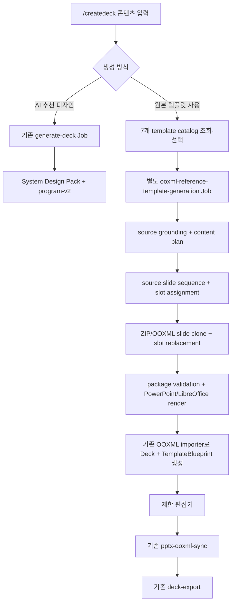

# AI PPT OOXML 레퍼런스 원본 충실도 모드 구현 계획

> 상태: Proposed
>
> 작성일: 2026-07-22
>
> 기준 브랜치: `feature/ai-ppt-curated-design-packs-2`
>
> 기준 HEAD: `eff6ce053c024c26c13a8506dcfb381a421cbfa2`
>
> 대상 경로: `/createdeck → 원본 템플릿 선택 → 별도 OOXML template Job → 제한 편집기 → OOXML sync → PPTX export`

## 1. 목적

ORBIT의 기존 AI PPT 생성은 `design-pack + program-v2`가 검수된 native layout을 선택하고 `Deck JSON`을 생성한다. 이 계획은 그 경로를 바꾸지 않고, 별도의 **OOXML 레퍼런스 원본 충실도 모드**를 추가한다.

원본 충실도 모드에서는 AI가 좌표, 크기, `zIndex`, shape geometry를 생성하지 않는다. AI와 deterministic planner가 결정하는 범위는 source slide sequence와 manifest에 허용된 slot content뿐이다. slide/master/layout/theme, 잠긴 decoration, frame geometry와 package relationship은 원본 PPTX에서 보존한다.

최종 제품에서는 사용자가 `/createdeck`에서 다음 두 경로 중 하나를 명시적으로 고른다.

1. `AI 추천 디자인`: 현재 `generate-deck`와 System Design Pack 경로를 그대로 사용한다.
2. `원본 템플릿 사용`: 7개 versioned PPTX template 중 하나를 선택하고 별도 Job으로 생성한다.

이 문서는 구현 순서, 계약, 검증 gate와 PR 경계를 정의한다. 레퍼런스 원본, 폰트, 생성 artifact와 secret을 저장소에 추가하지 않는다.

## 2. 확정된 전제와 결정

### 2.1 레퍼런스 기준

이번 계획은 저장소의 기존 inventory를 기준으로 7개 모두 PPTX, 총 139장으로 고정한다.

| template ID            | 기존 inventory slide 수 | family              |
| ---------------------- | ----------------------: | ------------------- |
| `simple-light`         |                      26 | Neutral             |
| `simple-dark`          |                      26 | Neutral             |
| `operating-review`     |                      31 | Executive Review    |
| `business-review`      |                      14 | Executive Review    |
| `project-kickoff`      |                      12 | Kickoff & Alignment |
| `team-alignment`       |                      24 | Kickoff & Alignment |
| `market-trends-report` |                       6 | Editorial Insight   |

구현 시작 시 실제 파일 SHA-256, slide 수와 package 구조를 다시 확인한다. 기존 inventory와 다르면 자동으로 덮어쓰지 않고 ingestion을 중단해 drift report를 만든다. 권리 검토는 범위 밖이며, 이 계획은 이용·수정·복제 권한이 확보됐다는 작업 전제를 사용한다. 다만 현재 `docs/quality/ai-ppt-design-pack-inventory.md`의 `license=pending` 기록은 실제 activation 전에 작업 전제와 일치하도록 명시적으로 갱신해야 한다.

### 2.2 제품 UX

원본 템플릿 모드에서는 기존 색상·폰트 선택 단계를 template 선택 단계로 대체한다. palette/font override는 원본 theme와 typography를 바꾸므로 노출하지 않는다.

- 콘텐츠 입력 화면에서 생성 방식을 고른다.
- `원본 템플릿 사용`을 고르면 Job을 만들기 전에 같은 wizard 안에서 기존 palette/font panel 대신 7개 template의 cover/body preview와 용도를 표시한다.
- template을 확정한 뒤 별도 OOXML template Job을 시작한다.
- `AI 추천 디자인`은 현재 `generate-deck → design-selection` 흐름을 그대로 사용한다.

### 2.3 계약 경계

- `GenerateDeckRequest`에 `generationMode`, `templateBlueprintId`, `designReferences` 또는 recipe-v1 selector를 추가하지 않는다.
- historical `ai-template-deck-generation` endpoint, queue와 processor를 복구하지 않는다.
- source catalog manifest와 생성된 Deck 인스턴스의 `TemplateBlueprint`를 구분한다.
- 현재 PPTX import endpoint는 사용자 업로드 원본을 가져오는 경로로 유지하고 AI content 생성에 사용하지 않는다.
- 원본 충실도 실패 시 사용자 선택 없이 System Design Pack으로 fallback하지 않는다.

### 2.4 기존 OOXML No-Go 결정과의 관계

`docs/quality/ai-ppt-checkpoint-c.md`와 Checkpoint D의 `No-Go (not triggered)`는 native pack이 engineering gate를 통과했고 source authorization이 당시 `pending`이었던 조건부 판단이다. 이번 요청은 원본 충실도 제품 모드를 별도 경계로 계획하고 source 권리가 확보됐다고 가정하므로 Task 20을 새 계획으로 다시 연다. 과거 결정을 소급해 `passed`로 바꾸지 않고, 이 문서의 Checkpoint A~D2를 새 승인 증거로 사용한다.

### 2.5 이번 범위에서 제외

- PDF, 이미지, HTML을 OOXML template으로 재구축하는 adapter
- 사용자가 임의 PPTX를 template catalog에 등록하는 기능
- 원본 theme를 변경하는 palette/font customization
- SmartArt, OLE, ActiveX, macro, embedded package의 content 수정
- 일반 `generate-deck` staged pipeline의 재작성
- PR, push, 배포와 base branch 로컬 merge

## 3. 현재 코드베이스 기준

### 3.1 재사용할 기반

| 기반                            | 현재 위치                                                    | 재사용 방식                                                  |
| ------------------------------- | ------------------------------------------------------------ | ------------------------------------------------------------ |
| strict public AI request        | `packages/shared/src/deck/generate-deck.schema.ts`           | leaf brief/reference schema만 재사용하고 root request는 분리 |
| OOXML import result             | `packages/shared/src/deck/pptx-ooxml-generation.schema.ts`   | 생성 package를 Deck/TemplateBlueprint로 materialize          |
| OOXML locator와 edit capability | `packages/shared/src/deck/template-blueprint.schema.ts`      | generated instance의 source mapping과 sync sidecar           |
| OOXML import                    | `services/python-worker/app/ai/pptx_ooxml_generation.py`     | 완성된 package를 visual tree와 mapping으로 변환              |
| OOXML sync                      | `apps/worker/src/pptx-ooxml-sync.processor.ts`와 Python sync | 제한 편집 후 current package 갱신                            |
| imported PPTX export            | `apps/worker/src/deck-export.processor.ts`                   | 최신 sync package의 export                                   |
| editor capability               | `ooxmlOrigin`, `ooxmlEditCapabilities`, `locked`             | slot별 편집 허용과 decoration lock의 기초                    |
| progressive UI pattern          | `AiDeckPreviewResponse`와 generation page                    | 별도 response schema로 polling/reveal UX 재사용              |
| storage/queue/job               | `StoragePort`, `packages/job-queue`, 공통 `Job`              | private catalog asset과 별도 Job lifecycle                   |

### 3.2 그대로 재사용할 수 없는 부분

- `pptx_ooxml_generation.py`는 package import와 authored slide 추가는 지원하지만, 선택한 source slide의 transitive relationship graph를 복제하는 template clone engine은 아니다.
- 현재 `TemplateBlueprint` slot은 import 의미 sidecar다. max chars/lines, crop policy, table/chart capacity와 허용 mutation을 표현하지 못한다.
- `Deck.metadata.sourceType === "import"`와 OOXML capability만으로는 “slot content만 수정 가능”을 서버에서 강제하지 못한다.
- 기존 `/createdeck`는 콘텐츠 단계에서 `generate-deck` Job을 먼저 만든 후 palette/font를 고른다. 원본 템플릿 모드는 Job 생성 시점부터 분기해야 한다.
- historical `ai-template-deck-generation`은 active schema, queue와 controller에서 제거됐으므로 이름이나 계약을 재사용하면 migration/운영 혼동이 생긴다.

## 4. 목표 아키텍처



### 4.1 source of truth 분리

세 종류의 상태를 섞지 않는다.

1. `OoxmlReferenceTemplateManifest`: 플랫폼이 관리하는 immutable/versioned source catalog다.
2. `OoxmlTemplateSnapshot`: 한 generation이 사용한 template version, checksum, source slide sequence와 slot assignment의 재현 기록이다.
3. `TemplateBlueprint`: 생성된 project Deck과 writable PPTX package 사이의 instance별 locator/sync sidecar다.

catalog manifest는 `template_blueprints` 테이블에 저장하지 않는다. 생성 완료 시 기존 `TemplateBlueprint`에 optional snapshot reference를 추가하고 project-owned baseline/current package asset을 연결한다.

### 4.2 package 생성과 editor materialization

template engine이 직접 `Deck JSON`을 조립하지 않는다.

1. private catalog asset에서 source PPTX bytes를 읽는다.
2. source slide clone과 slot replacement로 새 PPTX package를 만든다.
3. 완성된 package를 기존 `generate_pptx_ooxml()`에 전달한다.
4. importer가 Deck element, stable locator, render asset과 `TemplateBlueprint`를 만든다.
5. slot locator를 imported `elementId`에 reconcile하고 편집 policy를 확정한다.

이 구조는 기존 OOXML sync/export의 fail-closed behavior를 유지하면서 clone/replacement만 새 모듈로 격리한다.

### 4.3 저장 방식

원본 PPTX와 preview PNG는 Git에 넣지 않고 private managed storage에 둔다. storage key는 runtime에서 다음 규칙으로 파생하고 API response나 로그에 노출하지 않는다.

```text
system/ooxml-reference-templates/{templateId}/v{version}/source.pptx
system/ooxml-reference-templates/{templateId}/v{version}/previews/{previewId}.png
```

repository에는 source filename, 절대 경로와 원문 XML을 제외한 strict manifest, checksum과 annotation만 둔다. ingestion CLI는 source checksum과 manifest checksum이 일치할 때만 upload하고, 이미 같은 version이 다른 checksum으로 존재하면 overwrite하지 않는다.

생성 결과는 기존 project asset 정책을 따른다.

- immutable generation baseline package: project `design-asset`
- mutable current package: 별도 project `design-asset`
- slide render asset: project `design-asset`
- `TemplateBlueprint.sourcePackageFileId`와 `currentPackageFileId`: 위 project asset ID

### 4.4 보안 경계

모든 source가 curated라는 가정과 별개로 ingestion에서 다음을 fail-closed한다.

- ZIP path traversal, duplicate part, zip bomb와 size/part count 초과
- macro-enabled package, ActiveX, OLE와 embedded package
- external relationship, remote template와 linked media
- 손상된 content type, relationship target과 presentation slide mapping
- 지원하지 않는 encrypted/protected package

HTML/URL을 fetch하거나 external relationship을 해석하지 않는다. manifest, Job result와 로그에는 raw XML, source text, image bytes/base64, signed URL과 storage key를 넣지 않는다.

## 5. 제안 공통 계약

### 5.1 catalog manifest

`packages/shared/src/deck/ooxml-reference-template.schema.ts`에 다음 strict schema를 추가한다.

```ts
OoxmlReferenceTemplateManifest;
OoxmlSourceSlide;
OoxmlTemplateSlot;
OoxmlTemplateSelection;
OoxmlTemplateSnapshot;
OoxmlTemplateFidelityReport;
OoxmlReferenceTemplateGenerationRequest;
OoxmlReferenceTemplateGenerationJobResult;
OoxmlReferenceTemplatePreviewResponse;
```

manifest의 최소 projection은 다음과 같다.

```json
{
  "templateId": "operating-review",
  "version": 1,
  "status": "active",
  "sourceFormat": "pptx",
  "sourceSha256": "<64 lowercase hex>",
  "slideCount": 31,
  "canvas": {
    "aspectRatio": "16:9",
    "widthEmu": 12192000,
    "heightEmu": 6858000
  },
  "name": "Operating Review",
  "description": "경영 보고와 KPI 중심",
  "preview": { "coverPreviewId": "cover", "bodyPreviewId": "body" },
  "sourceSlides": [],
  "provenance": { "authorizationStatus": "approved", "inventoryVersion": 1 }
}
```

active manifest는 source checksum, 최소 cover/body preview, cover/closing source role과 1개 이상의 editable slot을 요구한다. unknown field, 중복 template/version, 중복 source slide/slot ID와 불완전 locator를 거부한다.

### 5.2 source slide와 slot

source slide는 다음을 가진다.

- stable `sourceSlideId`, source slide part와 source order
- semantic role: `cover | agenda | section | statement | summary | metric | comparison | chart | table | process | timeline | team-role | evidence | closing`
- layout/master/theme relationship identity
- capacity summary와 preview ID
- locked relationship/shape inventory checksum
- `slots[]`

slot locator는 position index에 의존하지 않는다.

```json
{
  "slotId": "operating-review-v1-slide-07-body",
  "semanticRole": "body",
  "contentType": "text",
  "required": true,
  "locator": {
    "slidePart": "ppt/slides/slide7.xml",
    "shapeId": "12",
    "placeholderType": "body",
    "relationshipId": null
  },
  "capacity": { "maxChars": 220, "maxLines": 7 },
  "mutationPolicy": ["text-content"],
  "replacementPolicy": { "overflow": "fail" }
}
```

content type별 추가 계약은 다음과 같다.

| type  | capacity/policy                                                                   |
| ----- | --------------------------------------------------------------------------------- |
| text  | chars, lines, paragraphs, bullet depth, allowed run/style mutation                |
| image | aspect ratio range, crop policy, alpha/mask requirement, replacement relationship |
| table | fixed row/column range, merged cell policy, editable cell locators                |
| chart | chart type, category/series capacity, embedded workbook update policy             |

decoration, master/layout element, unsupported SmartArt와 animation은 slot으로 annotation하지 않는다.

### 5.3 별도 generation request

endpoint는 `POST /api/v1/projects/:projectId/ooxml-reference-template-generations`를 사용한다. strict request는 일반 GenerateDeck root schema를 import하지 않고 별도로 정의하되, audience/purpose/tone, reference policy 같은 leaf enum은 공유한다.

```json
{
  "topic": "2026 하반기 운영 리뷰",
  "prompt": "핵심 KPI와 실행 과제를 정리",
  "targetDurationMinutes": 10,
  "slideCountRange": { "min": 8, "max": 10 },
  "metadata": {
    "audience": "executive",
    "purpose": "report",
    "tone": "professional"
  },
  "referencePolicy": "references-first",
  "referenceFileIds": ["file_1"],
  "templateSelection": {
    "mode": "user",
    "templateId": "operating-review",
    "version": 1
  }
}
```

`mode="user"`는 exact ID/version을 고정한다. internal/향후 client의 `mode="auto"`는 template ID를 생략하고 deterministic selector를 실행할 수 있지만, 이번 `/createdeck` UI는 사용자가 7개 중 하나를 확정해야 Job을 시작한다.

request에는 `design`, `stylePackId`, palette/font override, `templateBlueprintId`, `designReferences`와 recipe selector가 없다.

### 5.4 Job과 result

새 active Job type과 queue name은 `ooxml-reference-template-generation`으로 통일한다. 공통 status는 `queued | running | succeeded | failed`만 사용한다.

성공 result는 bounded ID와 report만 포함한다.

```json
{
  "deckId": "deck_ooxml_reference_job_1",
  "templateId": "template_job_1",
  "currentPackageFileId": "file_current_package",
  "renderAssetFileIds": ["file_slide_1"],
  "templateSnapshot": {
    "catalogTemplateId": "operating-review",
    "catalogTemplateVersion": 1,
    "sourceSha256": "<64 lowercase hex>",
    "sourceSlideIds": ["cover-01", "summary-02"],
    "slotAssignmentCount": 18
  },
  "fidelityReport": {},
  "warningCodes": []
}
```

source text, slot content, raw package locator 전체와 XML은 Job result에 넣지 않는다. 상세 assignment는 project-private artifact와 `TemplateBlueprint`에 저장한다.

processor는 다음 bounded stage를 사용한다.

```text
reference-extract-file → source-grounding → content-planning
  → template-planning → package-generation → render-validation
  → materialization → publication
```

새 `ooxml_reference_template_generation_artifacts` 테이블은 `(job_id, stage, shard_key)`를 unique key로 사용하고 검증된 content/template plan, slide render asset ID, fidelity report와 publication result만 저장한다. `slide-render` artifact의 `shard_key`는 zero-padded slide order다. raw package bytes는 artifact JSON이 아니라 project asset에만 저장한다. processor retry는 성공한 immutable artifact를 재사용하며 publication은 Deck, `TemplateBlueprint`, current package와 parent Job success를 한 transaction에서 확정한다.

### 5.5 Deck와 TemplateBlueprint

완성 Deck은 technical OOXML origin을 표현하기 위해 `metadata.sourceType="import"`, AI 생성 사실을 표현하기 위해 `metadata.generatedBy="ai"`를 사용한다. 새 optional `metadata.ooxmlReferenceTemplateSnapshot`은 catalog ID/version, source checksum과 generation ID만 저장한다. 기존 `createdFrom.designReferences`는 빈 배열로 유지한다.

`TemplateBlueprint`에는 optional `referenceTemplateSnapshot`과 slot edit policy를 추가한다.

- imported element는 authoritative locator와 capability를 유지한다.
- editable slot element도 frame은 잠그고 허용된 props만 변경한다.
- decoration와 non-slot element는 `locked=true`이고 mutation allowlist에 없다.
- 새 slide/element 추가, geometry 변경, delete, reorder와 animation 변경은 이 모드에서 기본 차단한다.

## 6. content와 sequence planning 정책

### 6.1 기존 planner 재사용 범위

source grounding과 content planning의 의미 로직은 재사용하지만 reference-template 전용 adapter 뒤에 둔다. `GenerateDeckRequest`나 Design Program을 새 mode의 public/internal root model로 사용하지 않는다.

공유 가능 범위:

- reference extraction과 source grounding
- story outline, slide role, message, evidence와 typed metric
- 사실성/근거 검증

실행하지 않는 범위:

- System Design Pack selector
- Art Director의 composition/geometry 계획
- native layout compiler와 safe remap
- palette/font override

### 6.2 sequence solver hard rule

solver는 다음 순서로 후보를 제거하고 점수를 계산한다.

1. role 불일치, required slot 누락, capacity 초과 후보 제거
2. 필요한 media/table/chart capability가 없는 후보 제거
3. cover/closing과 single-template rule 강제
4. 인접 동일 source 제거와 eligible layout 다양성 하한 강제
5. source reuse penalty와 content-role 적합성으로 결정

capacity 실패는 다음 순서로만 처리한다.

1. 의미를 보존하는 bounded copy shortening
2. 같은 role의 더 큰 capacity source slide 선택
3. content split과 slide count 범위 재검증
4. 같은 template family 안의 다른 source slide 선택
5. explicit terminal failure

System Design Pack 또는 authored fallback element를 조용히 만들지 않는다.

### 6.3 반복 기준

spike template은 eligible source가 충분한 PPTX를 골라 `unique source / generated slides >= 0.8`을 적용한다. 6장인 `market-trends-report`처럼 eligible source 수가 target보다 적은 template에는 다음 계산을 사용한다.

```text
requiredUniqueSourceCount = min(ceil(generatedSlideCount * 0.8), eligibleSourceSlideCount)
requiredUniqueLayoutCount = min(ceil(generatedSlideCount * 0.4), eligibleLayoutCount)
```

모든 template에서 인접 동일 source는 0건이어야 한다. 서로 다른 source가 같은 layout을
사용하는 것은 실제 catalog의 eligible layout 수가 제한된 경우 허용하되,
`requiredUniqueLayoutCount`를 충족해야 한다. source 재사용 시 동일 slot assignment와 동일
문구를 반복하지 않는다.

## 7. fidelity 평가 기준

### 7.1 identity control과 generated comparison 분리

pixel diff 하나로 통과시키지 않는다.

1. **Identity control**: source slide를 clone하되 content를 바꾸지 않는다. locked 영역과 전체 slide가 원본과 같아야 한다.
2. **Generated comparison**: slot content가 바뀐 결과다. slot mask 내부의 의도된 pixel 차이는 허용하고, locked 영역의 구조/시각 손실을 측정한다.

### 7.2 structural gate

다음은 점수와 무관한 hard failure다.

- PowerPoint 재개방 실패 또는 package validator error
- master/layout/theme relationship drift
- locked shape geometry, z-order 또는 style drift
- source 없는 authored element 생성
- unresolved relationship, duplicate part/ID와 content type 불일치
- slot capacity 초과, overlap, overflow와 crop policy 위반
- OOXML sync/export warning

### 7.3 visual metric

template/version/render environment별 baseline을 분리한다.

- locked-region SSIM/perceptual difference
- geometry edge alignment
- font family/size/weight와 fallback substitution
- fill/line/shadow
- image frame/crop/mask/effect
- table/chart style

임계값은 identity-control 7개 결과를 먼저 측정해 정한다. 최초 구현 PR에서 임의의 85점 같은 숫자를 통과값으로 고정하지 않는다. calibration report에는 PowerPoint와 LibreOffice의 정상 renderer 차이를 분리하고, 선택한 허용 오차와 근거를 기록한다. 일단 hard gate는 locked geometry exact match와 package warning 0건으로 시작한다.

### 7.4 artifact 구조

artifact는 Git이 아닌 `/tmp` 또는 승인된 QA storage에 생성한다.

```text
{templateId}/v{version}/
  baseline/source-slide-*.png
  generated/generated-slide-*.png
  diff/locked-overlay-slide-*.png
  montage/source.png
  montage/generated.png
  manifests/package.json
  manifests/font.json
  manifests/fidelity-report.json
```

report에는 artifact checksum, renderer/version, font checksum, source/template checksum, intended slot mask와 warning code만 기록한다.

## 8. 단계별 구현 작업

### Phase 0: 계약과 source baseline

#### Task 1: 7개 PPTX inventory를 원본 충실도 기준으로 확장

**Description:** 기존 `build_design_pack_inventory.py`를 source package, relationship와 security preflight까지 확장하고 7개 source의 checksum과 baseline metadata를 고정한다.

**Acceptance criteria:**

- [x] 7개 template의 SHA-256, slide/master/layout/theme/font/media/chart/table/SmartArt/animation inventory가 존재한다.
- [x] 기존 slide 수 139와 실제 package가 일치하며 drift 시 non-zero로 중단한다.
- [x] source path, source XML, font bytes와 image bytes가 report/Git에 포함되지 않는다.

**Verification:**

- [x] `cd services/python-worker && uv run pytest tests/test_ooxml_reference_inventory.py`
- [x] 7개 local source를 대상으로 inventory command 실행 후 checksum 검증

**Dependencies:** None

**Files likely touched:**

- `services/python-worker/scripts/build_ooxml_reference_inventory.py`
- `services/python-worker/app/ai/ooxml_reference_templates/inventory.py`
- `services/python-worker/tests/test_ooxml_reference_inventory.py`
- `docs/quality/ai-ppt-ooxml-reference-inventory.md`

**Estimated scope:** M

#### Task 2: shared manifest, selection, snapshot과 result schema 정의

**Description:** catalog, source slide, slot, selection, snapshot, fidelity report와 별도 request/result를 strict Zod schema로 정의하고 Python mirror를 추가한다.

**Acceptance criteria:**

- [x] unknown field, duplicate locator/ID, invalid capacity와 incomplete user selection을 거부한다.
- [x] 기존 `GenerateDeckRequest`, existing Deck와 `TemplateBlueprint`가 새 optional field 없이 계속 parse된다.
- [x] `templateBlueprintId`, `designReferences`, recipe selector가 일반 GenerateDeck에 추가되지 않는다.

**Verification:**

- [x] `pnpm --filter @orbit/shared test`
- [x] `cd services/python-worker && uv run pytest tests/test_ooxml_reference_contract.py tests/test_generate_deck_contract.py`

**Dependencies:** Task 1의 inventory field 결정

**Files likely touched:**

- `packages/shared/src/deck/ooxml-reference-template.schema.ts`
- `packages/shared/src/deck/ooxml-reference-template.schema.test.ts`
- `packages/shared/src/deck/template-blueprint.schema.ts`
- `services/python-worker/app/ai/ooxml_reference_templates/models.py`
- `docs/contracts.md`

**Estimated scope:** M

#### Task 3: private catalog ingestion과 preview baseline 구축

**Description:** source PPTX와 preview PNG를 private storage의 immutable version 경로에 등록하고 strict manifest만 repository catalog에 남긴다.

**Acceptance criteria:**

- [x] 같은 template/version의 checksum mismatch는 overwrite하지 않고 실패한다.
- [x] active catalog는 source object, cover/body preview와 manifest checksum이 모두 있을 때만 로드된다.
- [x] repository manifest에 local/plugin cache path, binary, signed URL과 storage credential이 없다.

**Verification:**

- [x] local fake `StoragePort` ingestion unit test
- [x] 7개 dry-run과 private test storage read-after-write smoke

**Dependencies:** Tasks 1, 2

**Files likely touched:**

- `services/python-worker/scripts/ingest_ooxml_reference_templates.py`
- `services/python-worker/app/ai/ooxml_reference_templates/registry.py`
- `services/python-worker/app/ai/design_library/ooxml-reference-templates/`
- `services/python-worker/tests/test_ooxml_reference_registry.py`

**Estimated scope:** M

#### Checkpoint A: source와 계약 고정

- [x] 7개 manifest 합계가 139장이다.
- [x] source와 preview checksum이 재현된다.
- [x] strict Zod/Pydantic mirror와 기존 GenerateDeck regression이 통과한다.
- [x] security preflight와 provenance gate를 통과하지 않은 template은 catalog option에 나오지 않는다.
- [x] 사람 승인: inventory와 slot annotation 범위를 검토한 뒤 spike로 진행한다.

2026-07-23 사용자 승인과 local QA private storage의 7개 source·139개 preview
read-after-write 검증으로 inventory·annotation 검수 증거는 충족됐다. 이후 같은 QA bucket에
7개 strict manifest가 `active` 상태로 게시되어 총 153개 object가 됐고 canonical bytes,
metadata SHA-256, content type, version ID와 anonymous `403`을 재검증했다. 현재 상태는
`/private/tmp/orbit-ooxml-qa-manifest-drift-audit-v2-WSyKlN`에 기록했다. 이 publication은
QA-only이며 calibration object가 없고 feature flag/allowlist도 꺼져 있다. repository catalog와
production rollout은 계속 disabled이고 §15의 production private managed storage도 준비되지
않았으므로 Checkpoint A의 정식 상태는 승인 보류다.

초기 승인 범위는 version 1 manifest의 253개 text slot이다. 같은 날 actual source image
후보 5개도 후속 승인했지만, 이 범위는 4개 template-manifest version 2 proposal로만 고정했고
모두 `disabled`다. 기존 QA-active version 1 manifest, repository catalog와 storage object는
변경하지 않았다.

### Phase 1: 한 개 PPTX vertical spike

#### Task 4: spike template 선정과 source slide/slot annotation 도구 구현

**Description:** inventory 결과에서 supported direct shape/table/chart와 충분한 unique source를 가진 한 개 template을 deterministic 기준으로 선정하고 role/slot annotation을 생성·검수한다.

**Acceptance criteria:**

- [x] 선정 근거가 slide count가 아니라 supported locator coverage, role coverage와 capacity로 기록된다.
- [x] cover/closing과 8~10장 fixture에 필요한 role/slot이 annotation된다.
- [x] decoration, master/layout object, unsupported SmartArt/animation은 editable slot에서 제외된다.

**Verification:**

- [x] annotation schema test와 duplicate locator test
- [x] 사람 검수용 source-slide catalog/montage 생성

**Dependencies:** Checkpoint A

**Files likely touched:**

- `services/python-worker/scripts/annotate_ooxml_reference_template.py`
- `services/python-worker/app/ai/ooxml_reference_templates/annotation.py`
- `services/python-worker/tests/test_ooxml_reference_annotation.py`
- `docs/quality/ooxml-reference-slot-annotation.md`

**Estimated scope:** M

#### Task 5: raw source slide clone과 package graph 보존 구현

**Description:** ZIP/OOXML part graph 수준에서 source slide를 복제하고 presentation ID, relationship, content type과 transitive mutable part를 충돌 없이 재작성한다.

**Acceptance criteria:**

- [x] slide/layout/master/theme, notes, timing, media와 supported chart/table relationship이 보존된다.
- [x] 새 slide part, presentation `rId`/slide ID, rel ID와 mutable child part 이름이 충돌하지 않는다.
- [x] clone 결과를 PowerPoint/LibreOffice에서 재개방하고 package validator warning이 0건이다.

**Verification:**

- [x] `cd services/python-worker && uv run pytest tests/test_ooxml_reference_clone.py`
- [x] identity-control clone 8~10장 render/diff

Microsoft PowerPoint 16.111에서 7개 actual source와 raw identity clone 전체 139장을 각각
open/PDF render/close/reopen하고 동일 해상도 pixel diff를 생성했다. 139장 모두 changed pixel
0이며 template별 6~8장 montage와 bounded report는
`/private/tmp/orbit-ooxml-powerpoint-identity-control-20260723-a`에 있다. 이 기계적 baseline은
exact font 설치 또는 사람 calibration 승인을 대체하지 않는다.

**Dependencies:** Task 4

**Files likely touched:**

- `services/python-worker/app/ai/ooxml_reference_templates/package.py`
- `services/python-worker/app/ai/ooxml_reference_templates/clone.py`
- `services/python-worker/tests/test_ooxml_reference_clone.py`
- `services/python-worker/tests/fixtures/ooxml-reference-minimal/`

**Estimated scope:** M

#### Task 6: text와 image slot replacement/capacity 구현

**Description:** annotated text/image slot만 변경하고 run/paragraph formatting과 image frame/crop/effect를 보존한다.

**Acceptance criteria:**

- [x] text replacement가 paragraph, bullet, indent, alignment와 가능한 run formatting을 보존한다.
- [x] image replacement가 frame, crop, mask, rotation, opacity/effect와 relationship 정합성을 보존한다.
- [x] capacity 초과는 shrink나 authored fallback 없이 typed issue로 실패한다.

**Verification:**

- [x] `cd services/python-worker && uv run pytest tests/test_ooxml_reference_text_slots.py tests/test_ooxml_reference_image_slots.py`
- [x] 한글 line break/font fallback과 crop golden render

**Dependencies:** Task 5

**Files likely touched:**

- `services/python-worker/app/ai/ooxml_reference_templates/text_slots.py`
- `services/python-worker/app/ai/ooxml_reference_templates/image_slots.py`
- `services/python-worker/app/ai/ooxml_reference_templates/capacity.py`
- `services/python-worker/tests/test_ooxml_reference_text_slots.py`
- `services/python-worker/tests/test_ooxml_reference_image_slots.py`

**Estimated scope:** M

#### Checkpoint B1: package clone spike

- [x] 8~10장 identity-control package relationship warning 0건
- [x] eligible-source 기준 unique source 80%와 eligible-layout 기준 layout 40%의 bounded 하한, 인접 동일 source 0건
- [x] source 없는 authored element 0건
- [x] locked region geometry/style drift 0건
- [x] PowerPoint와 LibreOffice 재개방/render 성공

2026-07-23 actual-source 139장 clone의 package/LibreOffice와 Microsoft PowerPoint 16.111
open, 139-page PDF render, close, reopen을 통과했다. PowerPoint repair/recovery/corrupt/font
substitution 로그 매치는 0건이고 종료 후 열린 presentation도 0개다. 그러나
source/generated locked diff artifact, exact font checksum 및 사람 검수가 한 묶음으로
완료되지 않아 Checkpoint B1은 미통과다. PowerPoint evidence는
`/private/tmp/orbit-ooxml-powerpoint-identity-20260723-a/summary.json`에 보관한다.

#### Task 7: generated package를 Deck/TemplateBlueprint instance로 materialize

**Description:** slot replacement 완료 package를 기존 OOXML importer로 변환하고 project baseline/current package, Deck, blueprint와 snapshot을 원자적으로 publication한다.

**Acceptance criteria:**

- [x] generated Deck은 `sourceType=import`, `generatedBy=ai`와 exact template snapshot을 가진다.
- [x] slot locator가 imported `elementId`에 unique하게 reconcile되고 decoration은 locked다.
- [x] partial failure는 Deck, blueprint와 current package 중 일부만 publication하지 않는다.

**Verification:**

- [x] Python materialization test
- [x] Worker repository transaction integration test

**Dependencies:** Tasks 2, 6

**Files likely touched:**

- `services/python-worker/app/ai/ooxml_reference_templates/materialize.py`
- `apps/worker/src/ooxml-reference-template/materialization.ts`
- `apps/worker/src/ooxml-reference-template/materialization.spec.ts`
- `packages/shared/src/deck/template-blueprint.schema.test.ts`

**Estimated scope:** M

#### Task 8: fidelity harness와 calibration report 구현

**Description:** identity control, slot-masked generated comparison, structural/package 검사를 하나의 deterministic report로 합친다.

**Acceptance criteria:**

- [x] intended slot mask와 locked region을 분리한 per-slide/whole-deck report가 생성된다.
- [x] renderer/font/version/checksum이 없으면 측정을 통과로 표시하지 않는다.
- [ ] threshold는 7개 identity baseline 측정값과 근거를 함께 기록한다.

**Verification:**

- [x] known drift fixture가 geometry/style/package failure를 재현한다.
- [x] no-op identity fixture가 locked-region gate를 통과한다.

2026-07-23 승인/disabled canonical manifest를 사용한 LibreOffice 26.8 identity candidate를
`/private/tmp/orbit-ooxml-identity-calibration-candidate-20260723-b`에 생성했다. 7개/139장의
locked-region SSIM은 모두 1.0이고 changed pixel, structural drift와 package warning은 0이며
461개 checksum이 일치한다. exact 38/substituted 313으로 font gate가 남아 candidate는
`runtimeEligible=false`, proposed threshold는 `null`이다. 따라서 측정 증거는 확보했지만
threshold 선택 근거의 exact-font 재측정과 사람 승인이 없어 acceptance checkbox는 미완료다.

PowerPoint app bundle과 Office CloudFonts를 read-only fontconfig에 추가한 별도 diagnostic
candidate
`/private/tmp/orbit-ooxml-identity-calibration-candidate-office-fonts-20260723-a`도
7개/139장 SSIM 1.0, changed pixel 0, structural pass와 checksum 461/461을 유지했다.
resolution은 exact 320/substituted 31, unique substitution 8개로 줄었지만 font license,
embedded-only/exact-absent family와 사람 threshold 승인이 남아 runtime에는 적용하지 않는다.

**Dependencies:** Tasks 5, 6, 7

**Files likely touched:**

- `services/python-worker/app/ai/ooxml_reference_templates/fidelity.py`
- `services/python-worker/scripts/evaluate_ooxml_reference_fidelity.py`
- `services/python-worker/tests/test_ooxml_reference_fidelity.py`
- `docs/quality/ai-ppt-ooxml-fidelity-evaluation.md`

**Estimated scope:** M

#### Checkpoint B2: editor round-trip spike

- [x] text/image slot 편집 후 기존 `pptx-ooxml-sync` warning 0건
- [x] 최신 sync version 확인 후 `deck-export` 성공
- [x] slot locator와 decoration lock mapping이 재현되며 product rollout 전 Task 18의 API mutation gate가 필요한 범위를 report에 기록
- [ ] spike report와 montage를 사람이 검수하고 7개 확장 여부를 승인

2026-07-23 승인 text-only 범위에서는 7개 template별 실제 slot 1개를 편집해 sync/export,
Python/LibreOffice/PowerPoint reopen을 수행했고 warning 0, unsupported 0과 편집 문구 유지를
확인했다. 7개 편집 전/후/mask/locked-overlay/montage 43개 파일도
`/private/tmp/orbit-ooxml-b2-slot-montage-7cg9oi8q`에 생성했다. geometry/style/relationship drift와
package/import warning은 모두 0이지만 `operating-review` 42px, `simple-light` 72px의 mask 밖
글리프 경계 차이는 threshold 없이 `LOCKED_PIXEL_DIFF_REVIEW_PENDING`으로 보존했다. 이 artifact는
LibreOffice 기반 montage-only 증거이며 PowerPoint/reopen/full-deck/font 증거를 대체하지 않는다.
사람 검수와 exact font 환경 승인이 남아 Checkpoint B2는 미통과다.

actual source의 direct picture 19개를 읽기 전용 감사한 결과 package-wide exclusive media
target을 가진 기술 후보는 5개다. source-authored `p:cNvPr@descr`의 정규화된 exact
replacement intent를 가진 4개는 high-confidence, 나머지 1개는 low-confidence로
분류했다. `team-alignment`의 14개 picture는 두 media part를 여러 picture가 공유하므로
독립 slot으로 만들지 않는다. 결과와 checksum은
`/private/tmp/orbit-ooxml-image-slot-candidates-v2-20260723-8vzdI7`에 보관한다.
annotation과 runtime은 shared target을 각각 `shared_image_media_target`,
`OOXML_REFERENCE_IMAGE_MEDIA_SHARED`로 fail-closed하도록 고정했다.

2026-07-23 사용자가 low-confidence `simple-dark` cover를 포함한 5개를 모두 승인했다.
`market-trends-report@2`, `project-kickoff@2`, `simple-dark@2`, `simple-light@2`의
template-manifest version 2 proposal은 `disabled`로 생성했고 source/QA storage/repository
catalog mutation은 적용하지 않았다. manifest-derived `imageCapacity`를 materialized
`slotEditPolicies`에 보존하고 editor sync가 aspect/alpha/mask, effective OPC content type,
package-wide exclusive media와 기존 relationship을 재검증하도록 고정했다. 실제 5개
image slot edit→sync/export는 warning/unsupported/package/reimport drift 0, relationship,
frame/crop/mask/effect와 locked inventory 보존 상태로 LibreOffice와 Microsoft PowerPoint
16.111의 총 96장 open/render/reopen을 통과했다. 증거는
`/private/tmp/orbit-ooxml-image-slot-roundtrip-capacity-v2-20260723-a`와
`/private/tmp/orbit-ooxml-powerpoint-image-slot-roundtrip-capacity-v2-20260723-b`에 있다.
다만 기존 text-slot locked pixel 차이의 사람 판정, exact font와 전체 fidelity/UX 승인이
남아 Checkpoint B2 자체는 미통과다.

같은 승인 범위를 253개 text slot 전수로 확장한 수정 전 matrix
`/private/tmp/orbit-ooxml-actual-text-slot-matrix-20260723-ew36f6m1`에서는 generic sync가
`bodyPr`에 overflow/wrap 기본값을 강제해 253/253 drift가 발생했다. reference 전용 sync가
원본 `bodyPr`를 보존하도록 수정한 뒤
`/private/tmp/orbit-ooxml-actual-text-slot-matrix-v2-20260723-60dgia3v`에서 253/253을 통과했다.
sync/unsupported/package/reimport warning, target frame/style drift와 locked shape의
geometry/style/relationship drift는 모두 0이다. 텍스트 길이 변경에 따른 run/paragraph
hierarchy rewrite 119건은 `bodyPr`/`lstStyle` exact, 494개 output style subtree의 original
template byte-equivalence, non-text/relationship semantics와 unclassified residual drift 0으로
분류했다.
이 text matrix는 별도 version 2 image proposal/round-trip 증거를 대신하지 않으며 전체
locked-diff 사람 검수도 대체하지 않는다.

### Phase 2: content planning, structured slot과 7개 확장

#### Task 9: reference-template content plan과 sequence solver 구현

**Description:** 기존 source grounding/content planning을 adapter로 재사용하고 role/capacity 기반 source sequence와 slot assignment를 생성한다.

**Acceptance criteria:**

- [x] planner output에는 source slide/slot ID만 있고 geometry가 없다.
- [x] single template, cover/closing, capacity, evidence와 repetition hard rule을 강제한다.
- [x] same input/catalog version은 deterministic tie-break로 같은 plan을 만든다.

**Verification:**

- [x] `cd services/python-worker && uv run pytest tests/test_ooxml_reference_planner.py`
- [x] 7개 family fixture의 role/capacity/repetition table-driven test

**Dependencies:** Checkpoint B2

**Files likely touched:**

- `services/python-worker/app/ai/ooxml_reference_templates/content_adapter.py`
- `services/python-worker/app/ai/ooxml_reference_templates/planner.py`
- `services/python-worker/app/ai/ooxml_reference_templates/selection.py`
- `services/python-worker/tests/test_ooxml_reference_planner.py`

**Estimated scope:** M

#### Task 10: table slot replacement 구현

**Description:** direct unmerged rectangular table만 지원하고 annotated capacity 안에서 cell text/data를 교체한다.

**Acceptance criteria:**

- [x] table frame, `a:tblPr`, `a:tblGrid`, cell style, border와 merge 구조를 보존한다.
- [x] row/column capacity, locator fingerprint와 rectangular grid가 어긋나면 fail-closed한다.
- [x] 생성 후 editor의 single-cell targeted sync가 warning 없이 동작한다.

**Verification:**

- [x] `cd services/python-worker && uv run pytest tests/test_ooxml_reference_table_slots.py tests/test_table_ooxml_sync.py`
- [x] table source identity/generated diff

**Dependencies:** Tasks 6, 7

**Files likely touched:**

- `services/python-worker/app/ai/ooxml_reference_templates/table_slots.py`
- `services/python-worker/tests/test_ooxml_reference_table_slots.py`
- `packages/shared/src/deck/ooxml-reference-template.schema.test.ts`

**Estimated scope:** M

#### Task 11a: chart slot package replacement 구현

**Description:** supported chart type에 한해 generation 시 chart XML과 embedded workbook을 함께 복제·교체하고 unsupported chart/SmartArt를 preserve-only로 유지한다.

**Acceptance criteria:**

- [x] manifest allowlist의 chart type/category/series capacity만 수정한다.
- [x] chart XML, cached values, workbook relationship과 number format이 일치한다.
- [x] unsupported chart, external workbook과 SmartArt는 editable slot으로 활성화하지 않는다.

**Verification:**

- [x] `cd services/python-worker && uv run pytest tests/test_ooxml_reference_chart_slots.py`
- [x] PowerPoint chart refresh/reopen과 LibreOffice render 비교

**Dependencies:** Tasks 5, 8

**Files likely touched:**

- `services/python-worker/app/ai/ooxml_reference_templates/chart_slots.py`
- `services/python-worker/tests/test_ooxml_reference_chart_slots.py`
- `docs/quality/ooxml-reference-slot-annotation.md`

**Estimated scope:** M

#### Task 11b: imported chart targeted sync capability 구현

**Description:** reference-template chart slot의 editor 변경을 authoritative chart/workbook locator에 적용하는 bounded sync capability를 추가한다.

**Acceptance criteria:**

- [x] optional `ooxmlEditCapabilities.chartData`는 supported chart type, unique relationship와 workbook fingerprint를 모두 증명한 source에만 `true`다.
- [x] category/series 값 변경은 chart XML cache와 embedded workbook을 원자적으로 갱신하고 style/geometry를 보존한다.
- [x] type, series/category count, formula range 또는 workbook fingerprint drift는 package 원본을 유지하고 fail-closed한다.

**Verification:**

- [x] `cd services/python-worker && uv run pytest tests/test_ooxml_reference_chart_sync.py`
- [x] `pnpm --filter @orbit/worker test -- pptx-ooxml-sync`
- [x] editor chart data edit → sync → PowerPoint refresh/reopen integration

**Dependencies:** Tasks 7, 11a

**Files likely touched:**

- `packages/shared/src/deck/slide-object.schema.ts`
- `packages/shared/src/deck/template-blueprint.schema.ts`
- `services/python-worker/app/ai/ooxml_reference_templates/chart_sync.py`
- `services/python-worker/tests/test_ooxml_reference_chart_sync.py`
- `apps/worker/src/pptx-ooxml-sync.processor.spec.ts`

**Estimated scope:** M

#### Task 12: 나머지 6개 template annotation과 full-deck fixture 확장

**Description:** 공통 ingestion/annotation pipeline으로 7개 모두 versioned source catalog와 8~10장 fixture를 갖추게 한다.

**Acceptance criteria:**

- [x] 7개 template에 source catalog, role, slot, capacity, preview와 provenance/checksum이 있다.
- [x] 각 template의 unsupported object와 font substitution risk가 report에 기록된다.
- [x] 7개 full-deck에서 package warning, overflow, overlap과 crop error가 0건이다.

**Verification:**

- [x] 7개 fixture generation command
- [x] 7개 PowerPoint/LibreOffice montage와 fidelity report 생성

LibreOffice 기반 source/generated/mask/locked-diff artifact는
`/private/tmp/orbit-ooxml-fidelity-artifacts-20260723-g`, PowerPoint 16.111의 7개×8장
self-contained PPTX/PDF/PNG/montage/report bundle은
`/private/tmp/orbit-ooxml-powerpoint-full-deck-montage-metadata-fixed-20260723-b`에 있다. 생성
PPTX는 source의 stale `TitlesOfParts`, 통계, custom property와 thumbnail을 제거하고 `Slides=8`을
재계산한 수정본이다. 두 renderer의 결과는 별도 evidence로 유지하며 사람 fidelity 승인과 exact
font gate는 계속 pending이다.

**Dependencies:** Tasks 9, 10, 11a, 11b

**Files likely touched:**

- `services/python-worker/app/ai/design_library/ooxml-reference-templates/`
- `services/python-worker/tests/fixtures/ooxml-reference-golden/`
- `services/python-worker/tests/test_ooxml_reference_catalog_golden.py`
- `docs/quality/ooxml-reference-template-reports/`

**Estimated scope:** M per template family; family별 PR로 분리

#### Checkpoint C: 7개 template generation 승인

- [x] 7개 template 각각 8~10장 full-deck 생성
- [x] required unique source 계산과 인접 반복 기준 통과
- [x] package/relationship/export warning 0건
- [x] overflow, overlap, crop error 0건
- [x] text/image/table/chart supported fixture 통과
- [x] chart slot editor mutation의 targeted sync/reopen 통과
- [x] template별 source/generated/diff/montage/report 존재

2026-07-23 7개 template의 deterministic 8장 package는 sequence, package,
overflow/overlap/crop, LibreOffice 56장과 Microsoft PowerPoint 16.111 open/render/reopen을
통과했다. 실제 7개 text-slot edit/export도 두 renderer에서 reopen했다. 7개 generated deck의
56장 source/generated/mask/locked-diff와 세 종류 montage는
`/private/tmp/orbit-ooxml-fidelity-artifacts-20260723-g`에 계획 §7.4 구조로 생성했고 모든
template의 package warning과 geometry/style/relationship drift는 0이다. font manifest는
template별 43~50개 substitution을 확인했고 exact/substituted 351개 resolved file checksum을
모두 기록했다. 다만 313개는 요청 family가 아니라 fallback file checksum이다. 따라서 요청한
exact font 설치·checksum, private calibration
threshold와 locked-diff의 사람 승인, production managed storage가 없어 Checkpoint C는 미통과다.

최신 strict runner report는
`/private/tmp/orbit-ooxml-checkpoint-c-report-20260723-metadata-fixed-final/summary.json`이다.
자동 검증은
7/7 통과했지만 PowerPoint evidence에 `FONT_AVAILABILITY_VALIDATION_PENDING`을 명시해 전체
상태를 `failed`로 유지했다. 실제 PowerPoint open/render/reopen 통과만으로 font 설치·checksum
gate를 대체하지 않는다.

source `docProps/app.xml`의 선택되지 않은 slide title과 통계, core/custom property, thumbnail이
생성본에 남는 결함은 clone 경계의 sanitizer와 회귀 테스트로 수정했다. 수정본 7개는 ZIP warning
0, slide part 8개, `app.xml Slides=8`, stale/private metadata 0을 전수 확인했다. actual text slot
편집→sync/export 수정본의 PowerPoint 16.111 render/reopen 증거는
`/private/tmp/orbit-ooxml-powerpoint-slot-roundtrip-bodypr-fixed-20260723-a`에 있으며 7개 모두
편집값 유지와 8장 재열기를 통과했다. 이 결과도 font/사람 승인 gate를 승격하지 않는다.

### Phase 3: 별도 API/Job과 `/createdeck` 제품 연결

#### Task 13: 별도 Job type, queue와 processor vertical slice

**Description:** `ooxml-reference-template-generation` Job을 생성·실행하고 stage별 progress와 bounded error를 공통 Job에 반영한다.

**Acceptance criteria:**

- [x] API/queue/Worker/Python 경계가 모두 별도 request/result schema를 검증한다.
- [x] enqueue/start/success/failure 업무 이벤트에 template ID/version, source slide/slot count와 issue code만 기록한다.
- [x] artifact retry는 성공 stage를 재사용하고 terminal failure는 System Design Pack으로 fallback하거나 partial Deck을 publication하지 않는다.

**Verification:**

- [x] `pnpm --filter @orbit/api test -- ooxml-reference-template`
- [x] `pnpm --filter @orbit/worker test -- ooxml-reference-template`
- [x] Python client invalid/timeout/error contract test

**Dependencies:** Tasks 7, 9

**Files likely touched:**

- `apps/api/src/ooxml-reference-template-generations/`
- `apps/worker/src/ooxml-reference-template-generation.processor.ts`
- `apps/worker/src/ooxml-reference-template/artifact-repository.ts`
- `apps/api/src/database/migrations/*CreateOoxmlReferenceTemplateArtifacts.ts`
- `packages/job-queue/src/index.ts`
- `packages/shared/src/jobs/job.schema.ts`
- `apps/worker/src/worker.service.ts`

**Estimated scope:** M per slice; API/queue, artifact repository와 processor PR 분리

#### Task 14: catalog option과 authenticated preview API 구현

**Description:** active/allowlisted 7개 template의 공개 metadata와 cover/body preview를 source storage key 노출 없이 제공한다.

**Acceptance criteria:**

- [x] disabled, checksum mismatch 또는 preview missing template은 option에서 제외된다.
- [x] response에는 ID/version/name/description/preview asset ID와 편집 가능 범위만 포함된다.
- [x] preview access는 인증을 요구하고 signed URL/storage key를 로그에 남기지 않는다.

**Verification:**

- [x] API catalog projection/auth/disabled-template test
- [x] preview missing/checksum drift test

**Dependencies:** Tasks 3, 13

**Files likely touched:**

- `apps/api/src/ooxml-reference-templates/`
- `services/python-worker/app/ai/ooxml_reference_templates/options.py`
- `services/python-worker/app/main.py`
- `packages/shared/src/deck/ooxml-reference-template.schema.test.ts`

**Estimated scope:** M

#### Task 15: generation preview artifact와 polling endpoint 구현

**Description:** content outline과 actual generated slide PNG를 순서대로 반환하는 read-only preview endpoint를 추가한다.

**Acceptance criteria:**

- [x] preview는 1번부터 연속된 completed prefix만 노출하고 `editable=false`다.
- [x] raw source, slot content plan, XML, prompt/provider response와 signed URL을 노출하지 않는다.
- [x] success 시 canonical Deck ID와 result Deck ID가 일치할 때만 editor-ready를 반환한다.

**Verification:**

- [x] out-of-order artifact, failed Job과 ready transition API test
- [x] preview 조회가 artifact/Deck을 수정하지 않는 read-only test

**Dependencies:** Task 13

**Files likely touched:**

- `apps/api/src/ooxml-reference-template-generations/ooxml-reference-template-preview.service.ts`
- `apps/api/src/ooxml-reference-template-generations/ooxml-reference-template-preview.controller.ts`
- `apps/api/src/ooxml-reference-template-generations/ooxml-reference-template-preview.service.spec.ts`
- `packages/shared/src/deck/ooxml-reference-template.schema.ts`

**Estimated scope:** M

#### Task 16: `/createdeck` 생성 방식과 template 선택 UI 구현

**Description:** 콘텐츠 단계에 생성 방식 선택을 추가하고 reference mode에서 palette/font 화면 대신 7개 template preview 선택을 사용한다.

**Acceptance criteria:**

- [x] AI 추천 경로 payload와 route transition은 기존 동작과 동일하다.
- [x] 원본 template 경로는 exact ID/version을 고른 뒤에만 별도 Job을 시작한다.
- [x] cover/body preview, 용도, editable slot 범위, 선택 상태와 unavailable error를 표시한다.

**Verification:**

- [x] `pnpm --filter @orbit/web test -- AiPptMockupPage`
- [x] desktop/mobile keyboard, loading, error와 mode switch UI test

**Dependencies:** Tasks 14, 15

**Files likely touched:**

- `apps/web/src/features/ai-ppt/AiPptMockupPage.tsx`
- `apps/web/src/features/ai-ppt/AiPptMockupPage.test.ts`
- `apps/web/src/features/ai-ppt/AiPptMockupPage.ui.test.ts`
- `apps/web/src/features/ai-ppt/OoxmlReferenceTemplateOptions.tsx`
- `apps/web/src/features/ai-ppt/ooxml-reference-template-api.ts`

**Estimated scope:** M

#### Task 17: reference generation page와 오류 UX 구현

**Description:** 별도 preview contract를 polling해 completed slide를 순서대로 공개하고 typed capacity/package/sync 오류를 사용자 문구로 매핑한다.

**Acceptance criteria:**

- [x] completed slide preview를 순서대로 표시하고 success 후 editor로 전환한다.
- [x] capacity, no source, font, aspect ratio, package, sync와 export failure를 구분한다.
- [x] failure 화면이 AI 추천 디자인으로 자동 이동하거나 새 Job을 자동 생성하지 않는다.

**Verification:**

- [x] Web preview ordering/reduced-motion/failure mapping test
- [x] retryable/non-retryable CTA test

**Dependencies:** Tasks 15, 16

**Files likely touched:**

- `apps/web/src/features/ai-ppt/OoxmlReferenceGenerationPage.tsx`
- `apps/web/src/features/ai-ppt/OoxmlReferenceGenerationPage.test.tsx`
- `apps/web/src/App.tsx`

**Estimated scope:** M

#### Checkpoint D1: mode와 generation E2E

- [x] `/createdeck`에서 두 생성 방식이 명확히 구분된다.
- [x] AI 추천 디자인 기존 E2E가 그대로 통과한다.
- [ ] 선택한 exact template ID/version/checksum이 result snapshot과 일치한다.
- [ ] 7개 중 한 template의 생성 preview와 editor transition이 E2E로 통과한다.

content outline과 `slide-render` shard producer, bounded Python issue 전달은 실제 Worker 경로에
연결했다. 현재 Playwright는 route-mocked UI 계약 증거이므로 actual API→queue→Python→atomic
publication→editor transition을 증명하지 않아 Checkpoint D1은 미통과다.

### Phase 4: 제한 편집, sync/export와 rollout

#### Task 18: slot-only editor policy를 Web과 API에서 강제

**Description:** snapshot/blueprint allowlist를 기준으로 slot content mutation만 허용하고 geometry, decoration와 slide lifecycle mutation을 차단한다.

**Acceptance criteria:**

- [x] text/image/table/chart slot의 허용 props만 수정 가능하고 frame/zIndex는 변경할 수 없다.
- [x] non-slot, decoration, add/delete/reorder/animation mutation은 UI 비활성화와 API 409로 거부된다.
- [x] 일반 native/imported Deck의 기존 editor capability는 회귀하지 않는다.

**Verification:**

- [x] editor toolbar/canvas/keyboard/drop policy unit test
- [x] API patch allowlist integration test와 직접 HTTP bypass test

**Dependencies:** Tasks 7, 16

**Files likely touched:**

- `apps/web/src/features/editor/reference-template/referenceTemplateEditPolicy.ts`
- `apps/web/src/features/editor/shell/EditorShell.tsx`
- `apps/api/src/decks/ooxml-reference-edit-policy.ts`
- `apps/api/src/decks/decks.service.ts`
- `packages/shared/src/deck/ooxml-reference-template.schema.ts`

**Estimated scope:** M, Web/API PR 분리

#### Task 19: sync freshness와 export gate 연결

**Description:** reference-template Deck export 전에 current Deck version의 OOXML sync 성공과 zero-warning 상태를 요구한다.

**Acceptance criteria:**

- [x] slot edit 저장은 기존 `pptx-ooxml-sync`를 enqueue하고 최신 version까지 성공해야 한다.
- [x] stale/failed/warning sync 상태에서는 export를 막고 retry/issue code를 표시한다.
- [x] 성공 export가 generated current package를 사용하고 source catalog 원본을 덮어쓰지 않는다.

**Verification:**

- [x] `pnpm --filter @orbit/worker test -- pptx-ooxml-sync deck-export`
- [x] `apps/worker/integration/pptx-ooxml-roundtrip.integration.spec.ts`
- [x] editor edit → sync → export → reopen integration

**Dependencies:** Task 18

**Files likely touched:**

- `apps/worker/src/deck-export.processor.ts`
- `apps/worker/src/deck-export.processor.spec.ts`
- `apps/web/src/features/editor/shell/hooks/useEditorFileTransfer.ts`
- `apps/web/src/features/editor/shell/utils/deckState.ts`
- `apps/worker/integration/pptx-ooxml-roundtrip.integration.spec.ts`

**Estimated scope:** M

#### Task 20: feature flag, 운영 runbook과 전체 E2E 추가

**Description:** 전역 flag와 template allowlist로 단계적으로 노출하고 생성/편집/export E2E 및 rollback 절차를 문서화한다.

**Acceptance criteria:**

- [x] global off면 reference mode와 catalog endpoint가 unavailable이고 AI 추천 경로만 보인다.
- [x] allowlist는 template ID/version 단위이며 disable이 진행 중/기존 Deck의 sync/export를 깨뜨리지 않는다.
- [x] 운영 지표와 rollback이 Job/Deck 삭제나 source overwrite 없이 수행된다.

**Verification:**

- [x] `tests/e2e/ai-ppt-ooxml-reference-template.spec.ts`
- [x] `node infra/scripts/check-env.mjs`와 `docker compose config`
- [ ] local Compose liveness/readiness와 flag on/off smoke

2026-07-23 Compose service별 계약 검증에서 `api`, `worker`, `python-worker`가 global flag와
allowlist를 off/on 모두 같은 값으로 받는 것을 확인했다. current branch image를 사용하는
격리 Compose project의 flag-off 상태에서는 API/Python health, API PostgreSQL/Redis/MinIO
readiness, `/createdeck` HTTP 200과 세 service의 `enabled=false`를 확인했다. flag-on은 구성
전달에 이어 기존 QA stack을 건드리지 않는 보조 포트에서 API readiness와
`enabled=true`를 확인했다. Python runtime은 승인 calibration object 부재를
`OOXML_REFERENCE_FIDELITY_CALIBRATION_UNAVAILABLE`로 감지해 startup fail-closed했고 인증
catalog도 `503`으로 닫혔다. 보조 API 종료 후 원래 API readiness와 `enabled=false` 복귀를
확인했다. 증거는
`/private/tmp/orbit-ooxml-flag-on-fail-closed-smoke-20260723`에 있다. 성공 generation을
실행하지 않았으므로 flag-on API→queue→publication vertical과 이 checklist는 미통과다.

route interception과 synthetic checksum을 사용하지 않는 opt-in spec
`tests/e2e/ai-ppt-ooxml-reference-template.real.spec.ts`도 추가했다. actual catalog와 exact
template snapshot, UI slot edit, sync freshness/warning 0, PPTX export/package를 검증하지만
`OOXML_REFERENCE_REAL_E2E=1` runtime을 아직 실행하지 않았으므로 D2 E2E 통과 증거가 아니다.

**Dependencies:** Tasks 17, 19

**Files likely touched:**

- `packages/config/src/index.ts`
- `.env.example`
- `infra/scripts/check-env.mjs`
- `tests/e2e/ai-ppt-ooxml-reference-template.spec.ts`
- `docs/runbooks/ai-ppt-ooxml-reference-templates.md`

**Estimated scope:** M

#### Checkpoint D2: 제품 적용 승인

- [ ] `/createdeck → template 선택 → generation → 제한 편집 → sync → PPTX export` E2E 통과
- [x] editor 수정 후 PowerPoint/LibreOffice reopen과 warning 0건
- [x] 7개 full-deck fidelity artifact와 report 존재
- [x] 기존 System Design Pack, PPTX import, OOXML sync/export regression 통과
- [ ] flag off와 template allowlist rollback smoke 통과
- [ ] 사람 검수: PowerPoint fidelity와 편집 제한 UX 승인

실제 7개 text-slot edit→sync/export package는 PowerPoint 16.111과 LibreOffice reopen을
통과했고 7개/56장 source/generated/mask/locked-diff와 montage/report 및 7개 편집 전후
montage를 생성했다. 별도 승인된 actual image slot 5개도 capacity·relationship을 보존한
sync/export 후 PowerPoint 16.111과 LibreOffice에서 5/5 render/reopen을 통과했다. 그러나
production private managed storage, 승인 calibration/font artifact, real vertical E2E와 사람
fidelity/제한 편집 UX 승인이 남아 Checkpoint D2는 미통과다. 2026-07-23 최종 repository
build/lint/test와 current-branch Python worker를 사용한 PostgreSQL PPTX round-trip 7개,
`/createdeck` Playwright 2개는 재실행해 통과했다.

## 9. 오류와 관찰 가능성

사용자 오류는 stable issue code를 한국어 문구로 매핑한다.

| code family                  | 사용자 구분                   |
| ---------------------------- | ----------------------------- |
| `OOXML_REFERENCE_CAPACITY_*` | 텍스트/표/차트 용량 초과      |
| `OOXML_REFERENCE_SOURCE_*`   | 적합한 source slide/slot 없음 |
| `OOXML_REFERENCE_FONT_*`     | 폰트 미설치 또는 substitution |
| `OOXML_REFERENCE_IMAGE_*`    | 이미지 비율/crop 불일치       |
| `OOXML_REFERENCE_PACKAGE_*`  | package/relationship 오류     |
| `OOXML_REFERENCE_SYNC_*`     | 편집 내용 sync 실패/stale     |
| `OOXML_REFERENCE_EXPORT_*`   | 최신 package export 실패      |

업무 이벤트는 다음을 사용한다.

```text
ooxml-reference-template.job.enqueued
ooxml-reference-template.job.started
ooxml-reference-template.stage.succeeded
ooxml-reference-template.stage.failed
ooxml-reference-template.job.succeeded
ooxml-reference-template.job.failed
```

허용 필드는 `jobId`, `projectId`, `templateId`, `templateVersion`, `sourceSlideId`, `slotId`, count, duration, issue code와 retryable뿐이다. raw XML, content, prompt, source filename/path, image/base64, signed URL, storage key와 provider response를 기록하지 않는다.

## 10. 전체 검증 매트릭스

| 계층              | 검증 내용                                     | gate                     |
| ----------------- | --------------------------------------------- | ------------------------ |
| Shared            | strict schema, mirror, backward compatibility | merge 차단               |
| Inventory         | 7개 checksum/139장, security preflight        | ingestion 차단           |
| Package clone     | relationship/content type/ID collision        | merge 차단               |
| Slot              | content capacity, locator, formatting/crop    | generation 차단          |
| Planner           | role/capacity/evidence/repetition             | generation 차단          |
| Materialization   | Deck/Blueprint/snapshot atomicity             | publication 차단         |
| Editor/API        | slot-only mutation allowlist                  | merge 차단               |
| Sync/export       | current version, zero warning, reopen         | release 차단             |
| Visual            | locked region + intended slot mask            | template activation 차단 |
| PowerPoint        | actual Microsoft PowerPoint render/reopen     | rollout 차단             |
| System regression | native design pack and import path            | merge 차단               |

최종 필수 명령:

```bash
pnpm build
pnpm lint
pnpm test
node infra/scripts/check-env.mjs
docker compose config

cd services/python-worker
uv run ruff check .
uv run mypy app
uv run pytest
```

위 명령 외에 다음 artifact 검증을 별도로 실행한다.

- 7개 template full-deck generation
- Microsoft PowerPoint render/reopen
- LibreOffice render
- OOXML ZIP/package validation
- slide PNG, locked-region diff와 whole-deck montage
- slot edit 후 sync/export/reopen
- `/createdeck` Playwright E2E

PowerPoint 실행 환경이 없으면 해당 항목을 성공으로 표시하지 않고 `not-run`과 남은 환경/명령을 report에 기록한다.

## 11. 위험과 완화

| 위험                                         | 영향   | 완화                                                        |
| -------------------------------------------- | ------ | ----------------------------------------------------------- |
| source package drift                         | High   | immutable version/checksum, overwrite 금지                  |
| transitive relationship 누락                 | High   | part graph clone, package validation, identity control      |
| theme/font renderer 차이                     | High   | renderer별 baseline, font checksum/substitution report      |
| 긴 한글 content                              | High   | capacity fail, alternate source, split; auto shrink 금지    |
| chart workbook 불일치                        | High   | supported type allowlist, chart+workbook atomic update      |
| 6장 template의 source 반복                   | Medium | eligible-source 기반 threshold, 인접 반복 금지              |
| editor가 decoration을 변경                   | High   | UI와 API 양쪽 mutation allowlist                            |
| 기존 import mode와 정책 충돌                 | High   | reference snapshot이 있을 때만 제한 policy 적용             |
| source asset 유출                            | High   | private StoragePort, authenticated preview, log allowlist   |
| 새 Job 운영 복잡도                           | Medium | distinct type/queue/issue code, flag/allowlist rollback     |
| clone engine이 기존 6천 줄 OOXML 모듈과 결합 | Medium | 새 package/slot 모듈, importer/sync는 public entry만 재사용 |

## 12. 문서 산출물

구현 PR은 단계에 맞춰 다음 문서를 추가하거나 갱신한다.

- 이 구현 계획: `docs/plans/ai-ppt-ooxml-reference-template-fidelity-mode.md`
- source inventory: `docs/quality/ai-ppt-ooxml-reference-inventory.md`
- slot annotation 형식: `docs/quality/ooxml-reference-slot-annotation.md`
- fidelity 기준/calibration: `docs/quality/ai-ppt-ooxml-fidelity-evaluation.md`
- template별 report: `docs/quality/ooxml-reference-template-reports/`
- rollout/rollback: `docs/runbooks/ai-ppt-ooxml-reference-templates.md`
- 공통 계약: `docs/contracts.md`
- test matrix: `docs/testing/test-matrix.md`
- 기존 inventory/quality 결정: `docs/quality/ai-ppt-design-pack-inventory.md`, Checkpoint C/D 문서

## 13. 권장 PR과 커밋 경계

기준 브랜치에서 직접 구현하지 않는다. 구현 시작 시 고유 worktree와 `feature/ai-ppt-ooxml-reference-templates` 형식의 branch를 만들고, 이미 존재하면 suffix를 붙인다. 공유 브랜치에는 rebase/force push를 하지 않는다.

| PR       | 범위                              | 선행 조건     | 권장 커밋 제목                                     |
| -------- | --------------------------------- | ------------- | -------------------------------------------------- |
| PR-00    | 계획 문서                         | 없음          | `docs: OOXML 레퍼런스 템플릿 구현 계획 추가`       |
| PR-01    | inventory/security preflight      | PR-00         | `build: OOXML 레퍼런스 inventory 도구 추가`        |
| PR-02    | shared/Python contract            | PR-01         | `feat: OOXML 레퍼런스 템플릿 공통 계약 추가`       |
| PR-03    | private catalog/preview ingestion | PR-02         | `build: OOXML 템플릿 private catalog 추가`         |
| PR-04    | annotation + raw clone spike      | Checkpoint A  | `feat: 원본 slide clone과 relationship 보존 추가`  |
| PR-05    | text/image slot                   | PR-04         | `feat: OOXML 텍스트와 이미지 slot 교체 추가`       |
| PR-06    | materialization/fidelity          | PR-05         | `test: OOXML 템플릿 fidelity 검증 추가`            |
| PR-07    | content/sequence planner          | Checkpoint B2 | `feat: OOXML source sequence와 capacity 계획 추가` |
| PR-08    | table slot                        | PR-07         | `feat: OOXML 표 slot 교체 추가`                    |
| PR-09a   | chart package slot                | PR-07         | `feat: OOXML 차트 slot 교체 추가`                  |
| PR-09b   | chart targeted sync               | PR-09a        | `feat: OOXML 차트 slot sync 추가`                  |
| PR-10a~d | 6개 template family 확장          | PR-08, PR-09b | `feat: OOXML 레퍼런스 템플릿 catalog 확장`         |
| PR-11    | API/Job/Worker                    | Checkpoint C  | `feat: OOXML 원본 템플릿 생성 Job 추가`            |
| PR-12    | catalog/preview API               | PR-11         | `feat: OOXML 템플릿 preview API 추가`              |
| PR-13    | `/createdeck` mode/template UI    | PR-12         | `feat: 원본 템플릿 선택 UI 추가`                   |
| PR-14    | generation preview/error UX       | PR-13         | `feat: OOXML 템플릿 생성 preview 추가`             |
| PR-15    | restricted editor/API policy      | PR-14         | `feat: OOXML slot 제한 편집 경계 추가`             |
| PR-16    | sync/export/E2E                   | PR-15         | `test: OOXML 템플릿 round-trip 검증 추가`          |
| PR-17    | flag/runbook/final report         | PR-16         | `docs: OOXML 템플릿 운영 검증 결과 기록`           |

각 커밋은 `<type>: <한국어 제목>` 형식, scope 없음, 필요한 경우 한국어 본문 2~3줄을 사용한다. 기능과 해당 targeted test를 같은 작은 단위로 묶고 관련 없는 변경은 stage하지 않는다.

## 14. 병렬화와 순차 의존성

계약과 spike가 먼저 고정된 뒤 다음 작업은 병렬화할 수 있다.

- table slot과 initial chart package slot 구현
- chart targeted sync와 unrelated template family annotation
- Neutral, Executive Review, Kickoff & Alignment, Editorial Insight template annotation
- API contract test와 Web static UI fixture
- PowerPoint/LibreOffice artifact runner

다음은 순차로 수행한다.

```text
inventory
  → shared contract
    → raw clone
      → text/image replacement
        → Deck/Blueprint materialization
          → round-trip spike approval
            → 7-template expansion
              → public Job/API
                → product UI/editor
                  → rollout
```

`packages/shared`, catalog version, `TemplateBlueprint`와 slot policy를 동시에 수정하는 작업은 한 명이 소유하거나 contract PR이 merge된 뒤 분기한다.

## 15. 구현 착수 전 확인 사항

다음 항목은 계획에 기본 결정을 반영했지만 실제 구현 시작 전에 source/operator 상태를 확인한다.

1. 7개 source PPTX의 현재 local 경로와 checksum이 기존 inventory와 일치하는가.
2. private managed storage에 system template asset을 업로드할 운영 주체와 환경별 bucket/prefix가 준비됐는가.
3. Microsoft PowerPoint render/reopen을 수행할 Windows/Office QA 환경이 있는가.
4. 7개 source의 사용 폰트가 target 환경에 설치 가능한가. 설치 불가 폰트는 substitution을 허용할지 template을 비활성화할지 결정됐는가.
5. 기존 `license=pending` 문서를 작업 전제인 authorization approved 상태로 누가 확인·갱신할 것인가.

위 항목 중 1~3이 준비되지 않으면 구현 코드는 진행할 수 있어도 Checkpoint A/B/C/D를 통과로 표시할 수 없다.

## 16. 완료 정의

- [ ] 7개 PPTX가 private storage와 versioned strict catalog에 등록된다.
- [x] 사용자가 `/createdeck`에서 AI 추천 디자인과 원본 템플릿 사용을 명확히 고른다.
- [x] 사용자가 7개 template 중 exact version을 직접 선택한다.
- [x] 별도 Job이 source slide clone과 slot replacement로 PPTX를 생성한다.
- [x] master/layout/theme, locked geometry/style와 package relationship이 보존된다.
- [x] editor가 허용된 text/image/table/chart slot content만 수정한다.
- [x] editor 수정 후 OOXML sync와 최신 package export가 warning 없이 성공한다.
- [x] 7개 full-deck PowerPoint/LibreOffice artifact와 fidelity report가 존재한다.
- [x] 일반 GenerateDeck, System Design Pack, PPTX import/sync/export regression이 모두 통과한다.
- [x] rollout flag off 시 기존 System Design Pack 제품 경로만 노출된다.
- [x] 실행하지 못한 검증은 성공으로 표시하지 않고 이유와 남은 범위를 기록한다.
