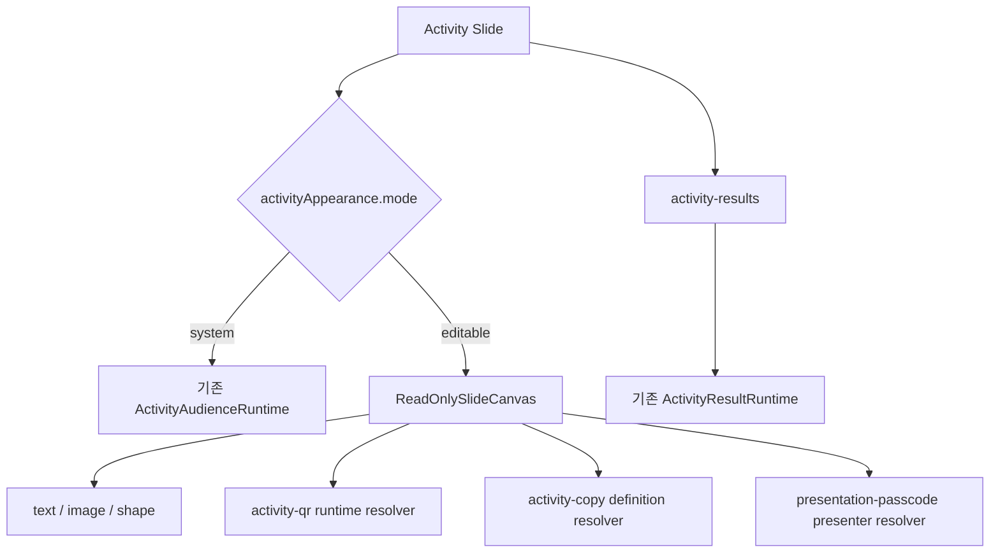

# 편집 가능한 참여 장표 디자인 구현 계획

## 문서 상태

- 상태: 구현 전 검토 요청
- 작성일: 2026-07-24
- 기준 브랜치: `develop`
- 작업 브랜치: `feature/editable-activity-slide-design`
- 선행 기능: `docs/plans/activity-slides-implementation-plan.md`
- 제품 기준: `docs/ideas/activity-slides.md`
- 공통 계약 기준: `docs/contracts.md`, `packages/shared`
- 구현 범위: 사전 질문, 실시간 투표, 만족도 조사 장표의 디자인 자유 편집
- 범위 제외: 연결 결과 장표의 차트·응답 카드 자유 배치

이 문서는 이미 구현된 참여 장표 runtime을 유지하면서 수집 장표의 시각 구성을 일반 에디터처럼 편집할 수 있게 만드는 실행 계획이다. 기존 계획의 잠긴 system layer 정책을 하위 호환 모드로 남기고, 새 장표에는 editable visual layer를 제공한다.

## 1. 목표와 완료 정의

발표자는 사전 질문, 실시간 투표, 만족도 조사 장표를 추가할 때 세 가지 기본 디자인, QR·입장 코드만 있는 최소 구성, 완전히 빈 캔버스 중 하나를 선택할 수 있어야 한다. 디자인을 선택한 뒤에는 일반 장표처럼 텍스트, 이미지, 도형과 runtime slot을 이동·크기 조절·삭제할 수 있어야 한다.

다음 조건을 모두 충족해야 기능이 완료된 것으로 본다.

- 새 참여 장표에서 세 가지 디자인 preset, `essentials`, `blank`를 선택할 수 있다.
- Product Design으로 만든 raster concept은 참고 자료로만 사용하고 실제 장표는 editable Deck element로 저장한다.
- `activity` 장표는 일반 텍스트, 이미지, 도형의 추가·선택·이동·크기 조절·삭제를 지원한다.
- `activity-results` 장표는 기존 role-aware 결과 renderer와 잠긴 system layer를 유지한다.
- QR, Activity 제목·설명, 발표 세션 입장 코드는 runtime-bound element로 배치할 수 있다.
- QR bitmap, audience URL, passcode 원문, response count는 Deck JSON에 저장되지 않는다.
- 기존 `elements: []` Activity 장표는 종전 system renderer로 계속 표시된다.
- 의도적으로 빈 editable 장표는 기존 system renderer로 되돌아가지 않는다.
- 질문·선택지 같은 semantic edit lock과 색상·배치 같은 visual edit 권한이 분리된다.
- 발표 화면과 에디터 캔버스가 같은 element geometry를 사용한다.
- 저장·복원·복제·원본 Activity 삭제·thumbnail·정적 export가 새 element를 안전하게 처리한다.
- passcode 표시 값은 owner/editor 전용 runtime 경계에서만 조회되고 public API, WebSocket, 로그, Deck, 정적 export에 포함되지 않는다.
- 관련 shared, editor-core, API, Web 테스트와 전체 build/lint가 통과한다.

## 2. 비목표

첫 구현에는 다음을 포함하지 않는다.

- 결과 장표의 chart bar, 응답 카드, moderation list를 개별 element로 분해
- audience mobile 응답 form 디자인을 Deck element로 편집
- Activity 장표에서 table, chart, custom shape, animation, action을 모두 즉시 활성화
- community template에 Activity slide 게시
- runtime 응답 수, 공개 결과, 주관식 원문을 Deck에 snapshot
- Product Design 결과 이미지를 slide background로 저장
- 4:3 Activity 지원
- 여러 Activity의 결과를 한 결과 장표에서 조합

일반 element 편집은 텍스트, 이미지, 기본 도형부터 시작한다. table, chart, custom shape, animation, action은 capability matrix와 발표 renderer 회귀를 별도 검증한 뒤 후속 범위로 연다.

## 3. 현재 저장소 기준선

| 영역 | 현재 상태 | 변경 방향 |
| --- | --- | --- |
| Slide 계약 | 모든 Slide가 `style`, `elements`, `animations`, `actions`를 공유 | `activityAppearance.mode`를 추가해 legacy system과 editable을 구분 |
| QR element | `activity-qr`가 `activityId`만 저장하고 session에서 URL을 해석 | 그대로 재사용하고 Activity canvas에서도 삽입 허용 |
| Activity 생성 | `createActivitySlide()`가 `elements: []` 생성 | 선택한 preset의 concrete element를 생성 |
| 편집 정책 | `canEditSlideCanvas()`가 `content`만 허용 | 기능별 capability 정책으로 교체 |
| Editor canvas | Activity와 result 모두 잠긴 system renderer | Activity `editable`만 `EditableCanvas`, result는 기존 renderer |
| 발표 renderer | Activity는 CSS 기반 `ActivityAudienceRuntime`으로 우회 | editable Activity는 read-only Deck canvas, legacy는 기존 renderer |
| result renderer | `sourceActivityId`와 session aggregate로 실시간 렌더 | 변경하지 않음 |
| passcode | Argon2 hash만 저장하고 응답에는 원문 없음 | 검증 hash와 별도로 암호화된 presenter-display copy 도입 |
| community template | Activity slide를 명시적으로 거절 | Activity 전용 local preset registry 사용 |
| export | Activity runtime을 정적 안내 projection으로 변환 | editable visual은 보존하되 runtime slot 값은 placeholder로 치환 |

기존 `docs/plans/activity-slides-implementation-plan.md`의 D4, D5와 `docs/ideas/activity-slides.md`의 잠긴 system layer 설명은 이 기능에서 다음처럼 확장한다.

- runtime 값은 계속 system-owned이며 Deck에 저장하지 않는다.
- runtime component의 frame과 시각 style은 editable element가 소유할 수 있다.
- semantic definition과 visual appearance의 잠금 정책은 독립적이다.
- `activity-results`는 기존 정책을 유지한다.

## 4. 확정 아키텍처 결정

| ID | 결정 | 이유 |
| --- | --- | --- |
| D1 | `ActivityDefinition`, visual elements, PresentationSession runtime을 별도 source of truth로 유지한다. | 질문 의미, 디자인, 실행 데이터를 서로 덮어쓰지 않는다. |
| D2 | Activity slide에 `activityAppearance: { mode: "system" \| "editable" }`를 추가하고 legacy 기본값은 `system`으로 정규화한다. | 기존 빈 element 장표와 의도적으로 빈 editable 장표를 구분한다. |
| D3 | preset ID는 Deck에 저장하지 않고 적용 시 concrete `style`과 `elements`만 저장한다. | preset 업데이트가 기존 사용자 장표를 조용히 변경하지 않게 한다. |
| D4 | Product Design은 1920×1080 visual concept 세 종을 만드는 데 사용하고, 승인된 결과를 editor-core preset 함수로 옮긴다. | raster 배경이 아니라 완전히 편집 가능한 결과를 제공한다. |
| D5 | `activity-qr`는 현재 계약을 재사용한다. | 이미 복제, 삭제, session lookup 경계가 검증돼 있다. |
| D6 | Activity 제목·설명은 `activity-copy` bound element로 표시한다. | semantic title/description과 캔버스 text의 이중 source of truth를 막는다. |
| D7 | 세션 passcode는 `presentation-passcode` bound element가 표시하고 element props에는 label/style만 저장한다. | passcode 원문을 Deck에 넣지 않는다. |
| D8 | passcode 검증용 Argon2 hash는 유지하고 presenter 표시용 값은 별도 AEAD ciphertext로 저장한다. | 인증 검증 강도를 유지하면서 owner/editor reload 후 표시를 복구한다. |
| D9 | passcode 복호화 endpoint는 owner/editor만 호출할 수 있고 public audience API와 WebSocket에는 추가하지 않는다. | 의도된 발표 화면 외 경계로 credential이 퍼지는 것을 막는다. |
| D10 | Activity editor 권한은 capability matrix로 관리한다. | 캔버스 편집 허용이 animation, chart, action까지 우발적으로 열지 않게 한다. |
| D11 | editable Activity 발표는 일반 read-only canvas path를 사용한다. | editor와 발표의 geometry·z-index·background를 일치시킨다. |
| D12 | `activity-results`는 기존 locked renderer를 유지한다. | live aggregate의 가변 layout과 privacy 경계를 이번 범위에서 건드리지 않는다. |
| D13 | 새 runtime slot이 없더라도 저장은 허용하되 QR과 참여 안내 누락을 visual warning으로 표시한다. | 빈 캔버스 요구를 허용하면서 발표 실패 가능성을 알려준다. |
| D14 | 정적 export는 editable decoration을 보존하고 QR/passcode slot을 안전한 안내 placeholder로 바꾼다. | live credential과 session URL을 파일에 남기지 않는다. |
| D15 | community template 계약은 변경하지 않고 Activity 전용 preset registry를 둔다. | 현재 sanitizer의 Activity 거절과 공개 template privacy 정책을 유지한다. |
| D16 | element renderer에 명시적인 runtime surface context를 전달하고 passcode 조회 허용 여부를 route 이름이나 slide kind로 추론하지 않는다. | editor·thumbnail·export가 실제 credential을 요청하는 실수를 막는다. |

## 5. 데이터와 렌더링 경계

### 5.1 Slide appearance

개념 계약은 다음과 같다.

```ts
type ActivityAppearance = {
  mode: "system" | "editable";
};

type ActivitySlide = BaseSlide & {
  kind: "activity";
  activity: ActivityDefinition;
  activityAppearance: ActivityAppearance;
};
```

정규화 규칙:

- 기존 Activity slide에 `activityAppearance`가 없으면 `{ mode: "system" }`을 채운다.
- 새 preset, `essentials`, `blank`로 만든 장표는 `{ mode: "editable" }`을 사용한다.
- `mode = "system"`에서는 기존 `ActivityAudienceSlideRenderer`를 사용한다.
- `mode = "editable"`에서는 element가 0개여도 빈 canvas를 그대로 렌더링한다.
- system에서 editable로 전환하는 command는 explicit user action이어야 한다.
- read나 preview가 Deck을 자동 변경하면 안 된다.

### 5.2 Runtime-bound elements

#### `activity-qr`

기존 계약을 유지한다.

```ts
type ActivityQrElementProps = {
  activityId: string;
};
```

#### `activity-copy`

```ts
type ActivityCopyElementProps = {
  activityId: string;
  field: "title" | "description";
  fallbackText: string;
  // text typography/alignment props
};
```

- 실제 text는 해당 `ActivityDefinition`에서 읽는다.
- text 원문을 element props에 복제하지 않는다.
- 원본 Activity 삭제와 Deck 복제 시 `activity-qr`와 같은 참조 정합성 규칙을 적용한다.
- title/description semantic edit가 잠겨도 element frame과 typography는 편집할 수 있다.

#### `presentation-passcode`

```ts
type PresentationPasscodeElementProps = {
  label: string;
  unavailableText: string;
  publicAccessText: string;
  // text typography/alignment props
};
```

- Deck에는 숫자 passcode가 존재하지 않는다.
- editor preview는 sample digit가 아닌 `••••` 또는 `발표 시작 후 표시`를 보여준다.
- current session이 `public`이면 `publicAccessText`를 표시한다.
- passcode session에 안전한 display copy가 없으면 `unavailableText`를 표시하고 owner/editor에게 재설정 CTA를 제공한다.
- 발표 중 실제 숫자는 owner/editor 인증 context에서만 조회한다.
- DOM에 나타나는 실제 숫자는 발표자가 room display에 공개하기로 선택한 결과다. public audience mobile DOM에는 포함하지 않는다.

### 5.3 Passcode 저장 경계

`presentation_sessions`에 presenter-display copy용 nullable encrypted payload와 key version을 추가한다.

```text
session_password_hash                 기존 검증용 Argon2 hash
session_password_display_ciphertext   AES-256-GCM versioned envelope
session_password_key_version          rotation 식별자
```

필수 규칙:

- `PRESENTATION_PASSCODE_ENCRYPTION_KEY`, `PRESENTATION_PASSCODE_ENCRYPTION_KEY_VERSION`은 key 이름과 형식만 저장소에 문서화하고 실제 값은 secret store에서 주입한다.
- key rotation이 필요하면 optional previous key와 version을 별도 환경변수로 받아 기존 envelope을 읽고 새 write는 current key만 사용한다.
- create/update command에서 hash와 ciphertext를 같은 transaction에 저장한다.
- public access mode에서는 hash와 ciphertext가 모두 null이어야 한다.
- API logger는 `passcode`, `displayPasscode`, ciphertext 관련 path를 redact한다.
- repository, 업무 이벤트, 오류 메시지는 passcode·ciphertext 원문을 기록하지 않는다.
- 기존 hash-only session은 migration에서 ciphertext를 만들 수 없으므로 null로 유지한다.
- 기존 session을 표시하려면 owner/editor가 passcode를 다시 설정해야 한다.
- key version이 지원되지 않거나 복호화가 실패하면 숫자를 추정하지 않고 unavailable 상태를 반환한다.

별도 owner/editor endpoint를 사용한다.

```text
GET /api/v1/projects/:projectId/presentation-sessions/:sessionId/presenter-access
```

응답은 strict schema로 `{ accessMode, displayPasscode }`만 제공한다. `displayPasscode`는 `passcode` mode에서만 4자리이고, public mode에서는 null이다. viewer와 audience cookie는 접근할 수 없다.

### 5.4 Preset registry

초기 registry는 다음 다섯 시작점을 제공한다.

| ID | 성격 | 기본 구성 |
| --- | --- | --- |
| `spotlight` | 중앙 집중형 | 큰 title, 중앙 QR, 하단 입장 코드 |
| `split` | 2단 구성 | 좌측 안내 copy, 우측 QR·입장 코드 |
| `editorial` | 여백 중심형 | 상단 작은 label, 큰 message, 하단 QR |
| `essentials` | 최소 구성 | QR와 입장 코드 slot만 배치 |
| `blank` | 완전 자유 구성 | element 없음 |

`spotlight`, `split`, `editorial`은 Product Design concept을 기반으로 한다. `essentials`, `blank`는 utility preset이며 ImageGen 결과가 필요하지 않다.

registry 규칙:

- theme token과 Deck canvas 크기를 입력으로 받아 element를 생성한다.
- element ID, z-index, role, Activity 참조는 적용할 때 새로 만든다.
- preset을 다시 적용하면 semantic definition과 Activity Run은 변경하지 않는다.
- 이미 visual element가 있는 장표에서 재적용하려면 전체 visual replacement 확인을 받는다.
- preset 적용 patch는 appearance mode, slide style, element replacement를 한 DeckPatch로 원자 적용한다.
- layout 적용 이후 preset과 연결을 끊고 사용자가 자유 편집한다.

## 6. 편집 capability matrix

| 기능 | content | activity/system | activity/editable | activity-results |
| --- | ---: | ---: | ---: | ---: |
| text 추가·편집 | 허용 | 전환 후 허용 | 허용 | 차단 |
| image upload/drop | 허용 | 전환 후 허용 | 허용 | 차단 |
| 기본 shape | 허용 | 전환 후 허용 | 허용 | 차단 |
| QR slot | 허용 | 전환 후 허용 | 허용 | 차단 |
| Activity copy slot | 차단 | 전환 후 허용 | 허용 | 차단 |
| passcode slot | 차단 | 전환 후 허용 | 허용 | 차단 |
| table/chart/custom shape | 허용 | 차단 | 1차 차단 | 차단 |
| animation/action | 허용 | 차단 | 1차 차단 | 차단 |
| semantic question edit | 해당 없음 | runtime 정책 따름 | runtime 정책 따름 | 해당 없음 |
| result layout/source edit | 해당 없음 | 해당 없음 | 해당 없음 | 전용 inspector만 허용 |

기존 `canEditSlideCanvas()` 하나로 모든 기능을 제어하지 않고 다음처럼 세분화한다.

```ts
type SlideEditingCapabilities = {
  visualElements: boolean;
  imageTransfer: boolean;
  activityRuntimeSlots: boolean;
  dataElements: boolean;
  customShapes: boolean;
  animations: boolean;
  actions: boolean;
};
```

toolbar, keyboard shortcut, file drop, context menu, inspector는 모두 같은 capability resolver를 사용한다.

## 7. Runtime element surface context

같은 `ElementNodeContent`가 editor, thumbnail, presentation, export에서 재사용되므로 surface와 민감 runtime 값 사용 권한을 명시적으로 전달한다.

```ts
type RuntimeElementSurface =
  | "editor"
  | "thumbnail"
  | "presentation"
  | "export";

type RuntimeElementContext = {
  surface: RuntimeElementSurface;
  sessionValues: "placeholder" | "presenter-authorized";
};
```

- editor와 thumbnail은 항상 `sessionValues = "placeholder"`다.
- authenticated presenter와 presenter가 연 audience display만 `presenter-authorized`를 사용할 수 있다.
- export는 항상 placeholder projection을 사용한다.
- `presentation-passcode` resolver는 context가 없거나 placeholder면 API를 호출하지 않는다.
- QR는 민감 credential은 아니지만 preview가 write를 발생시키지 않는 현재 read-only 규칙을 유지한다.
- context는 route 문자열이나 DOM 존재 여부로 추론하지 않고 renderer entry point에서 명시한다.

## 8. 역할별 렌더링



### Editor

- system 장표는 기존 preview와 `디자인 편집 시작` CTA를 보여준다.
- CTA 선택 후 preset picker를 열고 적용이 성공해야 editable mode로 바꾼다.
- editable 장표는 `EditableCanvas`를 사용한다.
- editor에서 QR와 passcode는 실제 credential 대신 명시적 placeholder를 보여준다.
- 우측 Activity inspector는 semantic fields와 runtime operations를 계속 담당한다.
- 디자인 preset과 runtime slot palette는 별도 visual section에 둔다.

### Presenter와 audience display

- editable 장표는 일반 slide geometry를 사용한다.
- QR와 passcode resolver는 current PresentationSession을 읽기 전용 조회한다.
- preview·thumbnail 렌더가 Activity Run을 생성하면 안 된다.
- 발표 시작 command가 기존 규칙대로 run을 명시적으로 ensure한다.
- runtime 조회 실패 시 다른 static element는 그대로 보여주고 해당 slot만 unavailable 상태를 표시한다.

### Audience mobile

- 변경하지 않는다.
- passcode 입력과 Activity 응답 form은 기존 route와 API를 사용한다.
- presenter-display endpoint나 display ciphertext에 접근하지 않는다.

### Result slide

- 변경하지 않는다.
- 원본 Activity의 질문 정의와 PresentationSession 결과를 기존 renderer가 계속 참조한다.
- editable 수집 장표의 visual element가 결과 장표로 복사되지 않는다.

## 9. 구현 단계

각 task는 수용 조건과 focused test를 통과한 뒤 즉시 커밋한다. 실패한 테스트나 임시 debug code를 포함한 상태로 다음 task로 넘어가지 않는다.

### Phase 0 — Product Design 기준 확정

#### Task 0.1 — 참여 장표 visual concept 세 종 생성 (S)

**설명:** 현재 ORBIT editor 화면, redesign token, 16:9 canvas를 기준으로 Product Design을 사용해 `spotlight`, `split`, `editorial`의 서로 다른 1920×1080 concept을 만든다. 같은 한 장에 세 안을 합치지 않고 독립 이미지로 생성한다.

**수용 조건:**

- [ ] 세 concept이 title/description, QR, 입장 코드 slot의 정보 위계와 안전 영역을 명확히 보여준다.
- [ ] 각 concept이 구조와 hierarchy에서 충분히 다르다.
- [ ] 사용자가 세 concept을 preset으로 채택하거나 수정 방향을 선택한다.

**검증:**

- [ ] 1920×1080 비율과 safe area 확인
- [ ] 작은 editor scale에서도 QR·입장 코드 위치를 식별 가능
- [ ] 생성물에 실제 passcode나 운영 URL 없음

**의존성:** 없음

**예상 범위:** S

#### Task 0.2 — concept을 editable element 명세로 변환 (S)

**설명:** 승인된 concept의 좌표, typography, color token, element role, runtime binding을 문서화한다. raster 이미지를 production asset으로 사용하지 않는다.

**수용 조건:**

- [ ] 각 preset의 element 목록과 1920×1080 좌표가 명시돼 있다.
- [ ] 모든 색·font가 theme 또는 redesign token으로 매핑된다.
- [ ] decorative element와 runtime-bound element가 구분돼 있다.

**검증:**

- [ ] 세 명세를 Deck element만으로 재현할 수 있음
- [ ] 외부 image asset이 필수인 preset 없음

**의존성:** Task 0.1

**예상 범위:** S

**커밋 후보:**

```text
docs: 참여 장표 디자인 프리셋 명세 추가
```

### Checkpoint P0

- [ ] Product Design 세 안 승인
- [ ] 실제 passcode·URL이 없는 design reference
- [ ] element 전환 명세 검토 완료

### Phase 1 — 공통 계약과 preset 기반

#### Task 1.1 — Activity appearance와 bound element schema (M)

**설명:** `activityAppearance`, `activity-copy`, `presentation-passcode` 계약과 legacy 정규화를 shared schema에 추가하고 `docs/contracts.md`를 갱신한다.

**수용 조건:**

- [ ] 기존 Activity fixture가 `mode=system`으로 parse된다.
- [ ] editable blank slide와 legacy empty slide를 구분한다.
- [ ] Deck schema가 QR bitmap, URL, passcode 숫자를 bound element props에서 거절한다.

**검증:**

- [ ] `pnpm --filter @orbit/shared test`
- [ ] legacy/current Deck schema fixture parse

**의존성:** Checkpoint P0

**예상 파일:**

- `packages/shared/src/deck/deck.schema.ts`
- `packages/shared/src/deck/slide-object.schema.ts`
- `packages/shared/src/deck/activity-deck.schema.test.ts`
- `docs/contracts.md`

**예상 범위:** M

**커밋 후보:**

```text
feat: 참여 장표 편집 레이아웃 계약 추가
```

#### Task 1.2 — Appearance patch와 참조 정합성 (M)

**설명:** system/editable 전환과 preset 적용을 원자적으로 수행하는 editor-core helper를 추가하고 복제·삭제 시 새 Activity 참조 element를 함께 처리한다.

**수용 조건:**

- [ ] appearance 전환과 element replacement가 하나의 DeckPatch에서 성공하거나 전체 실패한다.
- [ ] Deck 복제 시 `activity-copy`와 QR의 `activityId`가 새 ID로 remap된다.
- [ ] 원본 Activity 삭제 시 연결된 QR와 copy element가 제거된다.

**검증:**

- [ ] `pnpm --filter @orbit/editor-core test`
- [ ] apply/duplicate/delete focused test

**의존성:** Task 1.1

**예상 파일:**

- `packages/shared/src/deck/patch.schema.ts`
- `packages/editor-core/src/patches/applyPatch.ts`
- `packages/editor-core/src/patches/activitySlideOperations.ts`
- 관련 test

**예상 범위:** M

**커밋 후보:**

```text
feat: 참여 장표 디자인 전환 연산 추가
```

#### Task 1.3 — Activity preset registry (M)

**설명:** editor-core에 다섯 preset factory를 만들고 `createActivitySlide()`가 선택한 시작점을 concrete element로 생성하게 한다.

**수용 조건:**

- [ ] 세 design preset과 `essentials`, `blank`가 unique element ID로 생성된다.
- [ ] `blank`는 editable mode와 0개 element를 동시에 가진다.
- [ ] preset 적용 후 Deck 전체 schema 검증을 통과한다.

**검증:**

- [ ] `pnpm --filter @orbit/editor-core test`
- [ ] template별 snapshot 대신 semantic assertion 사용
- [ ] 16:9 frame bounds 검사

**의존성:** Task 1.2

**예상 파일:**

- `packages/editor-core/src/activity-layouts/*`
- `packages/editor-core/src/patches/activitySlideOperations.ts`
- `packages/editor-core/src/index.ts`
- 관련 test

**예상 범위:** M

**커밋 후보:**

```text
feat: 참여 장표 디자인 프리셋 추가
```

### Checkpoint P1

- [ ] shared/editor-core focused test 통과
- [ ] legacy Deck parse 회귀 없음
- [ ] blank와 legacy system mode 구분
- [ ] 복제·삭제 참조 정합성 확인

### Phase 2 — Editor visual editing

#### Task 2.1 — Slide editing capability 정책 분리 (M)

**설명:** content-only boolean 정책을 capability matrix로 교체하고 toolbar, file drop, keyboard/context command가 같은 resolver를 사용하게 한다.

**수용 조건:**

- [ ] editable Activity에서 text/image/basic shape 편집을 허용한다.
- [ ] Activity에서 table/chart/custom shape/animation/action은 계속 차단한다.
- [ ] result와 snapshot slide는 기존처럼 편집할 수 없다.

**검증:**

- [ ] capability unit test
- [ ] disabled toolbar와 keyboard shortcut test
- [ ] image drop capability test

**의존성:** Checkpoint P1

**예상 파일:**

- `apps/web/src/features/editor/shell/utils/slideEditingPolicy.ts`
- `apps/web/src/features/editor/shell/hooks/useEditorCanvasCommands.ts`
- `apps/web/src/features/editor/shell/hooks/useEditorFileTransfer.ts`
- `apps/web/src/features/editor/shell/components/EditorToolbar.tsx`
- 관련 test

**예상 범위:** M

**커밋 후보:**

```text
feat: 참여 장표 캔버스 편집 권한 추가
```

#### Task 2.2 — Activity editable canvas와 legacy 전환 UX (M)

**설명:** EditorCanvasStage에서 editable Activity는 `EditableCanvas`를 사용하고 system Activity는 기존 preview와 명시적 전환 CTA를 유지한다.

**수용 조건:**

- [ ] legacy system 장표를 여는 것만으로 Deck이 변경되지 않는다.
- [ ] preset 선택 후 editable canvas로 전환된다.
- [ ] editable blank 장표가 system preview로 fallback하지 않는다.

**검증:**

- [ ] EditorCanvasStage component test
- [ ] save/reload 후 mode와 element 유지
- [ ] undo/redo에서 appearance 전환 복구

**의존성:** Task 2.1

**예상 파일:**

- `apps/web/src/features/editor/shell/components/EditorCanvasStage.tsx`
- `apps/web/src/features/activity-slides/editor/*`
- `apps/web/src/features/editor/shell/EditorShell.tsx`
- 관련 test/CSS

**예상 범위:** M

**커밋 후보:**

```text
feat: 참여 장표 편집 캔버스 전환 추가
```

#### Task 2.3 — Preset picker와 빈 캔버스 시작점 (M)

**설명:** Activity 추가 flow와 inspector에 preset picker를 연결하고 기존 visual을 교체할 때 확인 dialog를 제공한다.

**수용 조건:**

- [ ] 새 장표에서 다섯 시작점을 keyboard로 선택할 수 있다.
- [ ] 기존 visual replacement 전 경고가 나타난다.
- [ ] semantic definition과 Activity Run은 preset 재적용 전후 동일하다.

**검증:**

- [ ] picker interaction/accessibility test
- [ ] semantic definition preservation test
- [ ] 1024px editor에서 dialog overflow 없음

**의존성:** Task 2.2

**예상 파일:**

- `SlideNavigatorPane.tsx`
- Activity preset picker component/CSS
- Activity editor integration
- 관련 test

**예상 범위:** M

**커밋 후보:**

```text
feat: 참여 장표 시작 디자인 선택 추가
```

#### Task 2.4 — Runtime slot palette와 visual warning (M)

**설명:** QR, Activity 제목·설명, passcode slot을 추가하는 palette를 제공하고 필수 참여 안내가 없는 경우 non-blocking warning을 표시한다.

**수용 조건:**

- [ ] slot을 drag/resize/z-order/delete할 수 있다.
- [ ] binding source와 실제 passcode 숫자는 inspector에서 임의 변경할 수 없다.
- [ ] QR가 없는 editable 장표에서 warning과 복원 action을 제공한다.

**검증:**

- [ ] element insertion/selection/transform test
- [ ] missing-slot warning test
- [ ] runtime secret가 serialized Deck에 없는 test

**의존성:** Task 2.3

**예상 파일:**

- Activity slot palette component
- `useEditorCanvasCommands.ts`
- selection inspector integration
- visual validation helper/test

**예상 범위:** M

**커밋 후보:**

```text
feat: 참여 장표 런타임 슬롯 편집 추가
```

### Checkpoint P2

- [ ] Activity text/image/shape/slot 편집
- [ ] blank·essentials·세 design preset 생성
- [ ] 저장·복원·undo/redo
- [ ] result slide 편집 차단 유지
- [ ] focused Web test와 `pnpm --filter @orbit/web build`

### Phase 3 — Passcode presenter runtime

#### Task 3.1 — Passcode 암호화 config와 migration (M)

**설명:** display ciphertext와 key version column, AEAD codec, 환경변수 계약을 추가한다. 기존 hash-only row는 null display copy로 보존한다.

**수용 조건:**

- [ ] 새 passcode session은 hash와 ciphertext를 함께 저장한다.
- [ ] public session은 둘 다 null이다.
- [ ] migration `run -> revert -> run`이 안전하다.

**검증:**

- [ ] codec roundtrip/tamper/key-version test
- [ ] migration unit + PostgreSQL roundtrip
- [ ] `node infra/scripts/check-env.mjs`

**의존성:** Checkpoint P2와 무관하게 Task 1.1 이후 진행 가능

**예상 파일:**

- 신규 TypeORM migration/spec
- presentation session repository
- `packages/config`
- 환경 예시·정책 문서

**예상 범위:** M

**커밋 후보:**

```text
feat: 발표 입장 코드 암호화 저장 추가
```

#### Task 3.2 — Presenter access endpoint와 redaction (M)

**설명:** owner/editor 전용 display endpoint를 추가하고 request/response/log redaction을 강화한다.

**수용 조건:**

- [ ] owner/editor만 display passcode를 조회할 수 있다.
- [ ] viewer와 audience cookie는 동일한 비노출 오류를 받는다.
- [ ] API log fixture에 passcode와 ciphertext가 없다.

**검증:**

- [ ] controller/service authorization test
- [ ] legacy/public/passcode state matrix
- [ ] logger redaction test

**의존성:** Task 3.1

**예상 파일:**

- presentation shared response schema
- presentation session controller/service
- API logger
- 관련 test

**예상 범위:** M

**커밋 후보:**

```text
feat: 발표자 입장 코드 조회 경계 추가
```

#### Task 3.3 — Web passcode runtime resolver (M)

**설명:** `presentation-passcode` element가 editor placeholder, public mode, unavailable, ready 상태를 역할에 맞게 렌더링하도록 runtime store와 명시적 runtime surface context를 추가한다.

**수용 조건:**

- [ ] editor와 thumbnail은 실제 숫자를 요청하지 않는다.
- [ ] presenter-authenticated slideshow만 actual display endpoint를 호출한다.
- [ ] resolver 실패가 전체 slide를 깨뜨리지 않는다.
- [ ] context가 누락되면 fail-closed placeholder를 사용한다.

**검증:**

- [ ] runtime store state test
- [ ] no-session/public/legacy/ready/failure renderer test
- [ ] unmount 후 polling cleanup test

**의존성:** Task 3.2

**예상 파일:**

- Activity passcode runtime store
- passcode Konva element content
- shared element renderer와 runtime context
- 관련 test

**예상 범위:** M

**커밋 후보:**

```text
feat: 참여 장표 입장 코드 런타임 표시 추가
```

### Checkpoint P3

- [ ] passcode hash 검증 회귀 없음
- [ ] owner/editor display 복구
- [ ] viewer/audience/public API/WS/log 비노출
- [ ] legacy session unavailable fallback
- [ ] API/shared/Web focused test 통과

### Phase 4 — Presentation, export, lifecycle 정합성

#### Task 4.1 — Editable Activity presentation renderer (M)

**설명:** SlideshowRenderer와 AudienceOutputRenderer가 appearance mode에 따라 legacy system renderer 또는 read-only Deck canvas를 선택하고 presenter-authorized runtime context를 명시적으로 전달하게 한다.

**수용 조건:**

- [ ] editor와 slideshow의 element frame이 동일하다.
- [ ] editable Activity의 QR/passcode가 current session runtime을 표시한다.
- [ ] system Activity와 result slide 렌더링은 기존 상태 matrix를 유지한다.

**검증:**

- [ ] renderer mode matrix test
- [ ] presenter/slide-window/single-screen role test
- [ ] no-run과 runtime failure fallback test

**의존성:** Checkpoint P3

**예상 파일:**

- `SlideshowRenderer.tsx`
- `AudienceOutputRenderer.tsx`
- Activity runtime renderer
- 관련 test

**예상 범위:** M

**커밋 후보:**

```text
feat: 발표 화면에 참여 장표 편집 디자인 반영
```

#### Task 4.2 — Thumbnail, preview, duplication 회귀 마감 (M)

**설명:** editable Activity thumbnail과 hidden render stage가 element canvas를 사용하고 legacy/result는 기존 special thumbnail을 유지하게 한다.

**수용 조건:**

- [ ] slide rail thumbnail이 저장된 visual을 반영한다.
- [ ] thumbnail/preview가 session이나 Activity Run을 생성하지 않는다.
- [ ] duplicate 후 runtime binding이 복제된 Activity ID를 참조한다.

**검증:**

- [ ] thumbnail mode test
- [ ] no-write runtime spy test
- [ ] duplication/save/reload test

**의존성:** Task 4.1

**예상 파일:**

- `ActivitySpecialSlideThumbnail.tsx`
- `SlideNavigatorPane.tsx`
- hidden/read-only render integration
- 관련 test

**예상 범위:** M

**커밋 후보:**

```text
fix: 참여 장표 미리보기와 복제 정합성 보완
```

#### Task 4.3 — Static export projection (M)

**설명:** editable decoration과 copy를 보존하면서 QR·passcode를 session-independent 안내 placeholder로 치환한다.

**수용 조건:**

- [ ] PPTX/PNG에 actual passcode, audience URL, QR bitmap이 없다.
- [ ] Activity visual의 background, text, image, shape geometry는 보존된다.
- [ ] 원본 Deck은 projection 과정에서 변경되지 않는다.

**검증:**

- [ ] shared/worker export projection test
- [ ] secret sentinel absence
- [ ] generated PPTX/PNG inspection

**의존성:** Task 4.1

**예상 파일:**

- deck export schema/projection
- worker export processor
- renderer/export test

**예상 범위:** M

**커밋 후보:**

```text
feat: 편집 참여 장표 정적 내보내기 추가
```

### Checkpoint P4

- [ ] editor/presenter/audience display geometry 일치
- [ ] legacy Activity와 result renderer 회귀 없음
- [ ] thumbnail·복제·export 정합성
- [ ] runtime credential export 비노출

### Phase 5 — E2E와 디자인 QA

#### Task 5.1 — 전체 편집·발표·결과 E2E (M)

**설명:** Activity 생성부터 preset 선택, visual 편집, session 생성, 발표, 응답, 기존 결과 장표 확인까지 한 흐름으로 검증한다.

**수용 조건:**

- [ ] 세 Activity template에서 editable design을 저장·복원한다.
- [ ] QR·입장 코드로 청중이 join하고 응답할 수 있다.
- [ ] 기존 result slide가 같은 Activity Run 결과를 표시한다.

**검증:**

- [ ] Playwright desktop editor/presenter flow
- [ ] audience mobile 390×844 flow
- [ ] refresh/reconnect와 legacy Deck fixture

**의존성:** Checkpoint P4

**예상 범위:** M

**커밋 후보:**

```text
test: 참여 장표 디자인 편집 전체 흐름 검증
```

#### Task 5.2 — Product Design fidelity와 접근성 QA (S)

**설명:** 승인 concept과 production canvas를 비교하고 keyboard, focus, contrast, zoom, overflow를 점검한다.

**수용 조건:**

- [ ] 세 preset이 승인된 hierarchy와 slot placement를 유지한다.
- [ ] 1487×1058, 1024×768 editor에서 주요 control이 접근 가능하다.
- [ ] 1920×1080 presentation과 reduced motion에서 P0/P1 문제가 없다.

**검증:**

- [ ] browser screenshot 비교
- [ ] keyboard-only preset/slot edit
- [ ] contrast와 safe area inspection

**의존성:** Task 5.1

**예상 범위:** S

**커밋 후보:**

```text
test: 참여 장표 편집 디자인 품질 검증
```

### Checkpoint P5 — 완료

- [ ] 전체 acceptance criteria 충족
- [ ] `pnpm build`
- [ ] `pnpm lint`
- [ ] `pnpm test`
- [ ] `pnpm typecheck`
- [ ] `node infra/scripts/check-env.mjs`
- [ ] `docker compose config`
- [ ] migration `run -> revert -> run`
- [ ] secret·credential diff 자체 점검
- [ ] PR 설명과 QA evidence 준비

## 10. 커밋과 PR 운영

### 10.1 커밋 원칙

- 각 Task가 focused test를 통과하면 즉시 커밋한다.
- 서로 다른 package의 독립 변경을 한 커밋에 섞지 않는다.
- 임시 debug, 생성 산출물, `.env.local`, credential 값을 커밋하지 않는다.
- 커밋 제목은 `<type>: <한국어 결과>` 형식을 사용하고 scope와 마침표를 붙이지 않는다.
- 변경 이유나 privacy 영향이 큰 passcode 커밋은 한국어 본문을 추가한다.
- 구현 도중 발견한 무관한 refactor는 이 브랜치에서 처리하지 않는다.

예상 커밋 순서:

```text
docs: 참여 장표 디자인 프리셋 명세 추가
feat: 참여 장표 편집 레이아웃 계약 추가
feat: 참여 장표 디자인 전환 연산 추가
feat: 참여 장표 디자인 프리셋 추가
feat: 참여 장표 캔버스 편집 권한 추가
feat: 참여 장표 편집 캔버스 전환 추가
feat: 참여 장표 시작 디자인 선택 추가
feat: 참여 장표 런타임 슬롯 편집 추가
feat: 발표 입장 코드 암호화 저장 추가
feat: 발표자 입장 코드 조회 경계 추가
feat: 참여 장표 입장 코드 런타임 표시 추가
feat: 발표 화면에 참여 장표 편집 디자인 반영
fix: 참여 장표 미리보기와 복제 정합성 보완
feat: 편집 참여 장표 정적 내보내기 추가
test: 참여 장표 디자인 편집 전체 흐름 검증
test: 참여 장표 편집 디자인 품질 검증
```

실제 변경이 커밋 후보의 책임과 다르면 타입과 제목을 코드 결과에 맞게 조정한다. 테스트가 구현과 같은 책임의 회귀 방지라면 구현 커밋에 포함하고, 독립적인 E2E/QA 묶음만 `test` 커밋으로 분리한다.

### 10.2 PR 분할 gate

한 PR이 1,000줄을 크게 넘거나 리뷰 경계가 흐려지면 다음 순서로 분할한다.

1. PR A — Product Design 명세, shared/editor-core appearance 계약과 preset
2. PR B — Web editor capability, editable canvas, picker와 slot palette
3. PR C — passcode encryption, presenter endpoint, Web runtime
4. PR D — presentation renderer, export, E2E와 QA

각 후속 PR은 최신 `origin/develop`을 `fetch` 후 명시적으로 merge하고, 공유 브랜치에는 rebase나 force push를 사용하지 않는다.

### 10.3 PR 제목 후보

```text
feat: 참여 장표 디자인 자유 편집 추가
```

PR 본문에는 다음을 반드시 포함한다.

- system/editable 하위 호환 정책
- result slide가 범위에서 제외된 이유
- passcode 저장·조회·로그·export privacy 경계
- 실행한 focused/full test와 migration roundtrip
- Product Design reference와 production screenshot 비교

## 11. 테스트 matrix

| 영역 | 필수 시나리오 |
| --- | --- |
| Shared | legacy mode default, editable blank, bound props strict validation |
| Editor core | preset ID/geometry, atomic apply, Activity ID remap, delete cleanup |
| Capability | content/activity/result/snapshot별 toolbar·shortcut·drop 권한 |
| Editor | preset 선택, blank, slot add/move/resize/delete, warning, undo/redo |
| Semantic lock | 응답 후 question edit 차단, visual frame/style edit 허용 |
| QR runtime | no-session, no-run, ready, unavailable, no preview write |
| Passcode DB | hash+ciphertext transaction, public null, legacy null, tamper failure |
| Passcode auth | owner/editor success, viewer/audience denial, log redaction |
| Runtime context | editor/thumbnail/export placeholder, presentation owner만 reveal |
| Presentation | system/editable/result mode matrix, role별 fallback |
| Persistence | save/reload, duplicate/remap, Activity delete cleanup |
| Thumbnail | editable visual, legacy special thumbnail, no runtime mutation |
| Export | static decoration 보존, QR/passcode/URL 비노출, Deck 불변 |
| E2E | create → design → session → present → respond → result |
| Accessibility | picker/slot keyboard, focus, 1024px overflow, contrast |

## 12. 위험과 대응

| 위험 | 영향 | 대응 |
| --- | --- | --- |
| 빈 editable 장표가 legacy renderer로 오인됨 | 사용자 디자인 유실·예상 밖 화면 | explicit `activityAppearance.mode` |
| content-only gate 완화가 animation/action까지 열어버림 | 발표 동작 회귀 | capability matrix와 command-level guard |
| Activity title을 일반 text로 복제 | semantic/visual copy 불일치 | `activity-copy` binding |
| passcode를 Deck 또는 로그에 저장 | credential 노출 | bound slot, encrypted display copy, redaction test |
| 암호화 key rotation 실패 | 기존 display code 조회 불가 | versioned envelope, unavailable fallback, reset flow |
| 기존 hash-only session 복호화 시도 | 잘못된 숫자 표시 | nullable ciphertext, 명시적 재설정 CTA |
| presenter endpoint가 audience 경계로 노출 | passcode 유출 | 별도 strict DTO, owner/editor guard, route test |
| renderer가 surface를 잘못 추론 | editor·thumbnail에서 passcode 조회 | explicit context, 누락 시 placeholder fail-closed |
| preview가 run/session을 생성 | 단순 편집으로 운영 상태 변경 | read-only lookup와 no-write spy test |
| preset 재적용이 질문 정의를 덮어씀 | 결과 의미 변경 | visual-only atomic patch |
| Product Design 이미지를 배경으로 사용 | 편집 불가능한 fake template | element conversion gate |
| result renderer까지 동시에 분해 | 범위 폭증·privacy 회귀 | result slide non-goal 고정 |
| community template에 runtime ref 포함 | 공개 template privacy 문제 | 전용 local registry 유지 |
| 정적 export에 passcode가 남음 | credential 파일 유출 | placeholder projection과 sentinel inspection |

## 13. 구현 전 승인할 제품 문구

기술 계약은 위 결정대로 진행할 수 있지만 다음 사용자 문구는 Product Design concept 승인 시 함께 확정한다.

- 화면 표기: `비밀번호` 대신 `입장 코드` 사용
- public mode 문구: `비밀번호 없이 바로 참여`
- session 없음 문구: `발표 시작 후 표시`
- legacy hash-only 문구: `입장 코드를 다시 설정해 주세요`
- QR 누락 warning: `참여 방법이 장표에 표시되지 않습니다`
- visual replacement 확인: `현재 디자인을 새 템플릿으로 바꿀까요?`

이 문구 결정은 데이터 계약을 바꾸지 않으며, 구현 중 임의로 서로 다른 용어를 사용하지 않기 위한 copy gate다.
