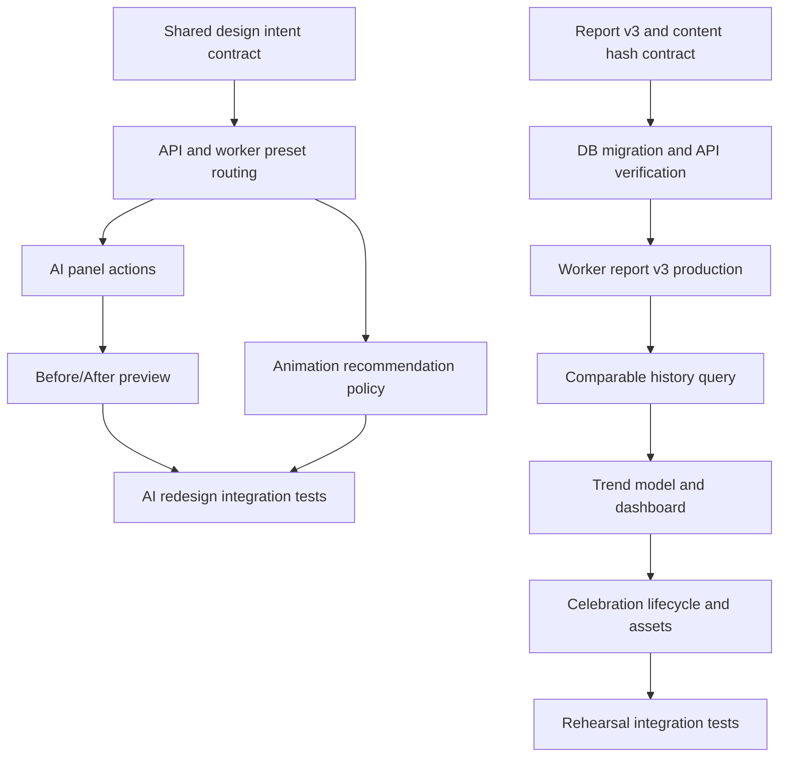

# 에디터 AI 재디자인 및 리허설 성장 리포트 구현 계획

> 상태: 구현 전 승인 문서
> 작성일: 2026-07-21
> 대상: `apps/web`, `apps/api`, `apps/worker`, `services/python-worker`, `packages/shared`, `packages/editor-core`
> 디자인 기준: 확정된 ORBIT 다크 편집기 시안 1번
> 리허설 시각 기준: 2026-07-21에 최종 선택한 `최근 5회 리허설 추세` 시안 1번 전체 화면
> 코드 기준: `AGENTS.md`, `docs/contracts.md`, `apps/web/src/styles/tokens.css`

## 1. 문서 목적과 구현 게이트

이 문서는 다음 두 제품 변화를 실제 구현 가능한 계약, 상태, 파일, 테스트, PR, 커밋 단위로 고정한다.

1. 우측 AI 패널의 중심을 이미지 생성에서 **현재 슬라이드 다시 디자인**으로 전환한다.
2. 하단 리포트를 단일 리허설 결과에서 **같은 내용으로 수행한 최근 5회 성장 추세**로 확장한다.

이 문서가 승인되기 전에는 기능 구현을 시작하지 않는다. 구현 중 계약이나 제품 결정이 달라지면 코드를 먼저 바꾸지 않고 이 문서를 먼저 갱신한다.

## 2. 확정된 결정과 전제

### 2.1 사용자 확정 결정

- 기존 ORBIT 다크 편집기 shell과 Electric Blue/Purple 역할 토큰을 유지한다.
- AI 패널의 primary action은 `슬라이드 다시 디자인`이다.
- `레이아웃 정리`, `핵심 메시지 강조`, `애니메이션 추천`은 secondary action이다.
- 이미지 생성은 제거하지 않고 composer의 보조 모드로 내린다.
- 디자인 제안은 Before/After로 비교하고 사용자가 적용하기 전까지 deck을 변경하지 않는다.
- 최근 5회 추세는 동일 `slideId`만으로 묶지 않고, `slideContentHash`까지 같은 기록만 비교한다.
- 추세 selector는 `습관어/분`, `말 속도`, `평균 음량`, `쉼 비율` 네 개이며 기본 선택은 `습관어/분`이다.
- 음량 안정은 `loudnessMadDb <= 3.0 dB`일 때로 정의한다.
- 임의의 0–100 전달력 점수와 한국어 발표에 맞지 않는 WPM 표시는 추가하지 않는다.
- ORBIT 따봉 마스코트와 `참 잘했어요 / GREAT` 도장은 실제 투명 배경 에셋을 사용한다.
- PR은 기능 영역별 큰 vertical slice로 묶고, PR 내부에서는 테스트가 통과하는 기능 단위마다 자주 커밋한다.
- 기존 작업 트리가 dirty이면 그 작업 트리에서 구현하거나 임의로 stash하지 않고 별도 Git worktree를 만든다.

### 2.2 구현 전제

- 디자인 제안은 기존 design-agent proposal과 `DeckPatchOperation`을 재사용한다.
- 1차 범위에서는 슬라이드 재디자인을 별도 장기 실행 Job으로 바꾸지 않는다.
- 기존 이미지 생성 Job은 그대로 유지한다.
- 리허설 기록 API의 사용자·프로젝트 접근 제어와 90일 보존 정책은 유지한다.
- 기존 report v1/v2는 계속 조회할 수 있어야 한다.
- 새로운 report v3만 내용 해시와 음량 안정 정책을 공식적으로 제공한다.
- 시각 값은 `apps/web/src/styles/tokens.css`의 `--redesign-*` 역할 토큰만 사용한다.

### 2.3 인터랙티브 프로토타입 참조와 격리 경계

선택 시안 1번의 레이아웃과 상호작용을 확인할 때 다음 일회성 프로토타입을 참고한다.

```text
/Users/donghyunkim/.codex/visualizations/2026/07/20/
  019f8028-fe9d-7341-9cc9-6e6da24b841a/
  rehearsal-trend-option-1/
```

참조 우선순위:

1. `prototype-final-settled.png`: 최종 desktop 화면과 시각적 위계
2. `design-qa-comparison-final.png`: 선택 시안과 프로토타입의 나란한 비교
3. `design-qa.md`: 검증 viewport, 통과한 interaction, 남은 제약
4. 실행 중 프로토타입: metric 전환, 상세 disclosure, panel resize/maximize/collapse, AI redesign 상태 확인

이 프로토타입은 **시각·동작 참고용이며 production source가 아니다.** 다음 경계를 반드시 지킨다.

- 프로토타입 폴더에 ORBIT 운영 코드를 작성하지 않는다.
- production code, test, build script, package script, Vite alias, CSS, asset URL에서 프로토타입 경로를 참조하지 않는다.
- 프로토타입의 React component, CSS, fixture module, package, generated bundle을 복사하거나 import하지 않는다.
- 프로토타입의 `orbit-thumbs-up.png`, `orbit-great-stamp.png` 등 asset을 production asset으로 복사하지 않는다.
- 프로토타입이 사용한 dependency를 편의를 이유로 ORBIT에 추가하지 않는다. production 요구와 기존 stack을 기준으로 별도 검토한다.
- 실제 UI는 `apps/web`, 계약은 `packages/shared`, playback은 필요한 경우 `packages/editor-core`에 새로 구현한다.
- 실제 asset은 소유권과 provenance가 확인된 별도 production asset으로 제작해 `apps/web/src/assets`에 둔다.
- 공통 primitive, pattern, feature 배치와 `tokens.css` 사용은 `AGENTS.md`를 따른다.
- 프로토타입 폴더 전체를 삭제하거나 접근 불가능하게 만들어도 ORBIT build, test, runtime, asset resolution이 변하지 않아야 한다.

## 3. 목표 UX와 레이아웃

### 3.1 전체 편집기 배치

```text
┌──────────────────────────────────────────────────────────────────────────────┐
│ Top toolbar                                                                  │
├──────────┬───────────────────────────────────────────────┬───────────────────┤
│ Slide    │                                               │ AI assistant      │
│ rail     │               Slide canvas                    │                   │
│          │                                               │ Redesign actions  │
│          │                                               │ Before / After    │
├──────────┴───────────────────────────────────────────────┴───────────────────┤
│ 대본 | QnA | 리포트                                                         │
│ 최근 5회 추세 | 핵심 지표 | 축하 피드백                                      │
└──────────────────────────────────────────────────────────────────────────────┘
```

- 우측 AI 패널은 기존 `EditorRightPanel` 영역을 유지한다.
- 하단 `리포트` 탭은 처음 열 때 340~360px 높이를 요청한다.
- 사용자가 직접 조절한 높이와 maximize/collapse 상태는 기존 동작을 유지한다.
- `대본`, `QnA` 탭의 기본 높이를 리포트 높이로 강제하지 않는다.

### 3.2 우측 AI 패널 정보 구조

AI 패널의 비어 있는 첫 화면은 다음 순서로 렌더링한다.

1. ORBIT assistant illustration와 `이 슬라이드를 더 설득력 있게` 제목
2. primary button: `슬라이드 다시 디자인`
3. secondary buttons:
   - `레이아웃 정리`
   - `핵심 메시지 강조`
   - `애니메이션 추천`
4. proposal이 있으면 Before/After inline preview
5. 채팅 기록
6. `디자인 | 이미지 생성` 모드와 composer

상태별 동작은 다음과 같다.

| 상태 | 화면 | 허용 동작 |
| --- | --- | --- |
| `idle` | hero와 빠른 동작 | 새 요청 |
| `generating` | skeleton/progress copy | 중복 요청 차단 |
| `proposal-ready` | Before/After와 요약 | 확대, 적용, 닫기 |
| `stale` | 원본 변경 경고 | 적용 차단, 다시 생성 |
| `applying` | 적용 progress | 중복 적용 차단 |
| `applied` | 적용 완료 메시지 | editor undo, 후속 요청 |
| `failed` | 실패 원인과 재시도 | 동일 intent 재시도 |

### 3.3 Before/After 비교

- Before는 요청 시점 `baseVersion`의 현재 슬라이드다.
- After는 proposal operation을 client에서 preview 적용한 candidate deck의 같은 `slideId`다.
- inline preview는 작은 썸네일 두 개와 화살표, `미리보기` 버튼으로 구성한다.
- 확대 모달은 두 슬라이드를 좌우로 동시에 보여준다.
- viewport가 좁으면 좌우가 아니라 위아래로 배치한다.
- Before와 After에는 각각 명시적인 텍스트 label을 제공한다.
- 색상 차이만으로 변경 여부를 표현하지 않는다.
- `deck.version !== proposal.baseVersion`이면 proposal을 `stale`로 표시하고 `적용`을 비활성화한다.
- 서버의 apply 응답이 stale을 반환하는 경우에도 같은 메시지와 복구 동작을 제공한다.
- 적용 성공은 기존 change record에 연결하여 editor undo 한 번으로 되돌릴 수 있어야 한다.

### 3.4 리허설 리포트 배치

선택 시안 1번의 전체 구성을 리허설 리포트의 시각적 source of truth로 사용한다. desktop 1280px 이상에서는 다음 3열을 사용한다.

```css
grid-template-columns:
  minmax(320px, 1.35fr)
  minmax(220px, 0.75fr)
  minmax(300px, 1fr);
```

| 열 | 내용 |
| --- | --- |
| 좌측 | `최근 5회 리허설 추세`, 4개 selector, 선택 지표 그래프 |
| 중앙 | 실제 단위의 습관어, 말 속도, 평균 음량, 음량 변화폭 카드 |
| 우측 | no-filler 긍정 피드백, 따봉 ORBIT 마스코트, 작은 GREAT 도장 |

- `>=1280px`: 추세, 지표, 축하 영역을 3열로 유지한다.
- `960~1279px`: 추세를 왼쪽에 유지하고 축하 영역을 중앙 지표 아래로 이동한다.
- `<960px`: 추세 → 지표 → 축하 → 이번 회차 상세 순서의 한 열로 적층한다.
- 기존 단일 회차의 시간별 음량·속도 그래프와 coaching 상세는 `이번 회차 상세` 접이식 영역으로 보존한다.

시안의 중앙 지표와 우측 피드백은 다음 표시를 기준으로 한다.

| 항목 | 시안 기준 표시 | 데이터 원본 |
| --- | --- | --- |
| 습관어 | `0.0회/분` | 활성 발화 시간으로 정규화한 filler rate |
| 말 속도 | `4.2음절/초 · 적정` | `voice.syllablesPerSecond` |
| 평균 음량 | `-36dBFS · 적정` | `voice.loudnessDb` |
| 음량 변화폭 | `2.4dB · 안정` | `voice.loudnessMadDb` |
| 긍정 피드백 | `오늘은 ‘음…’ 같은 습관어가 없었어요` | deterministic no-filler 판정 |
| 도장 | `참 잘했어요 / GREAT` | deterministic GREAT 판정 |

- 숫자와 단위의 시각적 간격은 token과 typography로 조정하되 접근성 이름은 `4.2 음절/초`, `-36 dBFS`, `2.4 dB`처럼 읽기 쉽게 제공한다.
- GREAT stamp는 축하 영역의 보조 시각 요소다. 마스코트나 메시지보다 크게 확대하지 않는다.
- 선택 시안의 숫자는 레이아웃 설명용 예시이며 production fallback으로 사용하지 않는다.

## 4. AI 슬라이드 개선 기능 명세

### 4.1 빠른 동작 계약

`packages/shared/src/deck/design-agent.schema.ts`에 다음 preset을 추가한다.

```ts
export const designAgentIntentPresetSchema = z.enum([
  "redesign-slide",
  "tidy-layout",
  "emphasize-message",
  "recommend-animation",
]);

export const createDesignAgentMessageRequestSchema = z.object({
  sessionId: z.string().trim().min(1).max(200).optional(),
  content: z.string().trim().min(1).max(2_000),
  intentPreset: designAgentIntentPresetSchema.optional(),
  context: designAgentContextSchema,
});
```

- `intentPreset`은 선택 사항으로 추가하여 기존 client와의 하위 호환성을 유지한다.
- `content`는 사용자에게 보이는 요청 문장이고, `intentPreset`은 worker의 안정적인 routing hint다.
- API와 worker는 preset을 모르는 경우 실패시키지 않고 기존 `content` 기반 해석으로 fallback한다.
- chat의 자유 입력은 preset 없이 기존 동작을 유지한다.

### 4.2 preset별 성공 조건

#### `redesign-slide`

- `slideId`, speaker notes, 키워드, 의미 cue/action은 보존한다.
- 전체 요소의 배치, 위계, 정렬, 크기, 색상, 배경을 함께 개선할 수 있다.
- 텍스트는 계속 편집 가능한 text element로 유지한다.
- 새 이미지는 필수가 아니며, 이미지가 없더라도 완성된 제안을 반환해야 한다.
- 슬라이드를 삭제하고 새 슬라이드를 만드는 방식은 사용하지 않는다.

#### `tidy-layout`

- 텍스트 의미와 데이터 값은 바꾸지 않는다.
- 정렬, 간격, overflow, 충돌, canvas boundary, 반복 요소의 크기만 정리한다.
- 변경 전후 element ID를 가능한 한 유지한다.

#### `emphasize-message`

- title, speaker notes, 기존 text를 근거로 핵심 문장을 고른다.
- 핵심 문장을 짧게 새로 쓰는 경우 proposal summary에 변경 사실을 명시한다.
- 새로운 사실, 수치, 출처를 만들지 않는다.
- typography, contrast, whitespace, supporting shape로 우선 강조한다.

#### `recommend-animation`

- 1차 허용 효과는 `appear`, `fade-in`, `zoom-in`이다.
- imported PPTX에서 motion mutation이 안전하지 않으면 제안을 만들지 않고 이유를 설명한다.
- 화려한 효과보다 start mode와 순서를 우선한다.
- 권장 기본 순서:
  - title: `on-slide-enter`
  - 첫 핵심 요소: `on-click`
  - 같은 의미 그룹: `with-previous`
  - 다음 설명: `after-previous`
- preview에서 실제 presenter timeline으로 재생할 수 있어야 한다.

### 4.3 proposal 불변 조건

- 요청 시점 `baseVersion`을 proposal에 유지한다.
- client preview에는 `applyDeckPatch`를 사용한다.
- 실제 저장은 기존 proposal apply API만 사용한다.
- preview 과정에서 autosave나 deck mutation을 발생시키지 않는다.
- proposal operation은 shared schema 검증을 통과해야 한다.
- 적용 실패나 stale proposal을 임의로 client에서 재작성하지 않는다.
- 적용 성공 후 기존 `changeRecord`와 snapshot/undo 흐름을 유지한다.

### 4.4 컴포넌트 책임

```text
AiChatPanel                         orchestration, chat/session state
└── DesignAssistantHome            hero, primary/secondary actions
└── DesignProposalCompareCard      inline Before/After
└── DesignAssistantComposer        design/image mode, free prompt
└── DesignProposalPreviewModal     expanded Before/After and apply
```

- shell 전용 orchestration은 기존 `AiChatPanel.tsx`에 둔다.
- 새 조합형 feature UI는 `apps/web/src/features/editor/design-agent/components`에 둔다.
- 공통 button, icon button, tabs는 `apps/web/src/components/ui`를 재사용한다.
- feature CSS는 `apps/web/src/features/editor/design-agent/design-assistant.css`로 분리한다.
- `editor-shell.css`에는 shell sizing과 integration selector만 남긴다.

## 5. 리허설 추세와 축하 기능 명세

### 5.1 report v3 계약

`SlidePracticeReport`에 v3 variant를 추가한다.

```ts
type SlidePracticeReportV3 = Omit<
  SlidePracticeReportV2,
  "reportVersion" | "metricDefinitionVersion"
> & {
  reportVersion: 3;
  metricDefinitionVersion: 3;
  contentHashVersion: "slide-text-v1";
  slideContentHash: string; // lowercase SHA-256, 64 hex chars
};
```

- v1/v2 shape는 그대로 parse하고 조회할 수 있어야 한다.
- v3의 `slideContentHash`는 `slideQuestionGuideTextHashInput(slide)`와 `sha256Canonical`을 재사용한다.
- 시각적 배치만 바뀌고 텍스트·speaker notes가 같으면 hash는 유지된다.
- text, alt, title, speaker notes가 바뀌면 hash가 바뀐다.
- client가 보낸 hash를 신뢰하지 않고 API가 현재 deck의 slide로 재계산해 검증한다.
- mismatch는 `409 SLIDE_PRACTICE_CONTENT_HASH_MISMATCH`로 실패시킨다.

### 5.2 저장과 조회

새 migration은 다음 nullable column을 추가한다.

```sql
ALTER TABLE slide_practice_audio_analyses
  ADD COLUMN content_hash_version text,
  ADD COLUMN slide_content_hash text;

ALTER TABLE slide_practice_reports
  ADD COLUMN content_hash_version text,
  ADD COLUMN slide_content_hash text;
```

- 기존 v1/v2 row 때문에 column은 nullable로 둔다.
- v3 row는 service와 worker에서 두 필드를 반드시 채운다.
- `slide_content_hash`에는 lowercase SHA-256 check constraint를 둔다.
- 다음 비교 조회 index를 추가한다.

```sql
CREATE INDEX idx_slide_practice_comparable_history
ON slide_practice_reports (
  project_id,
  created_by,
  deck_id,
  slide_id,
  slide_content_hash,
  created_at DESC
);
```

list API에는 선택 query `slideContentHash`를 추가한다.

```http
GET /api/v1/projects/:projectId/slide-practice-reports
  ?deckId=...
  &slideId=...
  &slideContentHash=...
  &limit=5
```

- 새 UI는 현재 slide hash와 `limit=5`를 함께 보낸다.
- UI는 비교 추세와 최신 상세를 분리해 조회한다.
  - 비교 추세: 현재 `slideContentHash`, `limit=5`
  - 최신 상세: hash filter 없이 `limit=1`
- v1/v2 또는 다른 hash의 최신 상세는 `이전 슬라이드 내용으로 연습한 기록`이라고 표시하고 비교 추세에는 포함하지 않는다.
- 현재 hash의 기록이 없으면 `이 내용으로 연습한 기록이 아직 없습니다.`를 표시한다.
- API의 creator-private 접근 제어와 90일 보존 정책은 유지한다.

### 5.3 metricDefinitionVersion 3 정책

| 지표 | 계산/범위 | 개선 방향 |
| --- | --- | --- |
| 습관어 | `totalCount / (activeSpeechMs / 60_000)` | 낮을수록 좋음 |
| 말 속도 | `syllablesPerSecond` | 3.5~4.8 음절/초 범위에 가까울수록 좋음 |
| 평균 음량 | `loudnessDb` | -45~-30 dBFS 범위에 가까울수록 좋음 |
| 쉼 비율 | `pauseRatio * 100` | 12~55% 범위에 가까울수록 좋음 |
| 음량 안정 | `loudnessMadDb <= 3.0` | true이면 안정 |

측정 규칙은 다음과 같다.

- 습관어 추세는 `quality.state === "measured"`, STT 사용 가능, `activeSpeechMs >= 5_000`일 때만 계산한다.
- 분모가 부족하거나 STT가 실패하면 0이 아니라 `null`로 취급한다.
- 말 속도, 평균 음량, 쉼 비율도 값이 `null`이면 그래프에 점을 만들지 않는다.
- `slideContentHash` 또는 `metricDefinitionVersion`이 다른 기록은 한 선으로 연결하지 않는다.
- 측정 불가는 0으로 그리거나 앞뒤 점을 직선으로 보간하지 않고 명시적인 gap으로 남긴다.
- 1회는 현재 값만, 2회는 이전 대비, 3회 이상은 추세를 표시한다.
- 적정 범위형 지표의 향상은 단순 증가/감소가 아니라 목표 범위까지의 거리 감소로 계산한다.

### 5.4 추세 UI

기본 selector는 `습관어/분`이다.

- `습관어/분`
- `말 속도`
- `평균 음량`
- `쉼 비율`

그래프는 오래된 기록에서 최신 기록 순으로 왼쪽에서 오른쪽에 배치한다. API 응답은 최신순이므로 UI model에서 한 번 reverse한다.

- `습관어/분`을 선택하면 그래프 상단에 `낮을수록 좋아요`를 항상 표시한다.
- selector는 button tab 또는 segmented control로 구현하고 keyboard focus와 `aria-selected`를 제공한다.
- 날짜 label은 `createdAt`에서 계산한다. 사용자의 현재 날짜와 같은 최신 기록만 `오늘`로 표시한다.
- measured point에는 숫자 label과 tooltip을 제공하고, unmeasured gap에는 `측정 불가` 접근성 설명을 제공한다.

선택 시안의 5회 값은 다음처럼 **test, Storybook, design QA 전용 fixture**로만 정의한다.

| 날짜 label | 습관어/분 |
| --- | ---: |
| `7/13` | 3.1 |
| `7/15` | 2.7 |
| `7/17` | 1.9 |
| `7/19` | 0.9 |
| `오늘` | 0.0 |

- fixture는 하강하는 line, point label, 날짜 간격, 0 값의 정상 표시를 시각 검증하는 데만 사용한다.
- production component의 default props, empty fallback, API error fallback, demo seed로 이 숫자를 사용하지 않는다.
- production 값은 반드시 조회된 report record에서 계산한다.

카드는 다음 실제 단위를 사용한다.

- `습관어 0.0회/분`
- `말 속도 4.2음절/초 · 적정`
- `평균 음량 -36dBFS · 적정`
- `음량 변화폭 2.4dB · 안정`

`전달력 점수 86`, `148 WPM`, 측정 실패를 0으로 치환한 값은 표시하지 않는다.

### 5.5 축하 판정

축하 문구는 LLM이 만들지 않고 report에서 결정적으로 계산한다.

```ts
const noFiller =
  report.reportVersion === 3 &&
  report.quality.state === "measured" &&
  report.voice.activeSpeechMs >= 5_000 &&
  report.fillers.totalCount === 0;

const great =
  noFiller &&
  isInRange(report.voice.syllablesPerSecond, 3.5, 4.8) &&
  isInRange(report.voice.loudnessDb, -45, -30) &&
  report.voice.loudnessMadDb !== null &&
  report.voice.loudnessMadDb <= 3.0 &&
  isInRange(report.voice.pauseRatio, 0.12, 0.55) &&
  isInRange(report.voice.pitchSpanHz, 45, 160);
```

- `noFiller`이면 `오늘은 ‘음…’ 같은 습관어가 없었어요` 카피를 노출한다.
- `great`이면 ORBIT 따봉 마스코트와 `참 잘했어요 / GREAT` 도장을 노출한다.
- 측정되지 않은 값을 성공으로 간주하지 않는다.
- 특정 습관어가 아니라 모든 filler가 0인 경우이므로 접근성 label은 `습관어 사용 없음`으로 제공한다.

### 5.6 축하 animation lifecycle

- animation trigger는 새 report가 생성된 직후의 `practiceSessionId`다.
- `EditorShell`은 마지막으로 처리한 session ID를 저장하고 report tab에 전달한다.
- history fetch 결과의 최신 report가 trigger ID와 같을 때만 animation을 한 번 실행한다.
- report tab 재진입, slide 재선택, 브라우저 새로고침에서는 정적 완료 상태만 보여준다.
- `prefers-reduced-motion: reduce`에서는 transform animation과 confetti를 제거한다.
- 성공 문구는 `aria-live="polite"`로 읽는다.
- decoration asset에는 빈 alt를, 의미를 가진 결과 문구에는 실제 텍스트를 사용한다.

권장 motion:

| 대상 | motion | 시간 |
| --- | --- | --- |
| 마스코트 | 아래에서 12px 이동 + 작은 bounce | 480ms |
| GREAT 도장 | scale 1.5 → 0.94 → 1, -8deg → 0deg | 420ms |
| confetti | opacity/translate, 장식 전용 | 최대 700ms |

에셋은 다음 위치에 둔다.

```text
apps/web/src/assets/orbit-mascot-thumbs-up.webp
apps/web/src/assets/orbit-great-stamp.webp
apps/web/src/assets/orbit-celebration-confetti.webp  # 선택
```

- 기존 `apps/web/src/assets/orbit-report-mascot-transparent.png`는 일반 포즈이므로 이번 따봉 상태에 재사용하지 않는다.
- 따봉 마스코트와 stamp는 선택 시안의 광원, Electric Blue/Purple palette, 입체 표현을 맞춘 별도 투명 raster asset으로 제작한다.
CSS drawing, emoji 대체, 임시 SVG를 production asset으로 사용하지 않는다.

## 6. 의존성 순서



- shared contract 변경 후에 API, worker, web을 병렬화할 수 있다.
- migration과 report producer 변경은 순차적으로 진행한다.
- AI PR과 리허설 PR은 서로 직접 의존하지 않지만 같은 editor shell/CSS를 수정하므로 동시에 구현할 경우 담당 파일을 명확히 나눈다.

## 7. 목표 파일 구조

```text
packages/shared/src/deck/
  design-agent.schema.ts
  design-agent.schema.test.ts

packages/shared/src/slide-practice/
  slide-practice.schema.ts
  slide-practice.schema.test.ts
  slide-practice-analysis.ts
  slide-practice-analysis.test.ts
  slide-practice-policy.ts              # 신규, 수치 정책 단일화

apps/web/src/features/editor/design-agent/
  designAgentApi.ts
  designAgentApi.test.ts
  design-assistant.css                  # 신규
  components/
    DesignAssistantHome.tsx             # 신규
    DesignProposalCompareCard.tsx       # 신규

apps/web/src/features/editor/practice/
  SlidePracticeHistoryPanel.tsx
  SlidePracticeHistoryPanel.test.tsx
  PracticeTrendChart.tsx                # 신규
  practiceTrend.ts                      # 신규 pure model
  practiceTrend.test.ts                 # 신규
  PracticeCelebration.tsx               # 신규
  PracticeCelebration.test.tsx          # 신규

apps/api/src/slide-practice/
  slide-practice.service.ts
  slide-practice.service.spec.ts

apps/worker/src/
  slide-practice-analysis.processor.ts
  slide-practice-analysis.processor.spec.ts

apps/api/src/database/migrations/
  <timestamp>-AddSlidePracticeContentHash.ts
  <timestamp>-AddSlidePracticeContentHash.spec.ts
```

실제 task는 한 번에 약 5개 이하 파일을 수정하도록 더 작게 나눈다. 위 목록 전체를 한 커밋에서 변경하지 않는다.

## 8. PR 구성

기능을 지나치게 작은 PR로 분산하지 않고 두 개의 큰 vertical-slice PR로 묶는다.

### PR 1 — AI 슬라이드 다시 디자인과 Before/After 제안

**목표:** 우측 AI 패널에서 재디자인 요청부터 비교, 적용, undo까지 한 흐름을 완성한다.

**포함 범위:**

- shared `intentPreset` 계약
- API/worker preset routing
- 우측 AI 패널의 확정 레이아웃
- primary/secondary action
- inline 및 확대 Before/After
- stale/apply/undo 상태
- export-safe animation 추천
- 접근성, responsive, 오류/재시도

**제외 범위:**

- 새로운 slide-redesign Job
- AI가 슬라이드 전체를 이미지 한 장으로 rasterize하는 기능
- 새로운 animation type 또는 PPTX serializer 확대
- 프로토타입 component, CSS, asset, dependency의 production 복사·import

### PR 2 — 최근 5회 리허설 추세와 축하 피드백

**목표:** 같은 내용으로 연습한 최근 5회를 비교하고, 근거 있는 긍정 피드백을 제공한다.

**포함 범위:**

- report v3와 `slideContentHash`
- migration, API 검증·필터, worker report 생산
- metric definition v3와 음량 안정 3.0 dB 정책
- 습관어/분, 말 속도, 평균 음량, 쉼 비율의 최근 5회 추세 model/chart
- 실제 단위의 지표 카드
- no-filler와 GREAT 판정
- 실제 마스코트·도장 에셋과 1회성 animation
- reduced motion, keyboard, screen reader 검증

**제외 범위:**

- 0–100 전달력 종합 점수
- 프로젝트 전체 리허설 대시보드
- raw audio, transcript 원문 저장·노출 확대
- 90일 retention 변경
- 프로토타입 fixture, mascot/stamp asset, package의 production 복사·import

## 9. PR 내부 task 및 커밋 계획

### 9.1 공통 커밋 원칙

각 PR은 큰 제품 단위로 유지하되, 내부 작업은 다음 패턴을 반드시 따른다.

```text
작은 기능 구현 → 관련 테스트 → diff 확인 → 커밋 → 다음 기능
```

- 테스트가 통과하는 기능 단위마다 커밋한다.
- 계약, migration, backend, UI, asset/motion, test cleanup을 한 커밋에 섞지 않는다.
- 의미 없는 `fix`, `update`, `wip` 커밋 메시지를 사용하지 않는다.
- 대량 formatting이나 관련 없는 refactor를 기능 커밋에 포함하지 않는다.
- PR 직전에 한 번에 squash하기 위한 거대 임시 커밋을 만들지 않는다.
- 커밋 메시지는 `docs/git-rules.md`에 따라 한국어로 작성한다.
- 각 PR의 마지막 검증 commit 전에 prototype dependency scan과 prototype-excluded build/test를 통과한다.

PR 2는 다음 dependency order를 지킨다.

```text
shared 계약 → migration/API → worker producer → trend model → report UI → celebration/accessibility
```

- 앞 단계의 관련 테스트가 통과하고 atomic commit이 생성되기 전에는 다음 단계로 넘어가지 않는다.
- PR 자체는 위 단계를 모두 포함하는 하나의 큰 리허설 성장 리포트 vertical slice로 유지한다.

### 9.2 PR 1 권장 커밋 순서

#### Commit 1 — design intent 계약

```text
feat: AI 슬라이드 개선 의도 계약 추가
```

- `intentPreset` schema/type/export 추가
- 하위 호환 및 invalid preset 테스트
- 검증: `pnpm --filter @orbit/shared test -- design-agent.schema.test.ts`

#### Commit 2 — API와 worker preset 처리

```text
feat: 디자인 에이전트 빠른 동작 라우팅 추가
```

- API request 전달
- Python worker model/prompt routing
- preset별 최소 operation 기대 테스트

#### Commit 3 — AI 패널 action hierarchy

```text
feat: AI 패널에 슬라이드 재디자인 동작 추가
```

- hero, primary/secondary action
- 이미지 생성 보조 모드 유지
- loading/disabled/error 상태 테스트

#### Commit 4 — inline Before/After

```text
feat: 디자인 제안 전후 비교 카드 추가
```

- 요청 시점 base deck 보존
- candidate preview
- stale 계산과 적용 차단

#### Commit 5 — 확대 비교와 적용 lifecycle

```text
feat: 디자인 제안 비교 모달과 적용 흐름 개선
```

- 좌우/상하 responsive 비교
- apply, stale API error, undo 연결
- focus trap, Escape, focus return

#### Commit 6 — animation 추천 정책

```text
feat: 내보내기 호환 애니메이션 추천 추가
```

- `appear`, `fade-in`, `zoom-in` 제한
- start mode sequencing
- imported PPTX fail-closed

#### Commit 7 — 통합 검증과 시각 마감

```text
test: AI 슬라이드 재디자인 흐름 검증 추가
```

- component/integration/browser test
- reduced motion과 responsive
- raw color 제거 및 token 검증

### 9.3 PR 2 권장 커밋 순서

#### Commit 1 — report v3 shared 계약

```text
feat: 슬라이드 내용 기반 리허설 리포트 계약 추가
```

- v3 variant, hash/version, metricDefinitionVersion 3
- v1/v2 compatibility test
- 3.0 dB 안정 정책 helper와 boundary test

#### Commit 2 — content hash migration

```text
feat: 리허설 내용 해시 저장 구조 추가
```

- nullable column, check constraint, comparable history index
- migration up/down test

#### Commit 3 — API hash 검증과 조회 filter

```text
feat: 같은 내용의 리허설 기록 조회 지원
```

- server recompute/409 mismatch
- list `slideContentHash` query
- creator-private, cursor, limit 회귀 테스트

#### Commit 4 — worker report v3 생산

```text
feat: 리허설 분석 결과에 내용 해시와 안정 지표 반영
```

- analysis row에서 hash 전달
- v3 report persist
- `loudness-unstable` coaching issue 반영
- measured/partial/unmeasured test

#### Commit 5 — 최근 5회 trend model

```text
feat: 리허설 추세 계산 모델 추가
```

- filler rate, pace/loudness/pause target distance, missing gap, chronological sort
- 1/2/3~5회 분기
- pure unit test

#### Commit 6 — 리포트 dashboard

```text
feat: 하단 리포트에 최근 5회 추세 추가
```

- `limit=5`, hash filter
- 4개 selector, chart, 실제 단위 cards, detail disclosure
- loading/empty/error/legacy state

#### Commit 7 — 축하 판정과 event wiring

```text
feat: 새 리허설 완료 축하 피드백 추가
```

- session ID trigger 전달
- no-filler/GREAT deterministic model
- 재진입 시 animation 미실행

#### Commit 8 — 마스코트와 motion

```text
feat: ORBIT 리허설 축하 모션 적용
```

- 승인된 raster asset
- stamp/mascot motion
- reduced motion와 aria-live test

#### Commit 9 — 통합·migration 검증

```text
test: 리허설 성장 리포트 통합 검증 추가
```

- migration round trip
- API → worker → web fixture
- desktop/responsive browser smoke

## 10. Task 완료 기준과 checkpoint

### Checkpoint A — PR 1 계약과 backend

- [ ] old client가 preset 없이 요청해도 성공한다.
- [ ] 네 preset이 API에서 worker까지 손실 없이 전달된다.
- [ ] 제안 operation이 shared schema를 통과한다.
- [ ] imported PPTX의 안전하지 않은 animation 변경이 차단된다.

### Checkpoint B — PR 1 UI flow

- [ ] 재디자인 클릭 후 Before/After가 생성된다.
- [ ] 적용 전 deck과 autosave state가 바뀌지 않는다.
- [ ] stale proposal은 적용할 수 없다.
- [ ] 적용 성공 후 undo 한 번으로 되돌아간다.
- [ ] 이미지 생성은 composer 보조 모드에서 계속 동작한다.

### Checkpoint C — PR 2 계약과 persistence

- [ ] report v1/v2/v3를 모두 parse하고 조회한다.
- [ ] client hash 위조 또는 stale hash를 API가 409로 차단한다.
- [ ] migration up/down과 index가 검증된다.
- [ ] v3 report가 hash와 metric version을 포함해 저장된다.

### Checkpoint D — PR 2 report UI

- [ ] 같은 hash의 최근 5회만 추세에 포함된다.
- [ ] 측정 실패가 0으로 표시되지 않는다.
- [ ] `습관어/분`, `말 속도`, `평균 음량`, `쉼 비율` selector가 keyboard로 전환된다.
- [ ] 습관어 fixture `3.1 → 2.7 → 1.9 → 0.9 → 0.0`가 test/design QA에서만 사용된다.
- [ ] 말 속도는 음절/초, 음량은 dBFS/dB로 표시된다.
- [ ] `loudnessMadDb === 3.0`은 안정, 3.0 초과는 불안정이다.
- [ ] 축하 animation은 새 report 직후 한 번만 실행된다.
- [ ] reduced motion에서는 정적 결과가 제공된다.

## 11. 테스트 전략과 실행 명령

### 11.1 shared 계약

```bash
pnpm --filter @orbit/shared test
pnpm --filter @orbit/shared build
pnpm --filter @orbit/shared typecheck
```

검증 대상:

- preset enum과 하위 호환
- report v1/v2/v3 union
- hash format과 version
- metric boundary: 2.99, 3.0, 3.01 dB
- filler rate와 target range distance

### 11.2 Web

```bash
pnpm --filter @orbit/web test
pnpm --filter @orbit/web lint
pnpm --filter @orbit/web build
```

검증 대상:

- AI panel state matrix
- Before/After base/candidate rendering
- stale/apply/error/focus lifecycle
- 최근 5회 4개 selector, fixture와 missing gap
- 새 session에서만 animation 실행
- keyboard, ARIA, reduced motion

리허설 dock의 visual QA는 두 기준을 사용한다.

- 선택 시안: `1487×1058`에서 전체 정보 구조와 비율을 비교한다.
- 최종 인터랙티브 프로토타입: `prototype-final-settled.png`와 `design-qa-comparison-final.png`가 검증된 `1440×1024` 상태에서 metric 전환, missing gap, 상세 disclosure, AI proposal, panel resize/maximize/collapse를 비교한다.

responsive 경계는 `1280`, `1279`, `960`, `959px`에서 각각 캡처해 3열, 축하 영역 이동, 한 열 적층을 검증한다. visual QA에 프로토타입 이미지를 입력으로 사용할 수 있지만 production test fixture, snapshot, static asset으로 복사하지 않는다.

### 11.3 API와 Worker

```bash
pnpm --filter @orbit/api test
pnpm --filter @orbit/api build
pnpm --filter @orbit/worker test
pnpm --filter @orbit/worker build
```

검증 대상:

- hash 재계산과 mismatch 409
- creator-private list filter
- worker v3 report 생산
- coaching issue와 비측정 처리
- 업무 이벤트 로그에 transcript, raw audio, script가 포함되지 않음

### 11.4 Python worker

```bash
cd services/python-worker
uv sync --locked
uv run ruff check .
uv run mypy app
uv run pytest
```

검증 대상:

- design intent preset model
- preset별 prompt/routing
- animation effect 제한
- provider 실패 fallback

### 11.5 migration

```bash
docker compose up -d postgres
pnpm db:migration:run
pnpm db:migration:revert
pnpm db:migration:run
```

### 11.6 repository checkpoint

```bash
pnpm lint
pnpm typecheck
pnpm test
pnpm build
node infra/scripts/check-env.mjs
docker compose config
```

문서만 변경한 현재 단계에서는 코드 테스트를 요구하지 않는다. 구현 PR에서는 변경 범위 명령과 repository checkpoint 결과를 PR 본문에 남긴다.

## 12. Git branch와 worktree 필수 절차

### 12.1 시작 전 preflight

모든 구현 세션은 다음 상태 확인으로 시작한다.

```bash
git status --short --branch
git worktree list
```

### 12.2 dirty 작업 트리 처리 — 필수

현재 작업 트리가 dirty이면 **그 디렉터리에서 구현을 시작하지 않는다.**

금지:

- 기존 변경을 기능 브랜치에 함께 커밋
- 사용자 변경을 임의로 stash
- untracked 파일 삭제 또는 이동
- dirty 상태에서 checkout, merge, pull
- 사용자 변경을 되돌리기 위한 reset/checkout

반드시 원격 기준을 먼저 갱신한 뒤 최신 `origin/develop`에서 별도 branch와 worktree를 생성한다. 로컬 `develop`이 오래되었거나 dirty하더라도 이를 base로 사용하지 않는다.

```bash
# 원본 작업 트리에서 상태와 대상 이름을 먼저 확인한다.
git status --short --branch
git worktree list

# pull이나 merge 없이 원격 develop 기준만 갱신한다.
git fetch origin develop --prune
git rev-parse origin/develop

# 동일한 branch/worktree가 없는지 확인한다.
git branch --list 'feature/editor-ai-redesign'

# fetch한 origin/develop에서 PR 1 branch와 worktree를 만든다.
git worktree add -b feature/editor-ai-redesign \
  /private/tmp/orbit-editor-ai-redesign \
  origin/develop

# PR 2도 시작 직전에 다시 fetch한 origin/develop에서 만든다.
git fetch origin develop --prune
git worktree add -b feature/rehearsal-growth-report \
  /private/tmp/orbit-rehearsal-growth-report \
  origin/develop
```

- 구현과 PR 준비는 새 worktree가 `origin/develop`에서 분기됐음을 확인한 뒤에만 시작한다.
- `git merge-base --is-ancestor origin/develop HEAD`로 생성 시점의 base 포함 여부를 확인한다.
- 원본 작업 트리가 dirty해도 `fetch`는 가능하지만 그 디렉터리에서 `pull`, `merge`, `checkout`은 실행하지 않는다.
- 이미 같은 branch/worktree가 있으면 새로 만들지 말고 소유자와 상태를 확인한다.
- worktree 생성 후 그 경로에서 다시 `git status --short --branch`를 실행해 clean 상태를 확인한다.
- 원본 dirty 작업 트리는 읽기 전용 참고 대상으로 취급한다.
- PR이 merge되기 전에는 worktree를 성급히 제거하지 않는다.

### 12.3 커밋 전 필수 확인

```bash
git status --short
git diff --check
git diff --staged
```

- staged diff가 하나의 논리 기능만 포함하는지 확인한다.
- `.env`, token, cookie, password, credential, raw audio, transcript 원문, speaker script가 포함되지 않았는지 확인한다.
- 관련 테스트가 통과한 뒤 커밋한다.
- 공유 브랜치에는 rebase 또는 force push를 하지 않는다.
- 사용자가 요청하지 않은 push, PR 생성, 배포는 하지 않는다.

### 12.4 프로토타입 격리 검증 — PR 필수 gate

두 PR은 review 요청 전에 다음 격리 검증을 통과해야 한다.

#### 1. 정적 dependency scan

production source와 build 설정에서 프로토타입 식별자나 절대 경로가 발견되면 실패한다.

```bash
rg -n \
  'rehearsal-trend-option-1|019f8028-fe9d-7341-9cc9-6e6da24b841a|prototype-final-settled|design-qa-comparison-final|\.codex/visualizations' \
  apps packages services infra package.json pnpm-lock.yaml turbo.json
```

기대 결과는 출력 없음이다. 또한 production source 아래의 symlink가 repository 밖, 특히 `.codex/visualizations`를 가리키지 않는지 확인한다.

#### 2. package와 asset provenance 확인

- ORBIT `package.json`과 `pnpm-lock.yaml`에 prototype package를 local/file dependency로 연결하지 않는다.
- Vite/TypeScript alias, CSS `url()`, dynamic import, test fixture path에 prototype 경로를 넣지 않는다.
- 마스코트와 stamp는 production 경로에서 별도 제작·검수한 파일만 사용한다.
- prototype bundle 또는 screenshot을 production runtime asset으로 포함하지 않는다.

#### 3. prototype-excluded build/test

- CI 또는 격리 container에는 ORBIT repository만 mount하고 `.codex/visualizations`는 mount하지 않는다.
- 그 환경에서 `pnpm lint`, `pnpm typecheck`, `pnpm test`, `pnpm build`를 실행한다.
- browser smoke에서도 모든 image/font/CSS 요청이 ORBIT repository 또는 승인된 production URL에서만 resolve되는지 확인한다.
- 로컬에서 실제 prototype 폴더를 잠시 이동하는 방식이 필요하면 반드시 소유자 승인을 받고 복구 절차를 먼저 정한다. 기본 검증 방식은 물리적 이동이 아니라 prototype 경로를 mount하지 않은 환경이다.

다음 조건을 최종 독립성 판정으로 사용한다.

```text
prototype 폴더 삭제 또는 접근 불가
        ↓
ORBIT install/build/test/runtime/asset resolution 변화 없음
```

## 13. PR 본문 필수 항목

두 PR 모두 다음을 포함한다.

```markdown
## 변경 요약
- 사용자 관점의 완료된 흐름
- shared/API/worker/web 변경 범위

## 계약 변경
- schema version과 하위 호환
- migration과 rollback
- 제외한 mock-only 값

## 테스트
- 실행 명령
- 결과
- 실행하지 못한 검증과 이유

## 영향 범위
- editor shell
- design agent 또는 slide practice pipeline
- PPTX import/export 또는 privacy 영향

## 프로토타입 격리
- 정적 dependency scan 결과
- prototype-excluded build/test 결과
- production asset provenance와 소유 경로
- prototype 폴더 삭제 시 영향 없음 확인

## 롤백
- 기능 commit revert 순서
- migration revert 조건
```

## 14. 코드 스타일

계산과 판정은 component 내부에 흩뜨리지 않고 pure function으로 둔다.

```ts
export function classifyLoudnessStability(
  loudnessMadDb: number | null,
): "stable" | "unstable" | "unmeasured" {
  if (loudnessMadDb === null) return "unmeasured";
  return loudnessMadDb <= 3.0 ? "stable" : "unstable";
}
```

- external input은 Zod/Pydantic으로 검증한다.
- 제품 수치 정책은 shared helper 하나에서 관리한다.
- UI component는 판정 결과를 표시하고 임계값을 다시 구현하지 않는다.
- raw hex, 임의 spacing, 임의 duration을 feature CSS에 추가하지 않는다.
- 아이콘은 기존 Tabler icon과 `apps/web/src/components/ui` primitive를 사용한다.
- 꼭 필요한 경우에만 짧은 코드 주석을 추가한다.

## 15. 경계

### 항상 수행

- 계약을 먼저 변경하고 consumer를 뒤에서 변경한다.
- 하위 호환 fixture를 유지한다.
- apply 전 deck 불변, stale 차단, undo를 검증한다.
- 측정되지 않은 값과 0을 구분한다.
- 새 report 업무 이벤트를 기록하되 민감 원문을 로그에 남기지 않는다.
- 각 기능 commit 전에 관련 테스트를 실행한다.
- dirty 원본 작업 트리와 새 worktree를 분리한다.
- 프로토타입은 UX 명세로만 읽고 production 구현은 ORBIT 정식 구조에서 새로 작성한다.
- PR review 전에 prototype-excluded build/test와 dependency scan을 실행한다.

### 먼저 질문

- 0–100 종합 점수 schema 또는 산식 추가
- `loudnessMadDb <= 3.0` 정책 변경
- content hash에 시각 배치나 이미지 binary까지 포함하는 변경
- 새 animation type 또는 PPTX serializer 지원 확대
- 새 외부 provider/의존성 추가
- raw audio, transcript, speaker notes의 저장·노출 범위 변경
- migration을 nullable이 아닌 필수 column으로 변경

### 절대 수행하지 않음

- AI 제안을 적용하기 전에 실제 deck을 mutation
- 슬라이드를 이미지 한 장으로 바꿔 editable content를 제거
- STT 실패나 측정 누락을 0으로 표시
- 프론트에서 계약 없는 전달력 점수를 계산
- raw audio, transcript 원문, speaker script를 log 또는 audience API에 노출
- `.env`, secret, build output, cache를 commit
- dirty 작업 트리의 사용자 변경을 임의로 stash, reset, delete, commit
- 프로토타입 component, CSS, asset, fixture, package, dist output을 production에 import·복사·symlink
- production build 또는 runtime이 `.codex/visualizations` 절대 경로에 의존하도록 구성
- 공유 브랜치 force push

## 16. 최종 성공 기준

### AI 슬라이드 개선

- [ ] 사용자는 우측 패널에서 한 번의 클릭으로 현재 슬라이드 재디자인을 요청할 수 있다.
- [ ] 레이아웃 정리, 핵심 메시지 강조, animation 추천이 구분된 intent로 처리된다.
- [ ] Before/After를 inline과 확대 모달에서 비교할 수 있다.
- [ ] 적용 전 deck은 바뀌지 않고 stale proposal은 차단된다.
- [ ] 적용 후 undo가 동작한다.
- [ ] 이미지 생성은 보조 모드로 계속 사용할 수 있다.
- [ ] animation 추천은 export-safe effect와 timeline만 사용한다.

### 리허설 성장 리포트

- [ ] `리포트` 탭 진입 시 dock이 약 340~360px로 확장되고 resize/maximize/collapse가 유지된다.
- [ ] `>=1280px` 3열, `960~1279px` 축하 영역 이동, `<960px` 한 열 적층이 적용된다.
- [ ] 같은 slide content의 최근 5회만 한 추세로 비교한다.
- [ ] 습관어, 말 속도, 평균 음량, 쉼 비율 추세와 음량 안정이 실제 단위로 표시된다.
- [ ] 기본 selector는 `습관어/분`이고 `낮을수록 좋아요` 방향이 보인다.
- [ ] 선택 시안의 날짜·숫자 fixture가 production fallback으로 번들되지 않는다.
- [ ] `loudnessMadDb <= 3.0` 경계를 계약과 UI가 동일하게 사용한다.
- [ ] v1/v2 기록은 깨지지 않고 legacy 상세로 조회된다.
- [ ] 측정 실패는 0이 아니라 측정 불가로 표시된다.
- [ ] no-filler와 GREAT는 deterministic 조건을 만족할 때만 표시된다.
- [ ] 축하 motion은 새 report 완료 직후 한 번만 실행된다.
- [ ] reduced motion, keyboard, screen reader 경로가 동작한다.

### 개발 프로세스

- [ ] PR 1과 PR 2는 각각 완결된 vertical slice다.
- [ ] 각 PR 내부에 기능별 atomic commit 이력이 남아 있다.
- [ ] 모든 commit은 테스트가 통과한 save point다.
- [ ] dirty 원본 작업 트리에서 직접 구현하지 않았다.
- [ ] PR 본문에 테스트, 영향 범위, rollback이 기록돼 있다.
- [ ] prototype dependency scan 결과가 비어 있다.
- [ ] `.codex/visualizations`를 mount하지 않은 환경에서 ORBIT build와 test가 통과한다.
- [ ] prototype 폴더를 삭제해도 runtime과 asset resolution에 영향이 없는 구조다.

## 17. 열린 질문

현재 구현을 시작하기 위해 남은 제품 결정은 없다.

다음 변경이 필요해지면 구현 전에 사용자에게 질문한다.

- 음량 안정 기준 3.0 dB 재조정
- GREAT 판정 지표 추가/제외
- 공식 0–100 전달력 점수 도입
- slide content hash 범위 변경
- 이미지 보조 재디자인을 장기 실행 Job으로 승격
