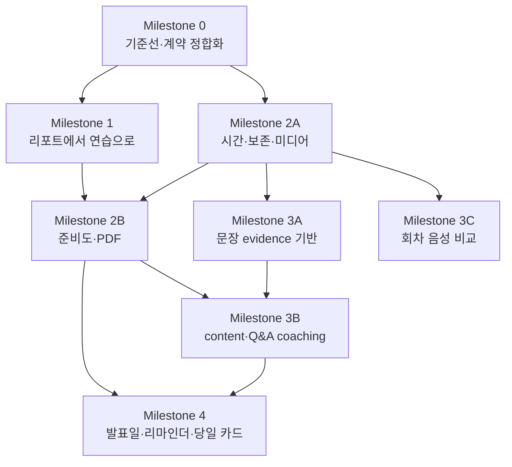

# 리허설 코칭 고도화 구현 계획

> 상태: 구현 검토 준비  
> 작성일: 2026-07-21  
> 기준 브랜치: `develop`  
> 상위 규칙: `AGENTS.md`, `docs/contracts.md`, `docs/product/adaptive-rehearsal-coach-direction.md`

## 1. 목적

이 문서 세트는 리허설 리포트를 결과 확인 화면에서 다음 연습으로 이어지는 코칭 허브로 전환하기 위한 실제 구현 계획이다. 작업은 Milestone 0~4로 나누고, 각 마일스톤 문서에는 다음 항목을 포함한다.

- 구현 순서와 선행 의존성
- S/M 크기의 실행 가능한 작업
- 변경할 shared 계약, DB, API, Worker, Python, Web 경계
- 테스트 가능한 수용 기준과 검증 명령
- rollout, rollback, 개인정보 보호 조건

이 문서는 제품 방향 문서가 아니라 구현 브랜치와 PR을 만들기 위한 실행 문서다. 실제 구현 중 공통 계약이 달라지면 코드보다 `packages/shared`와 `docs/contracts.md`를 먼저 갱신한다.

## 2. 확정된 제품 결정

| 주제                  | 결정                           | 구현 영향                                                                             |
| --------------------- | ------------------------------ | ------------------------------------------------------------------------------------- |
| 전사본·원본 음성 보존 | 업로드 완료 시점부터 기본 30일 | Object Storage와 metadata에 동일한 만료 기한을 적용하고 만료 후 접근을 먼저 차단한다. |
| 리포트 외부 공유      | PDF 저장만 제공                | 공개 링크, 비로그인 조회, 토큰 공유 API는 만들지 않는다.                              |
| 준비도 판단           | AI 종합 판단                   | 숫자 점수는 만들지 않고 `ready`, `needs-practice`, `unmeasured`와 근거를 제공한다.    |
| 리마인더              | 인앱 알림                      | 이메일, push, 외부 Calendar 연동은 범위에서 제외한다.                                 |
| 리포트의 대본         | 작성한 발표 대본               | `deck.slides[].speakerNotes`를 읽기 전용으로 표시하고 STT 전사본과 구분한다.          |
| 첫 회차 음성 비교     | 30일 보존 범위 안에서 제공     | 최초 음성이 만료되면 `보존 중인 가장 이른 회차`라고 표시한다.                         |

## 3. 현재 코드 기준선

현재 `develop`에는 다음 기반이 이미 존재한다.

- Worker가 `aiSummary`, `coaching.summary`, `coaching.strengths`, `coaching.nextPracticeFocus`를 생성한다.
- `PracticeGoalSummary`, `PracticePlanPage`, `FocusedPracticePage`, `ChallengeQnaPage`와 각 route가 존재한다.
- 리포트 페이지가 이전 성공 run과 report를 최대 3개까지 조회한다.
- 작성 대본은 `deck.slides[].speakerNotes`에 저장된다.
- `recordingDurationSeconds`가 있으면 Worker가 마지막 장표 시간을 계산한다.
- transcript JSON/TXT artifact 저장, transcript/audio 다운로드, 전체 오디오 signed playback URL이 존재한다.
- 원본 오디오는 현재 14일 retention deadline을 가진다.
- `CoachingReportView`, `ReportObservation`, `QnaAssessment` shared schema가 있으나 HTTP read model과 영속화는 연결되지 않았다.

현재 체감 문제의 직접 원인은 다음과 같다.

- 활성 리포트는 `RehearsalReportTestView`인데 기존 총평·연습 목표가 숨겨진 panel에 남아 있다.
- 활성 CTA가 practice plan이 아니라 일반 리허설로 이동한다.
- 직전 회차 데이터는 로드하지만 활성 overview에서 표시하지 않는다.
- transcript artifact는 저장되지만 report response에서 원문을 제거하고 화면 조회 API가 없다.
- Q&A 결과가 `qnaSummary` 또는 `CoachingReportView.qnaAssessment`로 투영되지 않는다.

## 4. 아키텍처 결정

### 4.1 Legacy report와 신규 coaching read model을 분리한다

`rehearsal_runs.report_json`은 기존 `RehearsalReport`의 SSoT로 유지한다. 준비도, content feedback, Q&A projection, 다음 행동 같은 신규 코칭 결과는 `CoachingReportView`를 구현해 별도 `coaching_report_json`에 저장한다.

- 기존 경로: `GET /api/v1/rehearsals/:runId/report`
- 신규 경로: `GET /api/v1/projects/:projectId/rehearsals/:runId/coaching-report`
- 과거 run에 신규 read model이 없으면 Web은 legacy report로 fallback한다.
- semantic retry, Q&A 완료, content analysis 완료는 새 coaching revision을 발행한다.

### 4.2 민감 원문과 장기 관찰값을 분리한다

- raw audio와 transcript artifact는 30일 후 삭제한다.
- speaker notes와 transcript 원문은 audience API, Job result, 로그, telemetry에 넣지 않는다.
- 장기 report에는 원문 대신 `slideId`, time range, sentence ordinal 같은 locator만 저장한다.
- PDF 기본 출력에서 speaker notes, transcript, audio 정보는 제외한다.

### 4.3 각 기능은 수직 슬라이스로 전달한다

DB 전체, API 전체, UI 전체를 따로 만드는 방식은 사용하지 않는다. 예를 들어 transcript 화면 읽기는 retention 계약 → owner-only API → Web panel → 만료 E2E까지 한 묶음으로 완료한다.

### 4.4 Web redesign 경계를 지킨다

- 공통 primitive는 `apps/web/src/components/ui`와 `apps/web/src/styles/tokens.css`를 사용한다.
- report 전용 UI는 `apps/web/src/features/rehearsal`, practice/reminder 전용 UI는 `apps/web/src/features/coaching`에 둔다.
- 둘 이상의 feature가 공유하는 조합형 패턴만 `apps/web/src/components/patterns`로 올린다.
- 신규 redesign UI를 기존 `apps/web/src/design-system`과 섞지 않는다.

## 5. 의존성 그래프



Milestone 1과 Milestone 2의 retention contract 작업은 Milestone 0 종료 후 병렬로 시작할 수 있다. `RehearsalReportDocument.tsx`, `RehearsalWorkspace.tsx`, `rehearsal-stt.processor.ts`는 hot spot이므로 같은 파일을 바꾸는 PR은 순차 병합한다.

## 6. 마일스톤 문서

1. [Milestone 0 — 기준선과 계약 정합화](./milestone-0-baseline-and-contracts.md)
2. [Milestone 1 — 리포트에서 맞춤 연습으로](./milestone-1-report-to-practice.md)
3. [Milestone 2 — 기본 기대 기능과 준비도](./milestone-2-expected-basics.md)
4. [Milestone 3 — 내용 중심 코칭](./milestone-3-content-coaching.md)
5. [Milestone 4 — 연습 지속 장치](./milestone-4-practice-continuity.md)

## 7. 브랜치와 PR 운영

- 각 작업은 `feature/<milestone>-<short-name>` 형식의 브랜치에서 진행한다.
- `main`과 `develop`에 직접 커밋하지 않는다.
- 하나의 PR은 S 또는 M 크기로 제한하며 예상 변경 파일은 최대 5개를 원칙으로 한다.
- migration, shared schema, API, Worker, Web을 동시에 바꾸는 작업은 계약 PR과 수직 기능 PR로 분리한다.
- 이미 push된 공유 브랜치에는 rebase 또는 force push를 하지 않는다.
- PR 본문에는 변경 요약, 수용 기준, 실행한 검증, privacy 영향, rollout/rollback을 포함한다.

## 8. 공통 완료 정의

모든 마일스톤은 아래 조건을 만족해야 종료할 수 있다.

- [ ] public request와 response가 shared Zod schema를 통과한다.
- [ ] DB 변경은 TypeORM migration과 `down()`을 포함한다.
- [ ] 신규 외부 입력은 runtime validation을 거친다.
- [ ] 실패 상태가 빈 성공 상태로 변환되지 않는다.
- [ ] raw audio, transcript, speaker notes, URL, storage key가 로그와 Job result에 없다.
- [ ] project role별 read/write 권한 테스트가 있다.
- [ ] 관련 Web component test와 핵심 Playwright E2E가 통과한다.
- [ ] `pnpm build`, `pnpm lint`, 변경 범위 test가 통과한다.
- [ ] 변경된 계약과 정책이 `docs/contracts.md`에 반영돼 있다.

## 9. 공통 검증 명령

```bash
pnpm --filter @orbit/shared test
pnpm --filter @orbit/web test
pnpm --filter @orbit/api test
pnpm --filter @orbit/worker test
pnpm test:coaching:migrations
pnpm test:coaching:integration
pnpm test:coaching:e2e
pnpm build
pnpm lint
node infra/scripts/check-env.mjs
docker compose config
```

Python 분석을 변경한 마일스톤은 추가로 실행한다.

```bash
cd services/python-worker
uv sync --locked
uv run ruff check .
uv run mypy app
uv run pytest
```

## 10. 안전한 제품 계측

기존 업무 이벤트 로깅 경계 안에서 다음 bounded event만 허용한다.

- `rehearsal.report.viewed`
- `rehearsal.report.practice_plan_opened`
- `rehearsal.report.focused_practice_opened`
- `rehearsal.report.challenge_qna_opened`
- `rehearsal.report.pdf_requested`
- `rehearsal.report.audio_playback_requested`
- `rehearsal.report.transcript_viewed`
- `rehearsal.reminder.acted`

event에는 `projectId`, `runId`, bounded status, feature mode만 넣는다. CTA 문구, AI 근거 문장, transcript, speaker notes, question/answer 원문은 넣지 않는다.

## 11. 전체 범위에서 제외하는 항목

- 공개 또는 비밀 report 공유 링크
- 이메일, SMS, browser push, Calendar 연동
- 발표 점수나 leaderboard
- transcript·audio의 프로젝트 수명 보존
- 청중 API에서의 presenter script, transcript, raw audio 노출
- 30일이 지난 최초 회차 audio 복구
- 요청 범위 밖 editor/rehearsal 대규모 리팩터링
