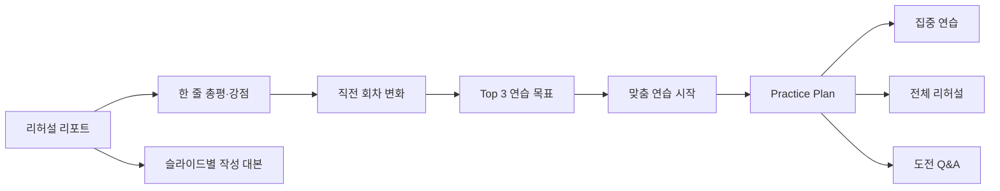

# Milestone 1 — 리포트에서 맞춤 연습으로

> 선행 조건: Milestone 0 Gate G0  
> 사용자 가치: 가장 높은 우선순위  
> 목표: 신규 DB나 Worker 변경 없이 이미 존재하는 AI 총평, 강점, 직전 회차, practice plan, focused practice, Q&A, speaker notes를 active report에 연결한다.

## 1. 완료 후 사용자 흐름

대표 CTA는 `맞춤 연습 시작` 하나로 유지한다. 집중 연습과 Q&A의 capability 및 goal eligibility 분기는 기존 `PracticePlanPage`가 담당한다.

## 2. 범위와 비범위

포함:

- active report에서 `aiSummary`, `strengths`, previous-run change, PracticeGoalSummary 노출
- report → plan → focused/Q&A 경로
- 작성 대본 read-only panel
- legacy report fallback과 모든 plan 상태
- 반응형·키보드·screen reader 검증

제외:

- 새 AI 호출
- report schema 또는 DB migration
- transcript 화면 조회
- readiness 판정
- PDF 저장

## 3. 작업 목록

### M1.1 — Active report에 AI 총평과 강점 연결

**설명:** 숨겨진 legacy panel이 아니라 `RehearsalReportTestOverview`의 첫 영역에 한 줄 총평과 강점을 배치한다. `aiSummary`가 없는 과거 report는 `coaching.summary`로 fallback한다.

**수용 기준:**

- [ ] `aiSummary.headline`과 `aiSummary.paragraphs`가 active overview에서 보인다.
- [ ] `coaching.strengths`를 최대 3개 표시하고 빈 배열이면 section을 숨긴다.
- [ ] AI 결과가 모두 없으면 긍정 내용을 임의 생성하지 않고 bounded unavailable 문구를 표시한다.

**검증:**

- [ ] `aiSummary`, legacy coaching, null coaching fixture component test
- [ ] 320px에서 headline과 strength list가 가로 overflow를 만들지 않는다.
- [ ] heading hierarchy와 list semantics를 axe로 확인한다.

**의존성:** G0

**예상 파일:**

- `apps/web/src/features/rehearsal/RehearsalReportTestOverview.tsx`
- `apps/web/src/features/rehearsal/rehearsal-report-test-view.css`
- `apps/web/src/features/rehearsal/RehearsalReportTestOverview.test.tsx`
- `apps/web/src/features/rehearsal/rehearsalReportTestViewModel.ts`

**예상 규모:** M

### M1.2 — Report Top 3와 practice plan CTA 활성화

**설명:** 현재 hidden overview에 전달되는 `PracticeGoalSummary`를 active overview로 옮긴다. ready goal이 있으면 `맞춤 연습 시작`으로 plan route에 이동하고, non-ready 상태는 기존 안전한 fallback을 유지한다.

**수용 기준:**

- [ ] 성공 report에서 Top 3와 `맞춤 연습 시작`이 active DOM에 존재한다.
- [ ] 한 번의 클릭으로 `/rehearsal/:projectId/plan/:runId`에 이동한다.
- [ ] `processing`, `no-goal`, `stale`, `error`, capability off에서 막힌 CTA가 생기지 않는다.

**검증:**

- [ ] `PracticeGoalSummary` 상태별 component test
- [ ] report → plan → focused practice와 report → plan → Q&A Playwright E2E
- [ ] browser back 이후 같은 report/run과 scroll context가 유지되는지 확인한다.

**의존성:** M1.1

**예상 파일:**

- `apps/web/src/features/rehearsal/RehearsalReportDocument.tsx`
- `apps/web/src/features/rehearsal/RehearsalReportTestView.tsx`
- `apps/web/src/features/rehearsal/RehearsalReportTestOverview.tsx`
- `apps/web/src/features/coaching/PracticeGoalSummary.tsx`
- `tests/e2e/adaptive-coaching.spec.ts`

**예상 규모:** M

### M1.3 — 직전 회차 변화 요약

**설명:** 현재 load 중인 `prevReports[0]`과 comparison API를 active overview에 연결한다. duration, filler, long silence, improved/repeated issue를 비교하되 측정 정의가 다른 값은 비교하지 않는다.

**수용 기준:**

- [ ] 전체 시간 변화가 `직전보다 40초 줄었어요` 형태로 report 첫 화면에 표시된다.
- [ ] filler와 long silence는 두 회차 모두 measured이고 version-compatible일 때만 방향을 표시한다.
- [ ] 첫 회차와 비교 불가 상태는 성공·실패 방향 대신 이유를 표시한다.

**검증:**

- [ ] first-run, improved, regressed, version mismatch pure model test
- [ ] comparison API 실패가 report 본문 전체를 실패시키지 않는 component test
- [ ] 음수·0·분 단위 duration copy 경계 테스트

**의존성:** M1.1

**예상 파일:**

- `apps/web/src/features/rehearsal/rehearsalRunComparisonModel.ts`
- `apps/web/src/features/rehearsal/rehearsalRunComparisonModel.test.ts`
- `apps/web/src/features/rehearsal/RehearsalReportTestOverview.tsx`
- `apps/web/src/features/rehearsal/RehearsalWorkspace.tsx`
- `apps/web/src/features/rehearsal/reportApi.ts`

**예상 규모:** M

### Checkpoint M1-A — 다음 행동 연결

- [ ] 총평, 강점, 변화, Top 3, CTA가 active overview 한 흐름에 있다.
- [ ] ready plan에서 focused practice와 Q&A까지 도달한다.
- [ ] plan/capability 실패가 legacy report 확인을 막지 않는다.
- [ ] 기존 slide detail과 audio issue playback 회귀가 없다.

### M1.4 — 작성 대본 read-only panel

**설명:** report의 전체/slide navigator와 연동되는 작성 대본 panel을 추가한다. speaker notes 원문을 run snapshot이나 report에 새로 복사하지 않고 현재 접근 가능한 deck의 `speakerNotes`를 `현재 작성 대본`으로 표시한다. current deck version이 run version과 다르면 `리허설 이후 수정된 현재 대본`임을 명시한다.

**수용 기준:**

- [ ] 선택한 slide의 `speakerNotes`를 파일 다운로드 없이 읽을 수 있다.
- [ ] 대본 없음, current deck와 run version 불일치, deck load 실패를 서로 다른 상태로 표시한다.
- [ ] UI 용어에서 `작성 대본`과 `실제 전사본`을 혼용하지 않는다.

**검증:**

- [ ] notes 있음/없음/여러 문단/긴 문장 component test
- [ ] slide 변경 시 panel heading과 content가 같이 갱신되는 test
- [ ] speaker notes가 analytics, URL, error message에 포함되지 않는 code review

**의존성:** M1.2

**예상 파일:**

- `apps/web/src/features/rehearsal/RehearsalReportTestView.tsx`
- `apps/web/src/features/rehearsal/RehearsalReportScriptPanel.tsx`
- `apps/web/src/features/rehearsal/RehearsalReportScriptPanel.test.tsx`
- `apps/web/src/features/rehearsal/rehearsal-report-test-view.css`

**예상 규모:** M

### M1.5 — Hidden legacy panel 제거와 responsive 정리

**설명:** active report로 옮긴 기능이 검증된 뒤 duplicate hidden DOM을 제거한다. 현재 사용하는 slide detail, silence, volume component는 유지하고 화면 조합 책임만 정리한다.

**수용 기준:**

- [ ] `rrd-panel-overview`, `rrd-panel-slides`에 중복된 사용자 콘텐츠가 남지 않는다.
- [ ] report에 동일 CTA, 동일 heading ID, 동일 transcript control이 중복되지 않는다.
- [ ] 1440×900, 1024×768, 390×844에서 핵심 CTA가 첫 두 viewport 안에 있다.

**검증:**

- [ ] `pnpm --filter @orbit/web test`
- [ ] `pnpm test:smoke --grep "report to practice"`
- [ ] axe, keyboard tab order, reduced motion 확인

**의존성:** M1.3, M1.4

**예상 파일:**

- `apps/web/src/features/rehearsal/RehearsalReportDocument.tsx`
- `apps/web/src/features/rehearsal/RehearsalReportDocument.test.tsx`
- `apps/web/src/features/rehearsal/rehearsal-report-components.css`
- `apps/web/src/features/rehearsal/rehearsal-report-test-view.css`

**예상 규모:** M

## 4. 마일스톤 종료 게이트 G1

- [ ] report에서 practice plan까지 한 번의 primary action으로 이동한다.
- [ ] plan에서 focused practice 또는 Q&A까지 추가 한 번의 action으로 이동한다.
- [ ] 총평과 강점은 실제 report field만 사용한다.
- [ ] 직전 회차 비교는 comparability를 지킨다.
- [ ] 작성 대본과 실제 전사본 용어가 분리돼 있다.
- [ ] hidden duplicate DOM이 제거됐다.
- [ ] Web test, adaptive coaching E2E, build, lint가 통과한다.

## 5. Rollout

1. `ADAPTIVE_REHEARSAL_COACH_ENABLED=true`이고 project allowlist에 포함된 project에서 먼저 노출한다.
2. report view와 practice plan open의 bounded event count만 확인한다.
3. plan API error rate와 report render error가 기준선보다 증가하지 않는지 확인한다.
4. feature flag off에서는 기존 `다시 리허설` CTA와 legacy report가 유지된다.

## 6. Rollback

- Web 조합 변경만 포함하므로 Milestone 1 PR을 revert하면 기존 report로 돌아갈 수 있어야 한다.
- DB, report schema, stored data를 변경하지 않는다.
- route를 삭제하지 않으며 기존 direct URL은 계속 동작한다.
