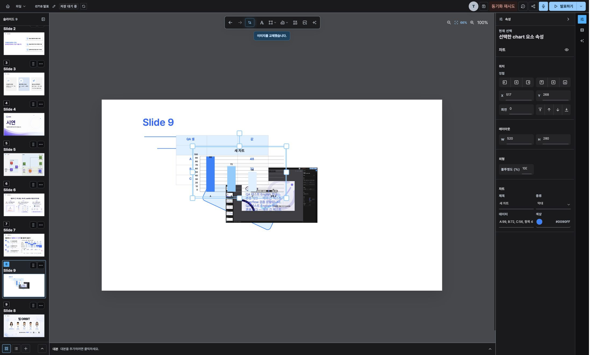
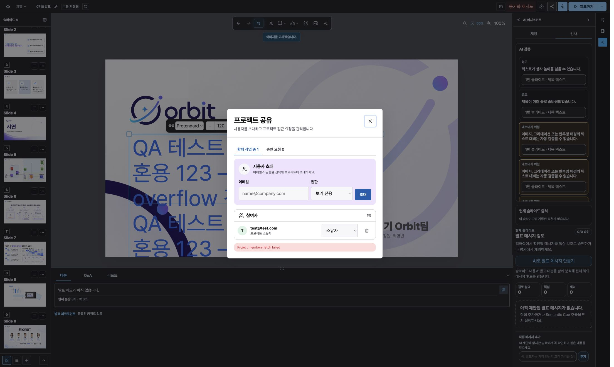
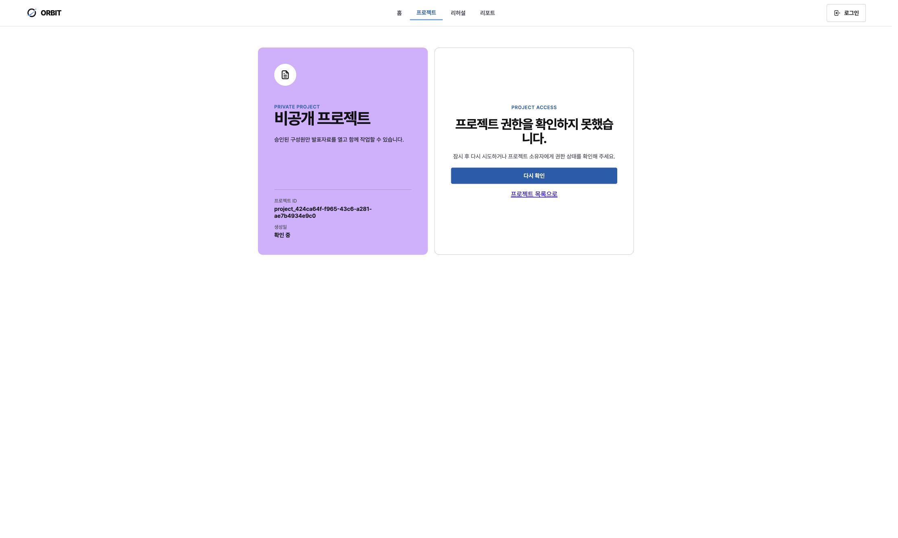
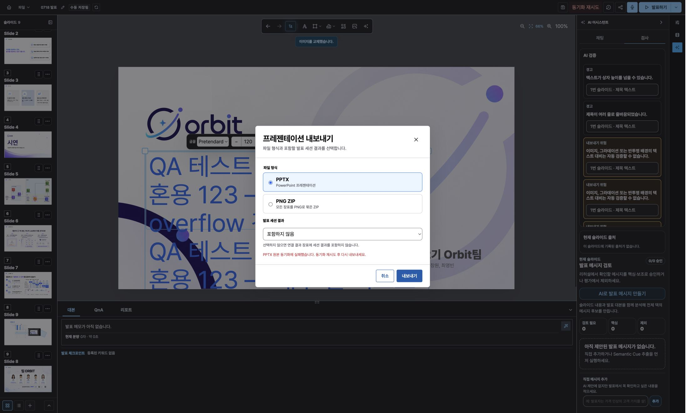
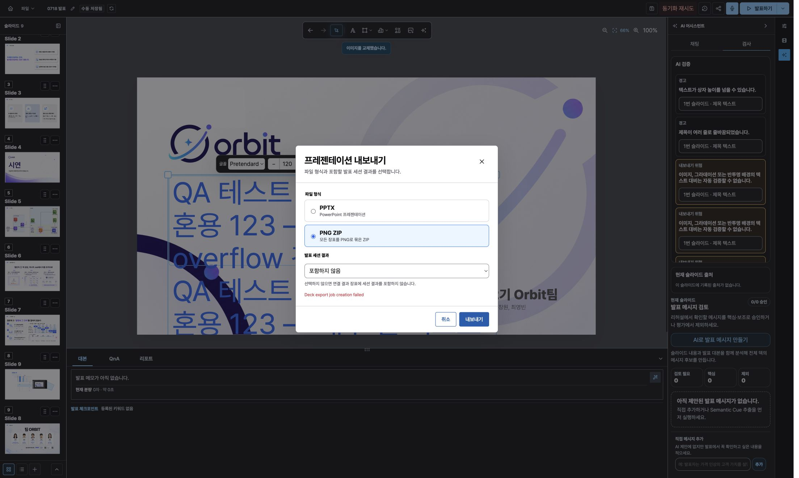
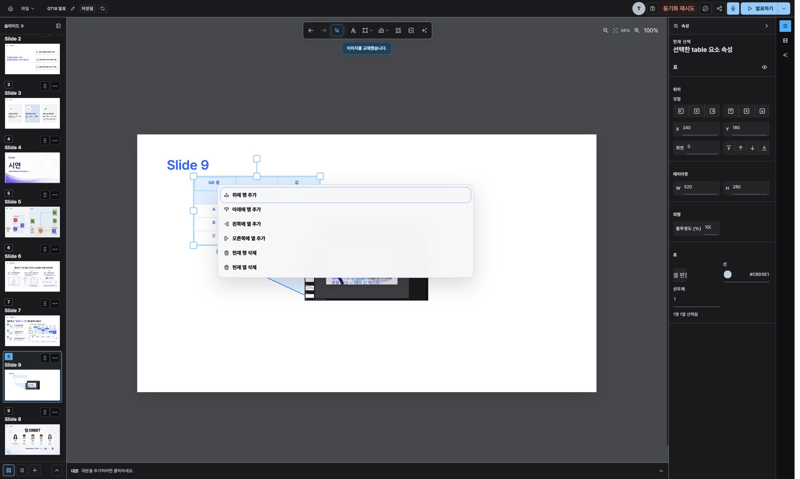
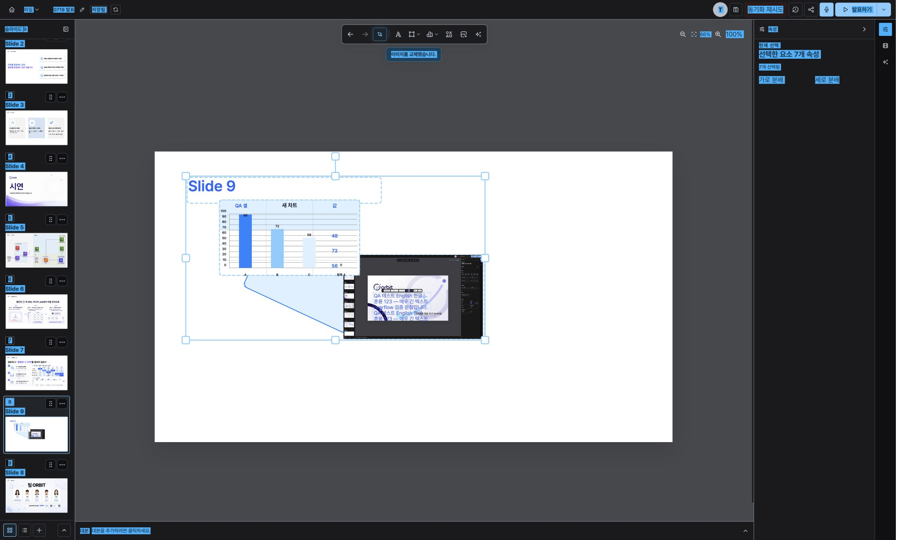
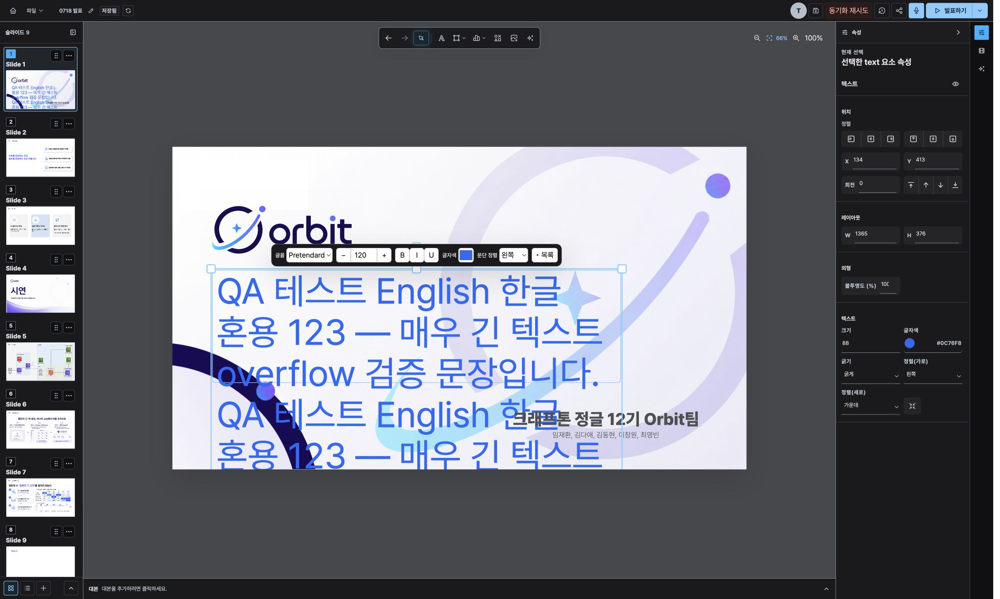
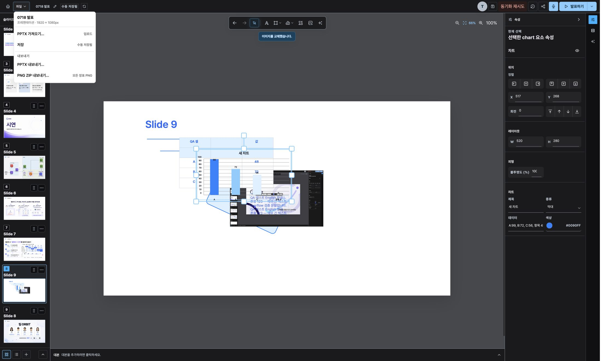
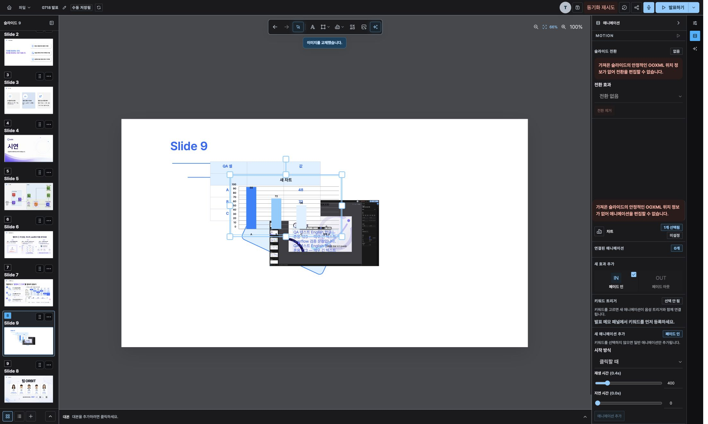

# ORBIT 슬라이드 편집기 QA 보고서 — 2026-07-18

## 요약

- 대상: `http://localhost:5173/project/project_424ca64f-f965-43c6-a281-ae7b4934e9c0`
- 대상 덱: 외부 PPTX를 가져온 `0718 발표`
- 방식: 인앱 브라우저의 실제 UI 조작 + DevTools Console/Network(CDP) 기록
- 발견 버그: **10건**
  - Critical: **1건**
  - Major: **6건**
  - Minor: **3건**
- 가장 큰 위험:
  1. 자동 저장 요청 실패가 `저장 실패`가 아니라 `저장 대기 중`으로 덮여 사용자가 미저장 상태를 오인할 수 있다.
  2. `project_members.is_pinned` migration 미적용으로 추정되는 API 500 때문에 공유, 버전 기록, 새로고침 후 에디터 접근이 모두 차단된다.
  3. 슬라이드 재정렬 patch의 OOXML 검증 기준이 잘못되어 PPTX 내보내기가 막힌다.
  4. PNG 내보내기 job 생성 API가 빈 응답의 500을 반환한다.

### 사전 스냅샷과 종료 상태

테스트 시작 전에 일반 에디터 조작(임시 슬라이드 추가 후 undo)을 저장하여 새 스냅샷을 만들었다.

- snapshotId: `snapshot_bd755034-29d6-4638-b740-d4e78c793938`
- version: `7`
- reason: `deck-replaced`
- createdAt: `2026-07-18T14:28:56.974Z`
- 생성 직후 슬라이드 수: 8개

종료 시 이 스냅샷을 UI에서 복원하려 했으나 `GET /api/v1/projects/:projectId/access`가 반복 500을 반환하여 버전 기록 화면과 에디터 재진입이 차단됐다(ORBIT-EQA-002). 따라서 테스트 조작이 포함된 현재 덱은 복원하지 못했다. API가 복구되면 위 snapshotId를 먼저 복원해야 한다.

### 체크리스트 결과

| # | 항목 | 결과 | 기록 |
|---|---|---|---|
| 1 | 슬라이드 레일 | 통과 | 추가 8→9, 복제 9→10, 삭제 10→9, 드래그 재정렬, 키보드 탐색을 확인했다. 새로고침 후 9개와 변경 순서가 유지됐다. 복제와 재정렬 undo도 통과했다. |
| 2 | 텍스트 | 부분 실패 | 인라인 편집, 굵기·크기·색, 한글/영문 혼용은 동작했다. 긴 텍스트가 프레임과 슬라이드 밖으로 렌더되어 다른 요소와 겹쳤다(ORBIT-EQA-008). |
| 3 | 도형·선·화살표·이미지 | 통과 | 추가, 이동, 리사이즈, 회전, 이미지 업로드·교체, 이미지 컨텍스트 메뉴를 확인했다. |
| 4 | 표 | 부분 실패 | 셀 편집, 행/열 추가·삭제와 셀 편집 undo는 통과했다. 셀 병합/해제 명령이 존재하지 않았다(ORBIT-EQA-005). |
| 5 | 차트 | 통과 | 막대 차트 추가, 인라인 데이터 편집, 값 변경, 데이터 행 추가를 확인했다. |
| 6 | 다중 선택 | 부분 실패 | 7개 요소 marquee 선택과 가로/세로 배분은 동작했다. 정렬 명령이 퀵바에 없다(ORBIT-EQA-006). 스냅 가이드는 드래그 중 최종 시각 증거를 확보하지 못해 미확정이다. |
| 7 | zoom·nudge·단축키 | 통과 | 66%→91%→66%, 100%, fit을 확인했다. Arrow nudge는 X 513→514로 이동했고 입력 필드 포커스 중에는 이동하지 않았다. `Cmd+S` 수동 저장도 동작했다. |
| 8 | undo/redo | 통과 | nudge undo/redo, 복제 undo, 재정렬 undo, 표 셀 편집 undo를 각각 격리해 확인했다. |
| 9 | 저장 상태 표시 | 실패 | offline patch 실패 뒤에도 `저장 대기 중`이 유지되고 네트워크 복구 후 자동 재시도가 없었다(ORBIT-EQA-001). 수동 저장으로만 복구됐다. |
| 10 | PPTX 가져오기 품질 | 부분 실패 | 가져온 요소는 대체로 렌더됐지만, 새로고침한 기존 import 덱에서는 가져오기 품질 패널이 표시되지 않았다(ORBIT-EQA-009). |
| 11 | 애니메이션 | 부분 실패 | 인스펙터는 열렸다. OOXML 편집 불가 경고가 있는데도 `페이드 인` 시작 버튼은 활성화되고 마지막 추가 버튼만 비활성화되는 dead-end가 있었다(ORBIT-EQA-010). |
| 12 | 스피커 노트 + AI | 통과 | AI 메모 초안 생성, 제안 확인, 편집 초안 반영까지 확인하고 취소해 덱 변경은 남기지 않았다. |
| 13 | AI 채팅·디자인·품질 검사 | 통과 | 디자인 제안 생성, 미리보기, 적용을 확인했다. 품질 경고 클릭 시 1번 슬라이드와 대상 텍스트로 포커스가 이동했다. |
| 14 | 내보내기 | 실패 | PPTX는 OOXML sync 실패(ORBIT-EQA-003), PNG는 job 생성 500(ORBIT-EQA-004)으로 모두 실패했다. |
| 15 | 공유·버전 기록·복원 | 실패 | 공유 구성원 API 500, access API 500으로 공유 조회와 버전 기록/복원이 차단됐다(ORBIT-EQA-002). |
| 16 | 닫기·ESC·포커스 | 부분 통과 | 공유 모달의 최초 포커스가 닫기 버튼에 위치했고 ESC로 닫혔다. 테스트한 export/AI dialog의 닫기도 동작했다. 최종 오른쪽 패널 재검증은 access API 500 때문에 에디터에 재진입하지 못해 중단했다. |

## 심각도순 버그 목록

### ORBIT-EQA-001 — Critical — 자동 저장 실패가 `저장 대기 중`으로 표시되고 자동 재시도되지 않음

#### 재현 단계

1. 에디터에서 요소를 선택한다.
2. DevTools Network에서 offline을 활성화한다.
3. 요소의 X 좌표를 변경한다.
4. `POST /deck/patches`가 실패할 때까지 기다린다.
5. 상단 저장 상태를 확인한다.
6. 네트워크를 복구하고 5초 이상 기다린다.

#### 기대 동작 vs 실제 동작

- 기대: 실패 직후 `저장 실패`와 원인이 표시되고, 네트워크 복구 시 자동 재시도하거나 명확한 재시도 동작을 제공한다.
- 실제: `저장 대기 중`이 계속 표시됐다. 네트워크를 복구해도 자동 재시도되지 않았고, 수동 저장을 눌러야 `수동 저장됨`으로 회복됐다.

#### 콘솔 / 실패 API

- Console: 이 재현에 직접 대응하는 별도 console error는 없었다.
- Request: `POST /api/v1/projects/project_424ca64f-f965-43c6-a281-ae7b4934e9c0/deck/patches`
- Response: HTTP 응답 없음, `net::ERR_INTERNET_DISCONNECTED`
- 네트워크 복구 뒤 동일 요청의 자동 재시도 없음

#### 스크린샷



### ORBIT-EQA-002 — Major — 구성원/access API 500으로 공유·버전 기록·에디터 접근이 연쇄 차단됨

#### 재현 단계

1. 에디터 상단의 `공유` 버튼을 누른다.
2. 공유 모달 하단 오류를 확인한다.
3. 모달을 닫고 `버전 기록`을 누른다.
4. `프로젝트 권한을 확인하지 못했습니다.` 화면에서 `다시 확인`을 누른다.
5. 프로젝트 URL을 직접 다시 연다.

#### 기대 동작 vs 실제 동작

- 기대: 공유 참여자 목록과 버전 기록이 로드되고, 에디터 재진입과 사전 스냅샷 복원이 가능해야 한다.
- 실제: 공유 모달은 `Project members fetch failed`를 표시했다. 버전 기록과 프로젝트 재진입은 access 확인 실패 화면으로 대체됐으며 재시도도 실패했다. 사전 스냅샷 복원이 차단됐다.

#### 콘솔 / 실패 API

- Console: 별도 JavaScript error 없음.
- Request 1: `GET /api/v1/workspaces/workspace_demo_1/projects/project_424ca64f-f965-43c6-a281-ae7b4934e9c0/members`
- Response 1: HTTP 500, `content-type: text/plain`, body 빈 문자열
- Request 2: `GET /api/v1/projects/project_424ca64f-f965-43c6-a281-ae7b4934e9c0/access`
- Response 2: HTTP 500, body 빈 문자열. UI의 `다시 확인`으로 총 2회 반복 재현.

#### 스크린샷





### ORBIT-EQA-003 — Major — 재정렬된 import 덱의 OOXML sync가 잘못된 permutation 판정으로 실패하여 PPTX 내보내기 차단

#### 재현 단계

1. import 덱에서 슬라이드를 추가하고 복제/삭제/재정렬한다.
2. 저장 완료를 기다린다.
3. `파일` → 내보내기에서 `PPTX`를 선택한다.
4. 내보내기를 실행한다.

#### 기대 동작 vs 실제 동작

- 기대: 현재 덱 순서를 OOXML에 동기화한 뒤 PPTX 다운로드가 시작된다.
- 실제: `PPTX 원본 동기화에 실패했습니다. 동기화 재시도 후 다시 내보내세요.` alert가 표시되고 다운로드가 시작되지 않았다.

#### 콘솔 / 실패 API

- Console: 별도 JavaScript error 없음.
- `GET /deck/ooxml-sync-state` → 200
- `POST /deck/ooxml-sync/retry` → 201
- 후속 `GET /deck/ooxml-sync-state` → 200이나 응답의 job이 논리적으로 실패:

```json
{
  "status": "failed",
  "deckVersion": 51,
  "syncedDeckVersion": 6,
  "retryable": true,
  "job": {
    "jobId": "job_84082a7c-2ef3-4029-9640-1cea207ae367",
    "type": "pptx-ooxml-sync",
    "status": "failed",
    "progress": 50,
    "message": "PPTX OOXML sync failed.",
    "error": {
      "code": "PPTX_OOXML_SYNC_UNSUPPORTED_OPERATION",
      "message": "reorder_slides:SLIDE_REORDER_PERMUTATION_INVALID",
      "retryable": false
    }
  }
}
```

#### 스크린샷



### ORBIT-EQA-004 — Major — PNG 내보내기 job 생성 API가 빈 본문의 500 반환

#### 재현 단계

1. `파일` → 내보내기를 연다.
2. `PNG`를 선택한다.
3. 내보내기를 실행한다.

#### 기대 동작 vs 실제 동작

- 기대: `deck-export` job이 생성되고 PNG 다운로드가 시작된다.
- 실제: 다운로드가 시작되지 않고 dialog에 `Deck export job creation failed`가 표시됐다.

#### 콘솔 / 실패 API

- Console: 별도 JavaScript error 없음.
- Request: `POST /api/v1/projects/project_424ca64f-f965-43c6-a281-ae7b4934e9c0/deck/exports`
- Request body: `{"format":"png"}`
- Response: HTTP 500, body 빈 문자열

#### 스크린샷



### ORBIT-EQA-005 — Major — 표 셀 병합/해제 기능이 없음

#### 재현 단계

1. 빈 슬라이드에 표를 추가한다.
2. 표의 셀을 선택하고 우클릭한다.
3. 모든 컨텍스트 메뉴 항목을 확인한다.
4. 표 퀵바와 속성 패널도 확인한다.

#### 기대 동작 vs 실제 동작

- 기대: 인접 셀을 다중 선택해 병합하고, 병합된 셀을 다시 해제할 수 있어야 한다.
- 실제: 행/열 추가·삭제만 있고 병합/해제 명령과 다중 셀 선택 경로가 없다.

#### 콘솔 / 실패 API

- Console error 없음.
- 실패 API 없음. 클라이언트 기능 자체가 노출되지 않는다.

#### 스크린샷



### ORBIT-EQA-006 — Major — 다중 선택 퀵바에 정렬 명령이 없음

#### 재현 단계

1. 빈 슬라이드에 도형, 선, 차트 등 여러 요소를 배치한다.
2. 빈 배경에서 marquee drag로 3개 이상 요소를 선택한다.
3. 다중 선택 퀵바를 확인한다.

#### 기대 동작 vs 실제 동작

- 기대: 좌/중앙/우, 상/중앙/하 정렬과 가로/세로 배분을 사용할 수 있다.
- 실제: `가로 분배`, `세로 분배`만 표시되고 정렬 명령이 없다.

#### 콘솔 / 실패 API

- Console/API 실패 없음.

#### 스크린샷



### ORBIT-EQA-007 — Major — marquee 선택 종료 시 render-phase 상위 상태 갱신 console error

#### 재현 단계

1. 하나의 슬라이드에 여러 요소를 배치한다.
2. 배경에서 marquee drag로 다중 선택한다.
3. 마우스를 놓고 DevTools Console을 확인한다.

#### 기대 동작 vs 실제 동작

- 기대: 선택 상태가 event/effect 단계에서 갱신되고 React render-phase 경고가 없어야 한다.
- 실제: `EditableCanvas`가 렌더되는 동안 `EditorShell`을 갱신한다는 React error가 기록됐다. 화면은 계속 동작했지만 concurrent rendering에서 선택 상태 불일치 위험이 있다.

#### 콘솔 에러 전문 / 실패 API

```text
Cannot update a component (`%s`) while rendering a different component (`%s`). To locate the bad setState() call inside `%s`, follow the stack trace as described in https://react.dev/link/setstate-in-render EditorShell EditableCanvas EditableCanvas
```

- timestamp: `2026-07-18T14:40:17.316Z`
- source: `http://localhost:5173/node_modules/.vite/deps/react-dom_client.js?v=4763f863`
- 실패 API 없음.

#### 스크린샷

전용 화면 스크린샷 없음. 같은 조작 결과의 다중 선택 화면은 ORBIT-EQA-006 스크린샷을 참고한다.

### ORBIT-EQA-008 — Minor — 긴 혼합 언어 텍스트가 프레임과 슬라이드 경계를 넘어 렌더됨

#### 재현 단계

1. 1번 슬라이드 제목을 더블클릭해 인라인 편집을 시작한다.
2. 긴 한글/영문 혼합 문장을 입력한다.
3. 큰 글자 크기와 굵기를 적용한다.
4. 편집을 종료한다.

#### 기대 동작 vs 실제 동작

- 기대: 텍스트 프레임 안에서 clip, scroll, autofit, 프레임 자동 확장 중 하나의 일관된 정책이 적용된다.
- 실제: rich-text fragment가 프레임 높이와 슬라이드 경계를 넘어 다른 요소 위에 렌더됐다. 품질 검사는 overflow 경고를 만들지만 기본 렌더 단계에서 막지 않는다.

#### 콘솔 / 실패 API

- Console/API 실패 없음.

#### 스크린샷



### ORBIT-EQA-009 — Minor — 기존 import 덱 재로드 시 PPTX 가져오기 품질 패널이 사라짐

#### 재현 단계

1. 외부 PPTX에서 가져온 덱을 연다.
2. 페이지를 새로고침한다.
3. 오른쪽 AI 어시스턴트의 검사/도구 영역을 확인한다.

#### 기대 동작 vs 실제 동작

- 기대: 저장된 import 결과의 품질 점수, 편집 가능 비율, 경고를 다시 확인할 수 있다.
- 실제: 가져오기 품질 패널이 전혀 표시되지 않는다. 패널은 현재 브라우저 세션에서 새 PPTX를 import한 직후에만 보인다.

#### 콘솔 / 실패 API

- Console/API 실패 없음.

#### 스크린샷



### ORBIT-EQA-010 — Minor — 애니메이션 편집 불가 상태에서도 효과 선택이 활성화되어 dead-end 생성

#### 재현 단계

1. 안정적인 OOXML 위치가 없는 import 슬라이드의 요소를 선택한다.
2. `애니메이션` 인스펙터를 연다.
3. 편집 불가 경고를 확인한다.
4. 활성화된 `IN 페이드 인`을 누른다.
5. `애니메이션 추가` 버튼을 확인한다.

#### 기대 동작 vs 실제 동작

- 기대: 슬라이드 전체가 편집 불가이면 효과 선택 버튼부터 비활성화되고 동일한 이유가 tooltip/status로 제공된다.
- 실제: `페이드 인` 선택은 활성화되어 폼이 열리지만 최종 `애니메이션 추가` 버튼만 비활성화된다.

#### 콘솔 / 실패 API

- Console/API 실패 없음.

#### 스크린샷



## 원인 분석

확정되지 않은 항목은 **추정**으로 표시했다.

### ORBIT-EQA-001

- `apps/web/src/features/editor/shell/hooks/useEditorDocumentController.ts:389-397`에서 저장 실패를 `error`로 설정한다.
- 그러나 같은 promise chain의 `finally`인 `apps/web/src/features/editor/shell/hooks/useEditorDocumentController.ts:398-401`이 pending patch가 남아 있으면 무조건 `auto-pending`을 다시 설정한다.
- 실패한 batch는 `apps/web/src/features/editor/shell/hooks/useEditorDocumentController.ts:203-206`에서 pending queue 앞에 되돌려지므로, 실패 직후에는 항상 `pendingPatchInputsRef.current.length > 0`이고 `error`가 즉시 `auto-pending`으로 덮인다.
- 재시도는 새 commit 또는 수동 `flush()`가 있을 때만 queue가 다시 작동하며, `online` event 기반 재시도는 없다.
- 검증 방법: `appendProjectDeckPatchAck`가 reject하는 단위 테스트에서 최종 `saveState === "error"`인지 확인하고, online event 후 동일 patch가 1회 재전송되는 통합 테스트를 추가한다.

### ORBIT-EQA-002

- **추정(강함): DB migration 미적용**이다.
- `apps/api/src/projects/project-member.entity.ts:20-21`은 모든 TypeORM `ProjectMemberEntity` 조회에 `is_pinned` 컬럼을 요구한다.
- 해당 컬럼은 당일 migration인 `apps/api/src/database/migrations/2026071801000-AddProjectMemberPins.ts:6-10`에서 추가된다.
- access API는 `apps/api/src/projects/projects.service.ts:244-250`, members API의 owner gate는 `apps/api/src/projects/projects.service.ts:319-325` → `428-440`에서 `ProjectMemberEntity.findOne()`을 호출한다. DB에 `is_pinned`이 없으면 두 endpoint가 동일하게 500이 되는 관찰과 일치한다.
- Web은 빈 500 body를 `apps/web/src/features/editor/shell/api/projectMembersApi.ts:52-55`의 fallback 메시지로만 표시하고, access gate는 `apps/web/src/App.tsx:257-273`에서 오류 화면으로 전환한다.
- 검증 방법: DB에서 `SELECT column_name FROM information_schema.columns WHERE table_name='project_members'`로 `is_pinned` 존재 여부와 migration table을 확인하고 `pnpm db:migration:run` 후 두 GET을 재검증한다. API 예외 로그에서 `column project_members.is_pinned does not exist` 여부도 확인한다.

### ORBIT-EQA-003

- `apps/worker/src/pptx-ooxml-sync.processor.ts:394-404`는 여러 버전에 걸친 미동기화 patch를 모은 뒤, 각 과거 `reorder_slides`를 최종 `storedDeck`과 함께 검증한다.
- `apps/worker/src/pptx-ooxml-sync.processor.ts:1280-1295`의 `isExactSlidePermutation()`은 각 operation의 slide ID 집합과 **최종 덱 전체**의 slide ID 집합/길이가 같아야 한다고 요구한다.
- 테스트 중 reorder 뒤 슬라이드 추가/삭제가 이어졌으므로 과거 시점에는 유효했던 permutation도 최종 덱 기준으로는 불일치한다. 그 결과 `apps/worker/src/pptx-ooxml-sync.processor.ts:427-436`에서 `SLIDE_REORDER_PERMUTATION_INVALID`가 발생한다.
- 복제 patch 자체도 `packages/editor-core/src/patches/slideOperations.ts:97-105`처럼 `add_slide`와 새 slide를 포함한 `reorder_slides`를 한 patch에 넣으므로, 검증 시점 상태를 엄밀히 재생하지 않으면 같은 오류가 날 수 있다.
- 검증 방법: synced version의 deck에서 pending operations를 순서대로 replay하면서 각 reorder를 그 시점의 slide set으로 검증하는 worker test를 추가한다. `add → duplicate → delete → reorder → undo` 시나리오가 PPTX sync까지 성공해야 한다.

### ORBIT-EQA-004

- Web은 `apps/web/src/features/editor/shell/api/editorJobApi.ts:124-143`에서 500의 빈 body를 `Deck export job creation failed`로 치환한다.
- API는 `apps/api/src/decks/decks.service.ts:231-241`에서 job row를 생성한 뒤 `apps/api/src/decks/decks.service.ts:243-278`에서 queue enqueue를 시도한다. enqueue 예외를 failed job으로 기록한 뒤 원본 예외를 그대로 throw하여, 전역 예외 처리 상태에 따라 빈 500이 된다.
- **추정:** 현재 환경의 `JOB_QUEUE_DRIVER`/Redis 또는 worker queue 연결 문제로 `enqueueDeckExport`가 reject했다. 정확한 하위 error는 HTTP 응답에 없어서 서버 업무 이벤트 로그 확인이 필요하다.
- 검증 방법: 동일 시각의 `deck_export.enqueued` 또는 `DECK_EXPORT_ENQUEUE_FAILED` job/서버 로그를 조회하고, queue driver별 `createExportJob({format:"png"})` 통합 테스트에서 201과 구조화된 실패 응답을 검증한다.

### ORBIT-EQA-005

- `packages/editor-core/src/table/tableOperations.ts:25-35`의 `TableOperation` union에는 셀 텍스트 수정과 행/열 삽입·삭제만 있고 merge/unmerge operation이 없다.
- 오히려 `packages/editor-core/src/table/tableOperations.ts:53-70`은 기존 `rowSpan`/`colSpan`이 하나라도 있으면 구조 편집 전체를 `merged-cells`로 비활성화한다.
- UI도 `apps/web/src/features/editor/shell/components/EditorContextMenus.tsx:228-261`에서 행/열 6개 명령만 렌더한다.
- 검증 방법: shared table schema의 span 표현을 기준으로 merge/unmerge command 계약, rectangular multi-cell selection, undo/redo 및 imported merged table 회귀 테스트를 함께 설계한다.

### ORBIT-EQA-006

- `apps/web/src/features/editor/shell/components/MultiSelectionQuickBar.tsx:1-5`의 props가 `onDistributeX/Y`만 제공하고, 렌더도 `13-28`에서 배분 버튼 두 개뿐이다.
- `apps/web/src/features/editor/shell/EditorShell.tsx:1745-1750` 역시 배분 handler만 연결한다. 정렬 command 자체가 퀵바 계약에서 빠져 있다.
- 검증 방법: six-way alignment patch builder와 quickbar handler를 추가하고, 2개/3개 이상 선택에서 enable 조건, undo/redo, 잠긴 요소 포함 시 동작을 테스트한다.

### ORBIT-EQA-007

- `apps/web/src/features/editor/canvas/EditorCanvas.tsx:585-595`에서 `setSelectionDraft(current => ...)` state updater 내부가 `onSelectElements(...)`를 호출한다.
- React state updater는 render 단계에서 실행될 수 있는데, `onSelectElements`는 부모 `EditorShell` 상태를 갱신하므로 관찰한 `EditorShell`/`EditableCanvas` render-phase error와 정확히 일치한다.
- 검증 방법: updater 안에서는 선택 사각형만 계산해 반환하고, 계산 결과를 event handler 지역 변수나 후속 effect에서 부모에 전달한다. StrictMode에서 marquee 종료 시 console error가 0건인지 테스트한다.

### ORBIT-EQA-008

- `apps/web/src/features/slides/rendering/elementRendering.tsx:124-143`의 rich-text 렌더는 fragment를 `Group` 안에 그대로 그리며 frame height clip을 적용하지 않는다.
- plain text도 `apps/web/src/features/slides/rendering/elementRendering.tsx:147-163`에서 `Text`에 width만 전달하고 height/ellipsis/clip 정책이 없다.
- `apps/web/src/features/editor/canvas/text/textLayout.ts:115-143`의 rich-text 결과도 실제 content height를 그대로 반환한다. plain path만 `155`에서 측정 높이를 available height로 제한하지만 실제 Konva `Text`에는 frame height가 전달되지 않는다.
- 인라인 편집 DOM은 `apps/web/src/features/editor/editor-shell.css:2911-2925`에서 `overflow: auto`인데, 편집 종료 후 Konva 렌더와 정책이 달라 결과가 갑자기 넘쳐 보인다.
- 검증 방법: schema의 autofit/overflow 정책을 명시하고 edit overlay, canvas, export renderer가 같은 정책을 사용하도록 한다. 한글/영문 혼용, 긴 단어, rich run, 회전 텍스트 snapshot test를 추가한다.

### ORBIT-EQA-009

- `apps/web/src/features/editor/shell/hooks/useEditorFileTransfer.ts:349-354`가 `pptxImportState`를 항상 메모리의 `idle`로 초기화한다.
- 이 상태는 같은 파일의 `506-541`에서 **현재 세션의 새 import 요청**이 실행될 때만 채워진다. 저장된 덱 metadata나 import 결과를 재수화하는 코드가 없다.
- `apps/web/src/features/editor/shell/components/PptxImportQualityPanel.tsx:24-26`은 `idle`이면 null을 반환하므로 기존 import 덱 재로드에서는 반드시 사라진다.
- 검증 방법: import quality report를 deck metadata 또는 별도 project import record에 저장하고, initial deck load 시 panel state를 구성하는 재로드 테스트를 추가한다.

### ORBIT-EQA-010

- 전체 슬라이드 mutation 금지 사유는 `apps/web/src/features/editor/shell/utils/motionEditingPolicy.ts:23-37`에서 계산된다.
- `apps/web/src/features/editor/shell/components/animation/components/AnimationInspectorPanel.tsx:97-101`은 경고를 표시하고, 기존 animation 편집만 `139-159`의 disabled fieldset으로 묶는다.
- 새 효과 흐름은 `116-137`에서 `mutationDisabledReason`을 `AnimationCreateFlow`/picker에 전달하지 않는다. picker는 `apps/web/src/features/editor/shell/components/animation/components/AnimationCreatePicker.tsx:20-31`에서 effect type 자체의 지원 여부만 보므로 `페이드 인`이 활성화된다.
- 최종 폼은 `apps/web/src/features/editor/shell/components/animation/components/AnimationCreateEditor.tsx:38-40`, `83-87`에서 `canCreateAnimation` 때문에 submit만 비활성화한다.
- 검증 방법: mutation disabled reason을 picker까지 내려 전체 create flow를 비활성화하고, 경고와 button title/aria-describedby가 같은 사유를 제공하는 component test를 추가한다.

## 수정 우선순위 제안

1. **P0 — ORBIT-EQA-001:** 저장 실패 상태 덮어쓰기를 먼저 제거하고 offline/online 재시도와 미저장 이탈 경고를 추가한다. 데이터 유실 가능성이 가장 크다.
2. **P0 — ORBIT-EQA-002:** `is_pinned` migration 적용 상태를 확인하고 API readiness에 필수 migration 검사를 넣는다. 현재는 새로고침만으로 편집기 자체가 차단된다. 적용 후 사전 snapshot `snapshot_bd755034-29d6-4638-b740-d4e78c793938`을 복원한다.
3. **P1 — ORBIT-EQA-003:** OOXML sync가 patch별 시점 상태를 replay하도록 permutation 검증을 수정한다. PPTX가 핵심 반출 경로라 merge 전에 회귀 테스트가 필요하다.
4. **P1 — ORBIT-EQA-004:** PNG queue enqueue 실패 원인을 서버 로그로 확정하고 API가 구조화된 오류를 반환하도록 한다.
5. **P1 — ORBIT-EQA-007:** render-phase 상위 상태 갱신을 제거해 선택/드래그 상태의 불확정성을 없앤다.
6. **P1 — ORBIT-EQA-005, ORBIT-EQA-006:** 체크리스트상 핵심 편집 기능인 표 병합과 다중 선택 정렬 command를 계약·undo 단위부터 구현한다.
7. **P2 — ORBIT-EQA-008:** text overflow 정책을 canvas/edit/export 사이에서 통일한다.
8. **P2 — ORBIT-EQA-009:** import quality report를 영속화하고 재로드 시 복원한다.
9. **P2 — ORBIT-EQA-010:** animation create picker의 disabled 상태와 설명을 최종 submit 상태와 일치시킨다.

## 검증 메모

- 알려진 이슈인 PDF 미지원, 덱 로드 실패 시 demo fallback, 실시간 공동 편집·댓글 미구현은 재보고하지 않았다.
- 테스트 도중 API key, token, cookie, password, `.env` 값은 기록하거나 출력하지 않았다.
- 코드 변경은 하지 않았고 이 문서와 QA 스크린샷만 추가했다.
