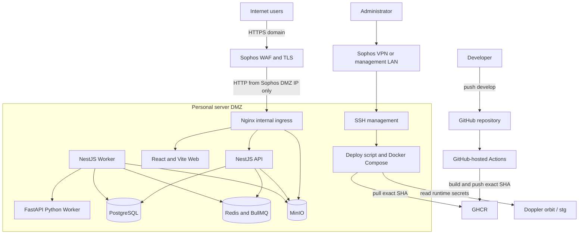

# 개인 staging GHCR 이미지 배포 기준

## 범위

이 문서는 개인 staging의 애플리케이션 이미지를 GitHub-hosted Actions에서 빌드하고,
개인 서버가 GHCR에서 pull하는 현재 기준을 설명한다. AWS production 배포 경로는 이
변경 범위에 포함하지 않는다.

AWS production은 `infra/scripts/deploy-aws-ec2.sh`의 기존
`DEPLOY_USE_REGISTRY`/온박스 fallback 계약을 유지한다. 개인 staging의 fail-closed
정책을 AWS에 자동으로 확대 적용하지 않는다.

실제 서버 설치·검증 절차는
`docs/runbooks/personal-server-deployment.md`를 source of truth로 사용한다.

## 현재 구조



- Workflow: `.github/workflows/build-personal-staging-images.yml`
- Registry namespace: `ghcr.io/kdh949`
- Build runner: GitHub-hosted `ubuntu-latest`
- Deploy trigger: 관리자가 Sophos VPN 또는 관리 LAN에서 수동 실행
- Runtime secret source: Doppler `orbit / stg`
- 개인 서버 self-hosted Actions runner: 사용하지 않음
- 개인 서버 application image build fallback: 사용하지 않음

## 이미지 계약

한 배포는 네 서비스를 모두 같은 40자리 commit SHA로 고정한다.

```text
ghcr.io/kdh949/orbit-api:<commit-sha>
ghcr.io/kdh949/orbit-worker:<commit-sha>
ghcr.io/kdh949/orbit-python-worker:<commit-sha>
ghcr.io/kdh949/orbit-web:<commit-sha>
```

`develop` 같은 mutable branch tag와 `latest`는 배포에 사용하지 않는다. 네 이미지 중
하나라도 빌드·pull·local inspection에 실패하면 실행 중 애플리케이션 컨테이너를
교체하지 않는다.

## 인증 경계

GitHub Actions는 repository `GITHUB_TOKEN`과 `packages: write` 권한으로 이미지를
게시한다. 개인 서버는 Doppler에 저장한 별도 read-only credential을 사용한다.

```text
GHCR_TOKEN=<read:packages 전용 PAT>
GHCR_USERNAME=kdh949
```

token 값은 repository, Actions log, Compose 파일에 기록하지 않는다. 서버의 Doppler
service token도 `orbit / stg` read 범위만 부여한다.

## 배포 순서

1. `develop`의 `Build personal staging images` workflow가 성공한 SHA를 고른다.
2. 관리자가 Sophos VPN 또는 관리 LAN으로 접속한다.
3. `deploy-personal-server.sh <commit-sha>`를 실행한다.
4. script가 server HEAD, Doppler env, 네 GHCR 이미지와 Compose 계약을 검증한다.
5. data service를 기동하고 migration을 실행한 뒤 동일 SHA 앱을 교체한다.
6. 내부 health check와 Sophos WAF 외부 경로를 확인한다.

GHCR 게시가 아직 끝나지 않았으면 script가 제한된 횟수만 재시도한다. 끝까지
성공하지 않으면 서버에서 이미지를 빌드하지 않고 배포를 실패 처리한다.

## Rollback

이전에 검증한 SHA의 네 이미지를 함께 pull하고 `--no-build --pull never`로 앱
컨테이너만 교체한다. source checkout에 `git reset --hard`를 사용하지 않는다.
DB migration은 자동 rollback하지 않으므로, 이전 앱과 schema 호환성이 없으면 별도
복구 계획이 필요하다. 구체적인 명령과 검증 항목은 개인 서버 배포 runbook의
`Rollback` 절을 따른다.

## 운영 체크리스트

- [ ] workflow validate와 네 image build가 모두 성공했다.
- [ ] 배포 SHA가 `develop`의 40자리 commit SHA다.
- [ ] 개인 서버가 `linux/amd64` 이미지와 호환된다.
- [ ] Doppler runtime token과 GHCR token이 최소 권한이다.
- [ ] SSH는 WAN이 아니라 Sophos VPN/관리 LAN에서만 허용된다.
- [ ] Sophos WAF → Nginx → API의 trusted proxy hop은 `2`다.
- [ ] 내부 및 외부 health check와 주요 smoke test를 기록했다.
